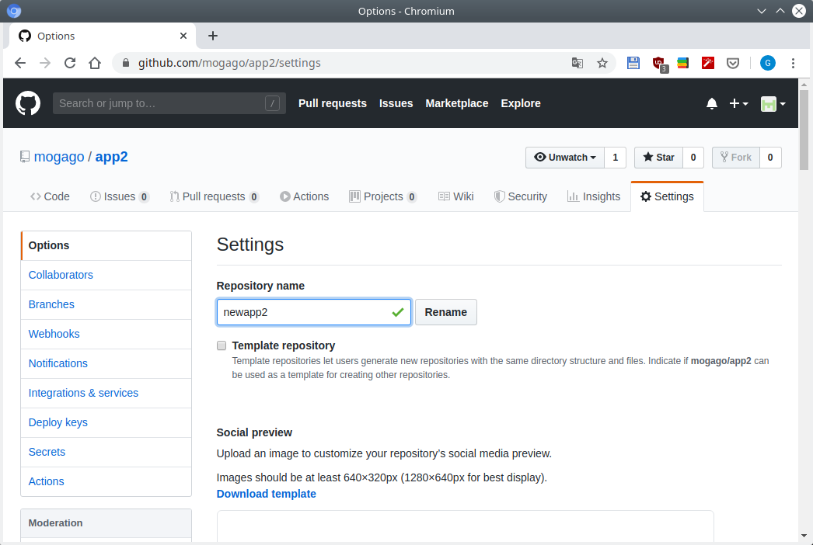
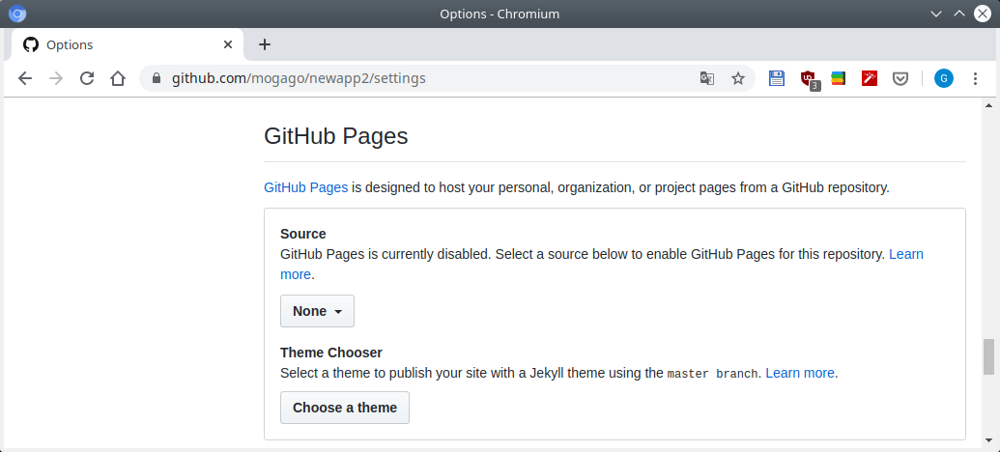
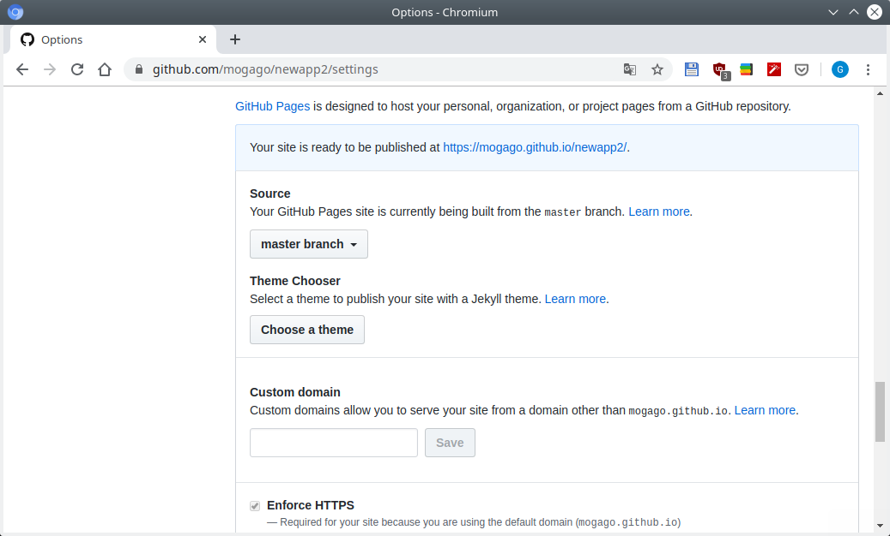
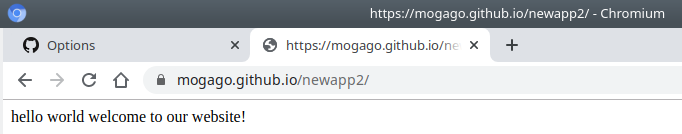
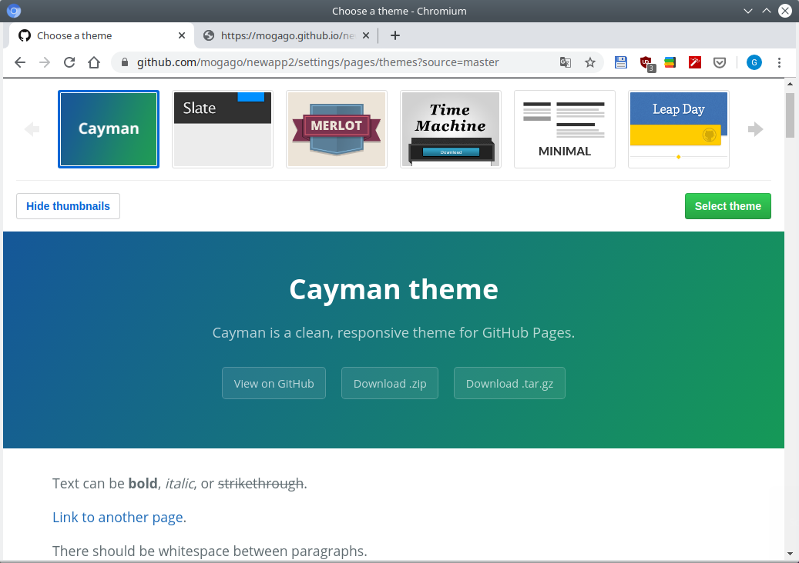
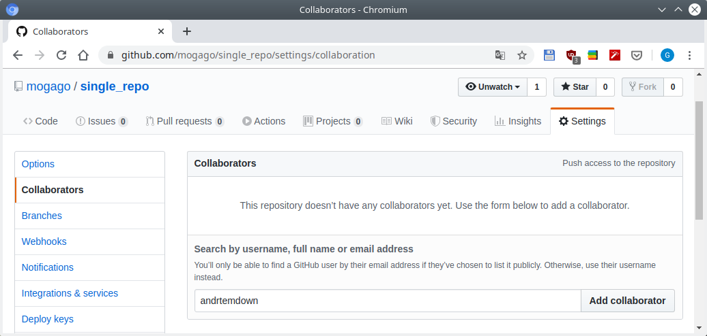
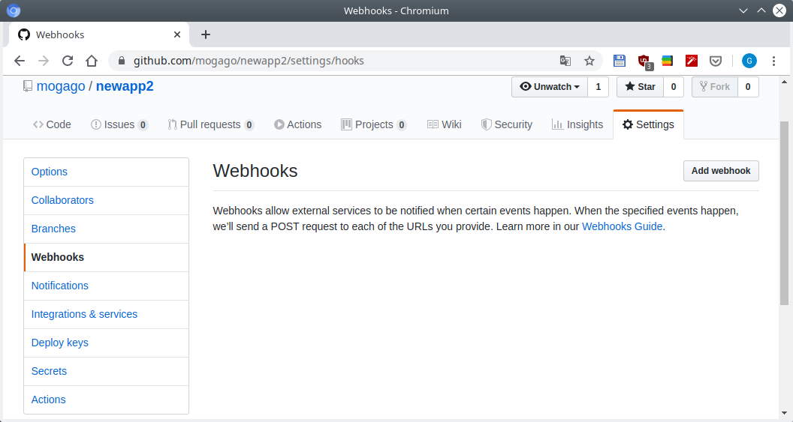
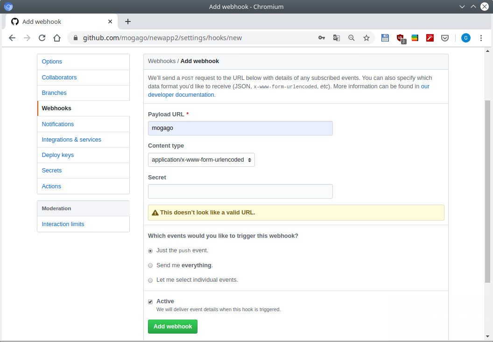
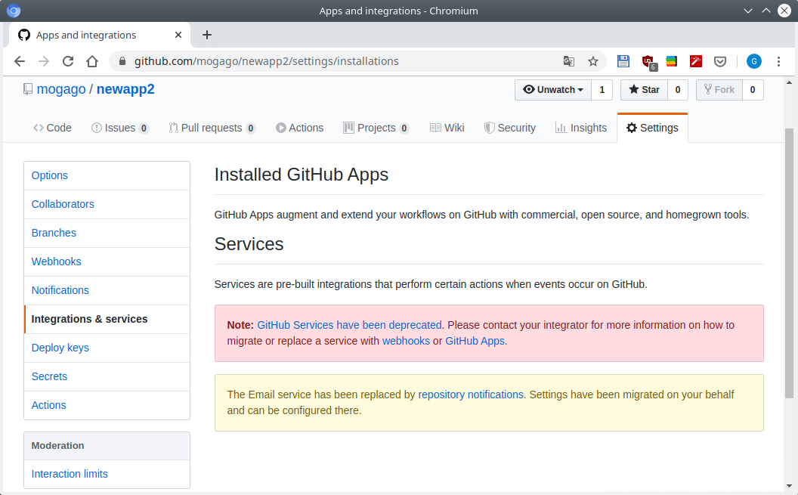
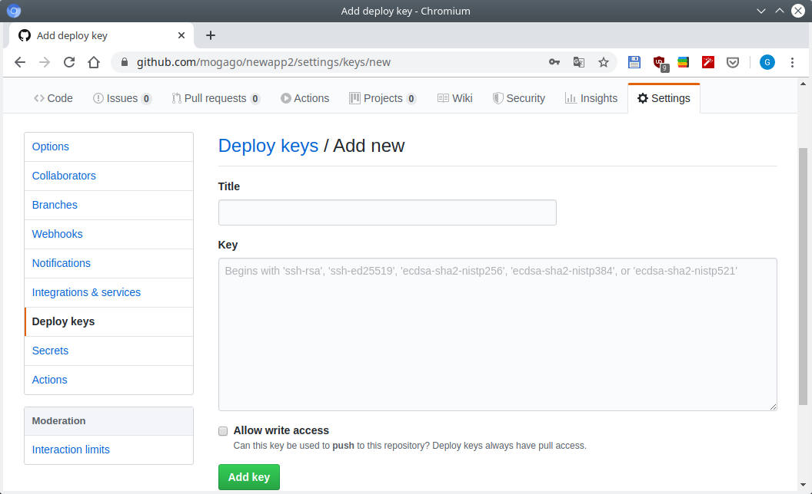

Lesson 9
========

*Lesson 9: Configuring a Project on GitHub*

.. contents:: Table of Contents

Basic configuration options and renaming on a repo
--------------------------------------------------

Veamos cómo se configura GitHub. En la opción :guilabel:`Settings` del proyecto podemos ver disitintas configuraciones. Por ejemplo podemos renombrar un repositorio:

    GitHub - Renaming a repo

Hemos renombrado el repositorio de GitHub de ``app2`` a ``newapp2`` pero aun así seríamos capaces de hacer ``push`` desde el terminal:

.. code-block:: bash

    $ cat .git/config 
    [core]
            repositoryformatversion = 0
            filemode = true
            bare = false
            logallrefupdates = true
    [remote "origin"]
            url = https://github.com/mogago/app2.git
            fetch = +refs/heads/*:refs/remotes/origin/*
    [branch "master"]
            remote = origin
            merge = refs/heads/master

Pensaríamos que al hacer un push a la dirección https://github.com/mogago/app2.git daría error pues ahora el repositorio apunta a https://github.com/mogago/newapp2 , sin embargo veremos que no encontraremos este problema:

.. code-block:: bash

    $ touch test.html
    $ git add .
    $ git commit -m "Whatever"
    [master 1d8cd6b] Whatever
    1 file changed, 0 insertions(+), 0 deletions(-)
    create mode 100644 test.html

    $ git push
    Username for 'https://github.com': mogago
    Password for 'https://mogago@github.com': 
    Counting objects: 3, done.
    Delta compression using up to 4 threads.
    Compressing objects: 100% (2/2), done.
    Writing objects: 100% (3/3), 267 bytes | 267.00 KiB/s, done.
    Total 3 (delta 1), reused 0 (delta 0)
    remote: Resolving deltas: 100% (1/1), completed with 1 local object.
    To https://github.com/mogago/app2.git
        42c4494..1d8cd6b  master -> master

En GitHub vemos que tenemos el archivo ``test.html`` creado a pesar del cambio de nombre:

    GitHub - Repo renamed

En :guilabel:`Settings` también podemos configurar Wikis, prender/apagar issues.

GitHub Pages
------------

GitHub Pages permite crear una página web de un proyecto que se ve mejor que una simple wiki.

Dentro de la opción :guilabel:`Settings` donde veremos la sección de **GitHub Pages**:

    GitHub - Settings, GitHub Pages

Al seleccionar :guilabel:`master branch` bajo la opción Source, tendremos otras opciones de selección como elegir un dominio personalizado:

    GitHub - GitHub Pages, branch ``master`` seleccionado

Además se habrá creado nuestra página web bajo la siguiente dirección: https://mogago.github.io/newapp2/

    GitHub - GitHub Pages webpage

En la sección de GitHub Pages podemos seleccionar un tema para la página web presionando el botón :guilabel:`Choose a theme`:

    GitHub - GitHub Pages themes

Seleccionar un tema de nuestro agrado y hacer clic en el botón :guilabel:`Select theme`.

Adding collaborators and integrations
-------------------------------------

Otra sección de :guilabel:`Settings` importante es la de :guilabel:`Collaborators`:

    GitHub - Añadir colaborador

Si hay otra persona que deseamos sea capaz de hacer ``push`` al repositorio debemos agregarlo a esta lista de colaboradores. (Referencia para agregar colaboradores en: sección :ref:`colaboradores` de :ref:`leccion-7`). Sin embargo ellos no podrán agregar nuevos colaboradores o cambiar configuraciones de administrador.

Otra parte importante de integración con GitHub es trabajar con **web hooks** y **services**. Estas son unas formas de integrar aplicaciones de terceros en nuestro proyecto de GitHub.

Podemos agregar un webhook, especificando una URL que usamos para que nos contacten. Si estamos buscando escribir nuestra propia aplicación y deseamos recibir notificaciones en tiempo real cuando algo sucede en nuestro repositorio de GitHub, esta sección es la que buscamos:

    GitHub webhooks

    GitHub webhooks

Si queremos integrar algo que ya ha sido construido, lo mejor será usar **Services**:

    GitHub service

Configuring deploy keys
-----------------------

La última sección de Settings que veremos es **Deploy keys**. Una de las formas que podemos lidiar con seguridad en GitHub es creando un **deploy key** para un repositorio en específico: 

    GitHub deploy keys

La razón por la que usaríamos esto, por ejemplo, sería cuando tengamos una aplicación que queramos que tenga acceso a este repositorio pero no a otros. Lo que haríamos es configurarlo con un deploy key (una llave SSH) e ingresaríamos esta información para que nuestro script tenga permisos para acceder y trabajar con ese repositorio en específico pero no con otros.
