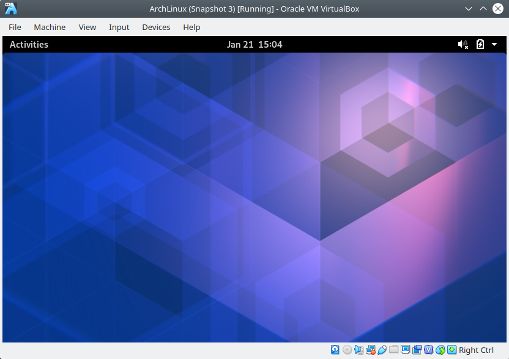

Instalar un Desktop Environment en Arch
=======================================

.. contents:: Table of Contents

Con el sistema operativo de Arch Linux instalado podemos agregarle un entorno de escritorio (dekstop environment) para tener una interfaz de usuario gráfica.

Existen varias alternativas de entornos de escritorio, pero los pasos de instalación son casi los mismos en todos.

Pre-requisitos
--------------

1. Usuario creado

Como pre-requisito, debemos tener un usuario creado con permisos de sudo.

2. **Display server (X server)**

Enlace entre software y hardware, permite a la PC mostrar las imágenes en pantalla y configurar la tarjeta gráfica de nuestra PC. La solución más popular en Linux es ``xorg``:

.. code-block:: bash

    '#' pacman -S xorg

Este comando instala 49 miembros en total (112 paquetes).

3. **Graphics driver**

El display server es inútil sin un graphics driver. Podemos instalar el driver específico de nuestro fabricante. Además podemos instalar un driver básico (``xf86-video-vesa``) si no estamos seguros de cual es nuestro fabricante de forma temporal, o si estamos en una VM, o como respaldo por si falla nuestro driver principal:

.. code-block:: bash

    # Vesa
    '#' pacman -S xf86-video-vesa
    # AMD
    '#' pacman -S xf86-video-amdgpu
    # Intel
    '#' pacman -S xf86-video-intel
    #Nvidia
    '#' pacman -S xf86-video-nouveau

4. **Display manager**

Es esencialmente nuestra pantalla de logueo. Inicia el **xorg display server** automáticamente para que no tenga que ser iniciado por línea de comandos cada vez que iniciamos el sistema. Nos provee con una lista de desktop environments instalados. La mayoría de desktop environments tiene un display manager recomendado a ser usado con él:

- KDE Plasma 5 - ``sddm``
- GNOME - ``gdm``
- LXDE - ``lxdm``
- Universal Display Manager - ``lightdm``, ``mdm-display-manager``, ``slim``, ``xorg-xdm``

.. Note::

    En teoría podemos cualquier display manager podría funcionar con cualquier desktop environment, sin embargo, es más fácil instalar el que corresponde a nuestro desktop environment.

Para instalar GNOME:

.. code-block:: bash

    '#' pacman -S gdm

Instalando el Desktop Environment
---------------------------------

1. Para instalar el desktop environment necesitamos instalar el grupo que contiene los paquetes para el desktop environment mismo. Los grupos que contienen los respectivos desktop environments son:

- KDE Plasma 5 - ``plasma``
- Cinnamon - ``cinnamon``
- GNOME - ``gnome``
- LXDE - ``lxde``
- MATE - ``mate``
- Xfce - ``xfce4``

El grupo que contiene los paquetes del desktop environment GNOME es ``gnome``:

.. code-block:: bash

    '#' pacman -S gnome

Por defecto, solo instala el desktop environment mínimo y no muchas aplicaciones.

2. La mayoría desktop environments tienen otro grupo con un conjunto de aplicaciones que podemos instalar junto con el desktop environment. Obtenemos programas como administradores de archivos, un terminal y media player.

- KDE Plasma 5 - ``kde-applications``
- Cinnamon - N/A (``nemo-fileroller``)
- GNOME - ``gnome-extra``
- LXDE - N/A
- MATE - ``mate-extra``
- Xfce - ``xfce4-goodies``

.. code-block:: bash

    '#' pacman -S gnome-extra

3. Habilitar el boot manager para que inicie automáticamente en el arranque del sistema:

.. code-block:: bash

    '#' systemctl enable gdm
    Created symlink /etc/systemd/system/display-manager.service → /usr/lib/systemd/system/gdm.service.

4. Reiniciar el sistema

    Arch Linux - GNOME Desktop environment

Referencias
-----------

- `How to Install a Desktop Environment in Arch Linux`_
- `Graphical user interface`_
- `Desktop environment`_

.. _How to Install a Desktop Environment in Arch Linux: https://www.youtube.com/watch?v=P4IV5BYPiPs
.. _Graphical user interface: https://wiki.archlinux.org/index.php/General_recommendations#Graphical_user_interface
.. _Desktop environment: https://wiki.archlinux.org/index.php/Desktop_environment: https://wiki.archlinux.org/index.php/Desktop_environment
