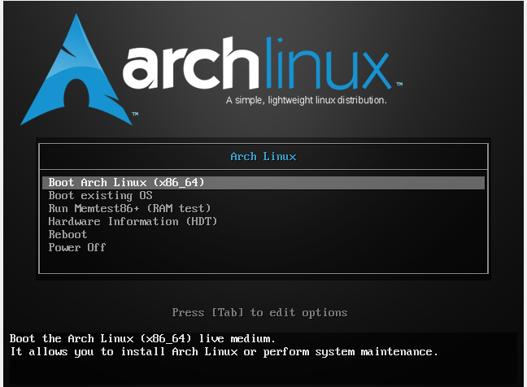

Instalando Arch en un dispositivo USB
=====================================

.. contents:: Table of Contents

El procedimiento para instalar Arch Linux en un dispositivo de almacenamiento USB comparte varios pasos con el procedimiento general de instalar Arch Linux en una PC (ver :ref:`installingarch`).

Requisitos:

- Debemos contar con una PC habilitada para cambiar el orden de arranque de los dispositivos de almacenamiento conectados (disco duro, USB, CD-ROM).
- 2 USB vacíos: en uno crearemos el medio de instalación .iso booteable (**live USB**) y el el otro instalaremos el SO en sí (**persistent USB**).
- Una imagen ISO de Arch Linux descargada (`página de descargas de Arch Linux`_)

.. _página de descargas de Arch Linux: https://www.archlinux.org/download/

Creando un medio de instalación
-------------------------------

En un USB de poca capacidad (p.ej. 8 GB) escribiremos la imagen ISO de Arch Linux, de forma que sirva como medio de instalación del SO.

Para escrbir un medio de instalación USB booteable sigamos los siguientes pasos:

- En Linux:

1. Conectar el live USB a la PC y desmontarlo:

.. code-block:: bash

    # umount /dev/sdXn
    '#' umount /dev/sdb1

2. Escribir el medio de instalación en el USB live:

.. code-block:: bash

    # dd bs=4M if=/path/archlinux.iso of=/dev/sdX status=progress && sync
    '#' dd bs=4M if=/home/gabriel/Downloads/archlinux-2020.01.01-x86_64.iso of=/dev/sdb status=progress && sync

.. Note::

    - ``if=/path/archlinux.iso``: es la ruta hacia la imagen ISO
    - ``of=/dev/sdX``: es el dispositivo USB (sdb, sdc, sdd, ...)

- En Windows:

Podemos usar programas como `Rufus`_, `Universal USB Installer`_ o `YUMI`_.

.. _Rufus: https://rufus.ie/
.. _Universal USB Installer: https://www.pendrivelinux.com/universal-usb-installer-easy-as-1-2-3/
.. _YUMI: https://www.pendrivelinux.com/yumi-multiboot-usb-creator/

Luego de este paso ya deberíamos tener un USB live con el medio de instalación de Arch Linux booteable. Ahora lo arranqueremos en nuestra máquina.

Arrancar el medio de instalación ISO live
-----------------------------------------

.. Important::

    En la BIOS o UEFI del sistema debemos cambiar el orden de arranque de los dispositivos y poner con mayor prioridad a los puertos USB. Según el modelo de la computadora, los pasos serán distintos. Seguir la referencia: `BIOS-UEFI - Boot from a CD DVD USB Drive or SD Card`_

.. _BIOS-UEFI - Boot from a CD DVD USB Drive or SD Card: https://www.groovypost.com/howto/bios-uefi-setup-guide-boot-from-cd-dvd-usb-drive-sd-card/

1. Con la PC apagada, insertar el USB live en la computadora.

2. Si hemos cambiado el orden de los dispositivos en la BIOS o UEFI, arrancará el medio USB.

3. En el menú bootloader elegir la opción :guilabel:`Boot Arch Linux (x86_64)`. Arrancará el medio de instalación de Arch Linux

    Live ISO image de Arch Linux

Cuando haya terminado de cargar el arranque de la imagen iniciaremos sesión automáticamente como usuarios ``root`` bajo el prompt:

.. code-block:: bash

    root@archiso ~ '#'

Proceso de instalación de Arch Linux
------------------------------------

Conexión a Internet
'''''''''''''''''''

Por defecto, el medio de instalación de Arch Linux reconocerá las interfaces de red que tengamos en el enlace, ya sea una interfaz de red cableada o inalámbrica. Sin embargo, el uso de ambas interfaces en el proceso de instalación es distinto.

La conexión recomendada es a través de una red cableada debido a la mayor velocidad y la configuración de red automática.

Conexión Cableada
"""""""""""""""""

Si tenemos una interfaz física cableada conectada a la red local, donde existe un servidor DHCP configurado, recibiremos la configuración de red automáticamente al arrancar el medio de instalación. Comprobar la conectividad a Internet con:

.. code-block:: bash

    '#' ping archlinux.org

En caso que tengamos problemas de conexión a la red cableada debemos hacer troubleshooting con los comandos ``ip`` y ``dhclient``.

Conexión Inalámbrica
""""""""""""""""""""

1. La mayoría de interfaces inalámbricas son soportadas por los drivers en el medio de instalación ISO. Para comprobar que nuestro sistema es compatible, revisar que los drivers del kernel se hayan cargado para la interfaz inalámbrica:

.. code-block:: bash

    '#' lspci -k | grep -A3 'Network controller'

2. Si los drives han cargado, levantar la interfaz inalámbrica:

.. code-block:: bash

    '#' ip link set dev wlan0 up

3. Escanear redes disponibles:

.. code-block:: bash

    '#' iw dev wlan0 scan | grep 'SSID:'

4. Revisar qué tipo de autenticación es requerida por la red a la que nos deseamos conectar:

.. code-block:: bash

    '#' iw dev wlan0 scan | less 

5. Según el tipo de seguridad en la red inalámbrica usar el correspondiente comando:

- Red inalámbrica con encriptación WPA/WPA2:

.. code-block:: bash

    '#' wpa_supplicant -i wlan0 -c <(wpa_passphrase 'networkname' 'password')

- Red inalámbrica con encriptación WEP:

.. code-block:: bash

    '#' iw dev wlan0 connect 'networkname' key 0:'password'

- Red inalámbrica sin encriptación:

.. code-block:: bash

    '#' iw dev wlan0 connect 'networkname'

6. Una vez que se ha establecido conexión bifurcar el proceso presionando Ctrl+Z (suspende el proceso) y ejecutando:

.. code-block:: bash

    '#' bg

7. Recibir configuración de red por DHCP:

.. code-block:: bash

    '#' dhclient -v wlan0

Pre-instalación
'''''''''''''''

1. Configurar la distribución del teclado (keyboard layout) a español:

.. code-block:: bash

    '#' loadkeys la-latin1

2. Comprobar conectividad a Internet:

.. code-block:: bash

    '#' ping archlinux.org

3. Actualizar el reloj del sistema

.. code-block:: bash

    '#' timedatectl set-ntp true
    '#' timedatectl set-timezone America/Lima
    '#' timedatectl status

                              Local time: Mon 2020-01-20 15:58:09 -05
                          Universal time: Mon 2020-01-20 20:58:09 UTC
                                RTC time: Mon 2020-01-20 20:58:09
                               Time zone: America/Lima (-05, -0500)
               System clock synchronized: yes
        systemd-timesyncd.service active: yes
                         RTC in local TZ: no

4. Reconocer el medio USB donde instalaremos el SO:

4.1 Listar dispositivos y particiones identificados en el sistema (con ``lblk`` o ``fdisk``):

.. code-block:: bash

    '#' lsblk

    NAME   MAJ:MIN RM   SIZE RO TYPE MOUNTPOINT
    loop0    7:0    0 541.5M  1 loop /run/archiso/sfs/airootfs
    sda      8:0    0 232.9G  0 disk 
    ├─sda1   8:1    0   549M  0 part 
    ├─sda2   8:2    0 144.5G  0 part 
    ├─sda3   8:3    0  83.8G  0 part 
    ├─sda4   8:4    0     1K  0 part 
    └─sda5   8:5    0   4.1G  0 part 
    sdb      8:16   1  58.8G  0 disk 
    ├─sdb1   8:17   1   656M  0 part /run/archiso/bootmnt
    └─sdb2   8:18   1    64M  0 part 
    sr0     11:0    1  1024M  0 rom

4.2 Conectar a la PC el medio de almacenamiento USB donde instalaremos el SO.

4.3 Volver a correr el comando para listar los medios de almacenamiento conectados a la PC y ver cual es el nuevo dispositivo en la lista:

.. code-block:: bash
    :emphasize-lines: 14,15

    '#' lsblk

    NAME   MAJ:MIN RM   SIZE RO TYPE MOUNTPOINT
    loop0    7:0    0 541.5M  1 loop /run/archiso/sfs/airootfs
    sda      8:0    0 232.9G  0 disk 
    ├─sda1   8:1    0   549M  0 part 
    ├─sda2   8:2    0 144.5G  0 part 
    ├─sda3   8:3    0  83.8G  0 part 
    ├─sda4   8:4    0     1K  0 part 
    └─sda5   8:5    0   4.1G  0 part 
    sdb      8:16   1  58.8G  0 disk 
    ├─sdb1   8:17   1   656M  0 part /run/archiso/bootmnt
    └─sdb2   8:18   1    64M  0 part 
    sdc      8:32   0 111.8G  0 disk 
    └─sdc1   8:33   0 111.8G  0 part 
    sr0     11:0    1  1024M  0 rom

Vemos que tenemos un nuevo dispositivo ``sdc`` en nuestra lista. Esta unidad es el USB que hemos conectado recientemente y donde haremos la instalación del SO.

5. Para realizar la partición del medio de almacenamiento usaremos dos herramientas: ``gdisk`` y ``fdisk``.

Deseamos el siguiente esquema de particiones:

- Partición 1:
    - Con ``gdisk``
    - Size: 10 MB
    - Type: BIOS boot partition (``ef02``)
- Partición 2:
    - Con ``gdisk``
    - Size: 500 MB
    - Type: EFI System (``ef00``)
- Partición 3:
    - Con ``gdisk``
    - Size: 70GB / 110 GB
    - Type: Linux filesystem (``8300``)
- Partición 4:
    - Con ``fdisk``
    - Size: 40GB / 110 GB
    - Type: HPFS/NTFS/exFAT (``7``)

5.1 Primero eliminar todas las particiones del USB con ``gdisk``:

.. code-block:: bash

    '#' gdisk /dev/sdc

    GPT fdisk (gdisk) version 1.0.4

    Partition table scan:
    MBR: MBR only
    BSD: not present
    APM: not present
    GPT: not present

    Found invalid GPT and valid MBR; converting MBR to GPT format
    in memory. THIS OPERATION IS POTENTIALLY DESTRUCTIVE! Exit by
    typing 'q' if you dont want to convert your MBR partitions
    to GPT format!

    Command (? for help): d
    Using 1

    Command (? for help): d
    No partitions

.. Note::

    - Opciones de ``gdisk``:

    .. code-block:: bash

        Command (? for help): ?
        b   back up GPT data to a file
        c   change a partition s name
        d   delete a partition
        i   show detailed information on a partition
        l   list known partition types
        n   add a new partition
        o   create a new empty GUID partition table (GPT)
        p   print the partition table
        q   quit without saving changes
        r   recovery and transformation options (experts only)
        s   sort partitions
        t   change a partition s type code
        v   verify disk
        w   write table to disk and exit
        x   extra functionality (experts only)
        ?   print this menu        

    - Lista de tipos de formato en ``gdisk``:

    .. code-block:: bash

        Command (? for help): L
        Type search string, or <Enter> to show all codes: 
        0700 Microsoft basic data  0c01 Microsoft reserved    2700 Windows RE          
        3000 ONIE boot             3001 ONIE config           3900 Plan 9              
        4100 PowerPC PReP boot     4200 Windows LDM data      4201 Windows LDM metadata
        4202 Windows Storage Spac  7501 IBM GPFS              7f00 ChromeOS kernel     
        7f01 ChromeOS root         7f02 ChromeOS reserved     8200 Linux swap          
        8300 Linux filesystem      8301 Linux reserved        8302 Linux /home         
        8303 Linux x86 root (/)    8304 Linux x86-64 root (/  8305 Linux ARM64 root (/)
        8306 Linux /srv            8307 Linux ARM32 root (/)  8308 Linux dm-crypt      
        8309 Linux LUKS            8400 Intel Rapid Start     8e00 Linux LVM           
        a000 Android bootloader    a001 Android bootloader 2  a002 Android boot 1      
        a003 Android recovery 1    a004 Android misc          a005 Android metadata    
        a006 Android system 1      a007 Android cache         a008 Android data        
        a009 Android persistent    a00a Android factory       a00b Android fastboot/ter
        a00c Android OEM           a00d Android vendor        a00e Android config      
        a00f Android factory (alt  a010 Android meta          a011 Android EXT         
        a012 Android SBL1          a013 Android SBL2          a014 Android SBL3        
        a015 Android APPSBL        a016 Android QSEE/tz       a017 Android QHEE/hyp    
        a018 Android RPM           a019 Android WDOG debug/s  a01a Android DDR         
        a01b Android CDT           a01c Android RAM dump      a01d Android SEC         
        a01e Android PMIC          a01f Android misc 1        a020 Android misc 2      
        a021 Android device info   a022 Android APDP          a023 Android MSADP       
        a024 Android DPO           a025 Android recovery 2    a026 Android persist     
        a027 Android modem ST1     a028 Android modem ST2     a029 Android FSC         
        a02a Android FSG 1         a02b Android FSG 2         a02c Android SSD         
        a02d Android keystore      a02e Android encrypt       a02f Android EKSST       
        a030 Android RCT           a031 Android spare1        a032 Android spare2      
        a033 Android spare3        a034 Android spare4        a035 Android raw resource
        a036 Android boot 2        a037 Android FOTA          a038 Android system 2    
        a039 Android cache         a03a Android user data     a03b LG (Android) advance
        a03c Android PG1FS         a03d Android PG2FS         a03e Android board info  
        a03f Android MFG           a040 Android limits        a200 Atari TOS basic data
        a500 FreeBSD disklabel     a501 FreeBSD boot          a502 FreeBSD swap        
        a503 FreeBSD UFS           a504 FreeBSD ZFS           a505 FreeBSD Vinum/RAID  
        a580 Midnight BSD data     a581 Midnight BSD boot     a582 Midnight BSD swap   
        a583 Midnight BSD UFS      a584 Midnight BSD ZFS      a585 Midnight BSD Vinum  
        a600 OpenBSD disklabel     a800 Apple UFS             a901 NetBSD swap         
        a902 NetBSD FFS            a903 NetBSD LFS            a904 NetBSD concatenated 
        a905 NetBSD encrypted      a906 NetBSD RAID           ab00 Recovery HD         
        af00 Apple HFS/HFS+        af01 Apple RAID            af02 Apple RAID offline  
        af03 Apple label           af04 AppleTV recovery      af05 Apple Core Storage  
        af06 Apple SoftRAID Statu  af07 Apple SoftRAID Scrat  af08 Apple SoftRAID Volum
        af09 Apple SoftRAID Cache  af0a Apple APFS            b300 QNX6 Power-Safe     
        bc00 Acronis Secure Zone   be00 Solaris boot          bf00 Solaris root        
        bf01 Solaris /usr & Mac Z  bf02 Solaris swap          bf03 Solaris backup      
        bf04 Solaris /var          bf05 Solaris /home         bf06 Solaris alternate se
        bf07 Solaris Reserved 1    bf08 Solaris Reserved 2    bf09 Solaris Reserved 3  
        bf0a Solaris Reserved 4    bf0b Solaris Reserved 5    c001 HP-UX data          
        c002 HP-UX service         e100 ONIE boot             e101 ONIE config         
        ea00 Freedesktop $BOOT     eb00 Haiku BFS             ed00 Sony system partitio
        ed01 Lenovo system partit  ef00 EFI System            ef01 MBR partition scheme
        ef02 BIOS boot partition   f800 Ceph OSD              f801 Ceph dm-crypt OSD   
        f802 Ceph journal          f803 Ceph dm-crypt journa  f804 Ceph disk in creatio
        f805 Ceph dm-crypt disk i  f806 Ceph block            f807 Ceph block DB       
        f808 Ceph block write-ahe  f809 Ceph lockbox for dm-  f80a Ceph multipath OSD  
        f80b Ceph multipath journ  f80c Ceph multipath block  f80d Ceph multipath block
        f80e Ceph multipath block  f80f Ceph multipath block  f810 Ceph dm-crypt block 
        f811 Ceph dm-crypt block   f812 Ceph dm-crypt block   f813 Ceph dm-crypt LUKS j
        f814 Ceph dm-crypt LUKS b  f815 Ceph dm-crypt LUKS b  f816 Ceph dm-crypt LUKS b
        f817 Ceph dm-crypt LUKS O  fb00 VMWare VMFS           fb01 VMWare reserved     
        fc00 VMWare kcore crash p  fd00 Linux RAID

5.2 Crear una nueva ``GUID partition table (GPT)`` con la opción ``o``:

.. code-block:: bash

    Command (? for help): o
    This option deletes all partitions and creates a new protective MBR.
    Proceed? (Y/N): y

5.3 Crear las primeras tres particiones con la opción ``n`` de gdisk:

Referencia: `MBR vs GPT y BIOS vs UEFI`_

.. _MBR vs GPT y BIOS vs UEFI: https://wiki.manjaro.org/index.php?title=Some_basics_of_MBR_v/s_GPT_and_BIOS_v/s_UEFI

- Primero creamos una partición el Master Boot Record (MBR) de 10 MB al inicio de la memoria:

.. code-block:: bash

    Command (? for help): n
    Partition number (1-128, default 1): 
    First sector (34-234441614, default = 2048) or {+-}size{KMGTP}: 
    Last sector (2048-234441614, default = 234441614) or {+-}size{KMGTP}:+10MB   
    Current type is 'Linux filesystem'
    Hex code or GUID (L to show codes, Enter = 8300): EF02
    Changed type of partition to 'BIOS boot partition'

- Luego creamos una partición EFI de 500 MB:

.. code-block:: bash

    Command (? for help): n
    Partition number (2-128, default 2):      
    First sector (34-234441614, default = 22528) or {+-}size{KMGTP}: 
    Last sector (22528-234441614, default = 234441614) or {+-}size{KMGTP}: +500MB
    Current type is 'Linux filesystem'
    Hex code or GUID (L to show codes, Enter = 8300): EF00
    Changed type of partition to 'EFI System'

- Finalmente, asignamos espacio para la partición Linux donde instalaremos el SO:

.. code-block:: bash

    Command (? for help): n       
    Partition number (3-128, default 3): 
    First sector (34-234441614, default = 1046528) or {+-}size{KMGTP}: 
    Last sector (1046528-234441614, default = 234441614) or {+-}size{KMGTP}: +70G
    Current type is 'Linux filesystem'
    Hex code or GUID (L to show codes, Enter = 8300): 
    Changed type of partition to 'Linux filesystem'

5.4 Revisar que la tabla de particiones sea correcta:

.. code-block:: bash

    Command (? for help): p
    Disk /dev/sdc: 234441648 sectors, 111.8 GiB
    Model: 550             
    Sector size (logical/physical): 512/4096 bytes
    Disk identifier (GUID): 006577F7-F6D7-4A6D-96A3-8CB841B35647
    Partition table holds up to 128 entries
    Main partition table begins at sector 2 and ends at sector 33
    First usable sector is 34, last usable sector is 234441614
    Partitions will be aligned on 2048-sector boundaries
    Total free space is 86596461 sectors (41.3 GiB)

    Number  Start (sector)    End (sector)  Size       Code  Name
        1            2048           22527   10.0 MiB    EF02  BIOS boot partition
        2           22528         1046527   500.0 MiB   EF00  EFI System
        3         1046528       147847167   70.0 GiB    8300  Linux filesystem

5.5 Guardar los cambios realizados en el dispositivo de almacenamiento USB:

.. code-block:: bash

    Command (? for help): w

    Final checks complete. About to write GPT data. THIS WILL OVERWRITE EXISTING
    PARTITIONS!!

    Do you want to proceed? (Y/N): y
    OK; writing new GUID partition table (GPT) to /dev/sdc.
    The operation has completed successfully.

5.6 Haremos una última partición con ``fdisk`` para usarla como almacenamiento común (como si conectáramos un USB a la PC):

.. code-block:: bash

    '#' fdisk /dev/sdc

    Welcome to fdisk (util-linux 2.34).
    Changes will remain in memory only, until you decide to write them.
    Be careful before using the write command.

    Command (m for help): p
    Disk /dev/sdc: 111.81 GiB, 120034123776 bytes, 234441648 sectors
    Disk model: 550             
    Units: sectors of 1 * 512 = 512 bytes
    Sector size (logical/physical): 512 bytes / 4096 bytes
    I/O size (minimum/optimal): 4096 bytes / 4096 bytes
    Disklabel type: gpt
    Disk identifier: 006577F7-F6D7-4A6D-96A3-8CB841B35647

    Device       Start       End   Sectors  Size Type
    /dev/sdc1     2048     22527     20480   10M BIOS boot
    /dev/sdc2    22528   1046527   1024000  500M EFI System
    /dev/sdc3  1046528 147847167 146800640   70G Linux filesystem

Para crear una partición que se use como almacenamiento simple, le daremos el tipo **NTFS**:

.. Error::

    El type ``7`` debería pertenecer a ``HPFS/NTFS/exFAT``. Comprobar esto usando el parámetro ``t`` de ``fdisk``.

.. code-block:: bash
    :emphasize-lines: 4,10,12,27

    Command (m for help): n
    Partition number (4-128, default 4): 
    First sector (147847168-234441614, default 147847168): 
    Last sector, +/-sectors or +/-size{K,M,G,T,P} (147847168-234441614, default 234441614): +40G

    Created a new partition 4 of type 'Linux filesystem' and of size 40 GiB.

    Command (m for help): t
    Partition number (1-4, default 4): 4
    Partition type (type L to list all types): 7

    Changed type of partition 'Linux filesystem' to 'PowerPC PReP boot'.

    Command (m for help): p
    Disk /dev/sdc: 111.81 GiB, 120034123776 bytes, 234441648 sectors
    Disk model: 550             
    Units: sectors of 1 * 512 = 512 bytes
    Sector size (logical/physical): 512 bytes / 4096 bytes
    I/O size (minimum/optimal): 4096 bytes / 4096 bytes
    Disklabel type: gpt
    Disk identifier: 006577F7-F6D7-4A6D-96A3-8CB841B35647

    Device         Start       End   Sectors  Size Type
    /dev/sdc1       2048     22527     20480   10M BIOS boot
    /dev/sdc2      22528   1046527   1024000  500M EFI System
    /dev/sdc3    1046528 147847167 146800640   70G Linux filesystem
    /dev/sdc4  147847168 231733247  83886080   40G PowerPC PReP boot

    Command (m for help): w
    The partition table has been altered.
    Calling ioctl() to re-read partition table.
    Syncing disks.

5.7 Listar las particiones de la unidad de almacenamiento para confirmar que hemos creado las particiones correctamente:

    '#' lsblk /dev/sdc
    NAME   MAJ:MIN RM   SIZE RO TYPE MOUNTPOINT
    sdc      8:32   0 111.8G  0 disk 
    ├─sdc1   8:33   0    10M  0 part 
    ├─sdc2   8:34   0   500M  0 part 
    ├─sdc3   8:35   0    70G  0 part 
    └─sdc4   8:36   0    40G  0 part

6. Formatear las particiones creadas:

.. Caution::

    La partición ``sdc1`` que contiene a la información de BIOS/MBR no será formateada.

6.1 Formatear la partición EFI ``sdc2`` con un filesystem ``FAT32``:

.. code-block:: bash

    '#' mkfs.fat -F32 /dev/sdc2
    mkfs.fat 4.1 (2017-01-24)

6.2 Formatear la partición Linux ``sdc3`` como filesystem ``ext4``:

.. code-block:: bash

    '#' mkfs.ext4 /dev/sdc3
    mke2fs 1.45.4 (23-Sep-2019)
    Creating filesystem with 18350080 4k blocks and 4587520 inodes
    Filesystem UUID: c99ccd7a-d73d-42f3-ac3e-cd92156a6c96
    Superblock backups stored on blocks: 
        32768, 98304, 163840, 229376, 294912, 819200, 884736, 1605632, 2654208, 
        4096000, 7962624, 11239424

    Allocating group tables: done
    Writing inode tables: done
    Creating journal (131072 blocks): done
    Writing superblocks and filesystem accounting information: done

6.3 Formatear la partción ``sdc4`` como filesystem NTFS:

.. code-block:: bash

    '#' mkfs.ntfs -f /dev/sdc4

    Cluster size has been automatically set to 4096 bytes.
    Creating NTFS volume structures.
    mkntfs completed successfully. Have a nice day.

7. Montar el filesystem de las 3 particiones formateadas:

.. code-block:: bash

    '#' mkdir -p /mnt/usb
    '#' mount /dev/sdc3 /mnt/usb 

    '#' mkdir /mnt/usb/boot
    '#' mount /dev/sdc2 /mnt/usb/boot

    '#' mkdir /mnt/storage
    '#' mount /dev/sdc4 /mnt/storage

Instalación
'''''''''''

1. Seleccionar los mirrors. En el archivo ``/etc/pacman.d/mirrorlist`` definimos la lista de servidores mirror de donde se descargarán los paquetes. Eliminar servidores que no deseemos con un editor de texto (``vim`` o ``nano``):

.. Note::

    En el archivo ``/etc/pacman.d/mirrorlist`` donde se listan los mirrors, cuanto más arriba se posicione un mirror en la lista, más prioridad tendrá al descargar un paquete.

.. code-block:: bash

    '#' vim /etc/pacman.d/mirrorlist

.. code-block:: bash

    '#' cat /etc/pacman.d/mirrorlist 
    ##
    ## Arch Linux repository mirrorlist
    ## Filtered by mirror score from mirror status page
    ## Generated on 2020-01-01
    ##

    ## United States
    Server = http://mirror.dal10.us.leaseweb.net/archlinux/$repo/os/$arch
    ## United States
    Server = http://archlinux.surlyjake.com/archlinux/$repo/os/$arch
    ## United States
    Server = http://ca.us.mirror.archlinux-br.org/$repo/os/$arch
    ## United States
    Server = http://mirror.kaminski.io/archlinux/$repo/os/$arch

2. Instalar paquetes esenciales del sistema Arch Linux

.. code-block:: bash

    '#' pacstrap /mnt/usb base linux linux-firmware

Configurar el sistema
'''''''''''''''''''''

1. Generar un archivo fstab (filesystem table) para montar correctamente las particiones:

El archivo fstab (ver `Wikipedia - fstab`_) es usado en sistemas Linux para montar correctamente las particiones de disco correctamente al momento del arranque. Estas particioens pueden identificarse en el fstab de diferentes maneras, y algunos métodos aún usan las etiquetas estándar (``/dev/...``), en lugar de UUIDs (ver `Wikipedia - Universally unique identifier`_). Esto será de seguro un punto de falla de una instalación en un USB, pues las etiquetas estándar asignadas para dispositivos removibles no son consistentes luego de cada arranque del sistema.

.. _Wikipedia - fstab: https://en.wikipedia.org/wiki/Fstab
.. _Wikipedia - Universally unique identifier: https://en.wikipedia.org/wiki/Universally_unique_identifier

.. code-block:: bash

    '#' genfstab -U /mnt/usb >> sudo /mnt/usb/etc/fstab

Nuestro dispositivo USB debe contener ahora un sistema Linux permanente. Pero aún nos falta configurar algunas cosas antes de que inicie por sí mismo.

2. Cambiar root (``chroot``) en el nuevo sistema:

Más `información de chroot de Wiki de Arch`_.

.. _información de chroot de Wiki de Arch: https://wiki.archlinux.org/index.php/Chroot

.. code-block:: bash

    root@archiso ~ '#' arch-chroot /mnt/usb
    [root@archiso /]'#'

3. Configurar el time zone:

.. code-block:: bash

    '#' ln -sf /usr/share/zoneinfo/America/Lima /etc/localetime
    '#' hwclock --systohc

4. Instalar un editor de texto en el entorno chroot (`comandos no encontrados en chroot`_):

.. code-block:: bash

    '#' pacman -S vim

.. _comandos no encontrados en chroot: https://superuser.com/questions/1499709/nano-command-not-found-after-entering-chroot-during-arch-install

5. Localización. 

5.1 Descomentar la línea ``es_PE.UTF-8 UTF-8`` del archivo ``/etc/locale.gen``:

.. code-block:: bash
    :emphasize-lines: 7,11

    '#' vim /etc/locale.gen

    '#' cat /etc/locale.gen
        
        ...
        #en_SG.UTF-8 UTF-8
        en_US.UTF-8 UTF-8
        #en_US ISO-8859-1
        ...
        #es_PA ISO-8859-1
        es_PE.UTF-8 UTF-8
        #es_PE ISO-8859-1
        ...

5.2 Generar archivos de locación en base al archivo ``/etc/locale.gen``:

.. code-block:: bash

    '#' locale-gen
    
    Generating locales...
    en_US.UTF-8... done
    es_PE.UTF-8... done
    Generation complete.

5.3 Crear el archivo ``locale.conf`` con la variable ``LANG`` (``LANG=en_US.UTF-8`` para idioma inglés y ``LANG=es_PE.UTF-8`` para español):

.. code-block:: bash

    '#' echo LANG=en_US.UTF-8 > /etc/locale.conf # export LANG=en_US.UTF-8
    
    '#' cat /etc/locale.conf

        LANG=en_US.UTF-8

5.4 Para realizar los cambios hechos anteriormente del keyboard layout, editar el archivo ``/etc/vconsole.conf``:

.. code-block:: bash

    '#' vim /etc/vconsole.conf

    '#' cat /etc/vconsole.conf

        KEYMAP=la-latin1

6. Configuración de red

6.1 Crear el archivo ``/etc/hostname``:

.. code-block:: bash

    '#' echo arch > /etc/hostname
    '#' cat /etc/hostname
    
        arch

6.2 Editar el archivo ``/etc/hosts/`` y agregar 3 líneas:

.. code-block:: bash

    '#' vim /etc/hosts
    '#' cat /etc/hosts
    
        127.0.0.1	localhost
        ::1		    localhost
        127.0.1.1	arch.localdomain	arch

7. Configurar una contraseña root:

.. code-block:: bash

    '#' passwd

        New password:
        Retype new password:
        passwd: password updated successfully

8. Bootloader. Para permitir que el dispositivo USB arranque en ambos modos (BIOS y UEFI), necesitamos instalar 2 bootloader. Por facilidad de instalación, instalaremos GRUB para ambos modos:

8.1 Descargar los paquetes de ``grub`` y ``efibootmgr``:

.. code-block:: bash

    '#' pacman -S grub efibootmgr

8.2 Ver los block devices para determinar el dispositivo USB objetivo:

.. code-block:: bash

    '#' lsblk

El dispositivo USB es ``/dev/sdX`` sin ningún número.

8.3 Configurar GRUB para el **modo de arranque MBR/BIOS**:

.. code-block:: bash

    '#' grub-install --target=i386-pc --boot-directory /boot /dev/sdc

8.4 Configurar GRUB para el **modo de arranque UEFI**:

.. code-block:: bash

    '#' grub-install --target=x86_64-efi --efi-directory /boot --boot-directory /boot --removable
    Installing for x86_64-efi platform.
    Installation finished. No error reported.

8.5 Generar una configuración GRUB:

.. code-block:: bash

    '#' grub-mkconfig -o /boot/grub/grub.cfg
    Generating grub configuration file ...
    Found linux image: /boot/vmlinuz-linux
    Found initrd image: /boot/initramfs-linux.img
    Found fallback initrd image(s) in /boot: initramfs-linux-fallback.img
    done

9. Habilitar el servicio de DHCP ``dhcpcd``:

.. code-block:: bash

    '#' pacman -S dhcpcd

    '#' systemctl enable dhcpcd
    Created symlink /etc/systemd/system/multi-user.target.wants/dhcpcd.service → /usr/lib/systemd/system/dhcpcd.service.

Cuando reiniciemos nuestro SO recién instalado, debería habilitar DHCP automáticamente.

10. Crear un nuevo usuario con permisos de sudo:

.. code-block:: bash

    '#' useradd -md /home/user1 -s /bin/bash user1
    '#' passwd user1
    '#' usermod -aG wheel user1

    '#' pacman -S sudo
    '#' visudo /etc/sudoers

            root ALL=(ALL) ALL

            ## Uncomment to allow members of group wheel to execute any command
            %wheel ALL=(ALL) ALL

11. Salir de chroot y apagar el sistema:

.. code-block:: bash

    [root@archiso /]# exit
    root@archiso ~ # umount /mnt/usb/boot /mnt/usb
    root@archiso ~ # poweroff

Al volver a iniciar el sistema, si tenemos el arranque de dispositivos USB con prioridad, arrancará nuestro USB con el sistema operativo Linux.