Instalando Arch
===============

.. contents:: Table of Contents

El siguiente procedimiento se basa en la `guía de instalación oficial de la Wiki de Arch Linux`_. Los pasos describen **cómo instalar el sistema operativo (SO) Arch Linux desde un sistema live que haya arrancado con la imagen de instalación oficial**.

Los requerimientos necesarios en el sistema donde instalaremos Arch Linux es que debe ser compatible con la arquitectura x86_64, debe contar con un mínimo de 512 MiB de RAM, deben haber 800 MiB libres de espacio en el disco (lo que ocupa aproximadamente una instalación básica de Arch Linux) y conectividad a Internet para obtener paquetes de repositorios externos.

Para obtener una imagen .iso de Arch Linux podemos descargar un torrent desde la `página de descargas de Arch Linux`_.

.. _guía de instalación oficial de la Wiki de Arch Linux: https://wiki.archlinux.org/index.php/Installation_guide
.. _página de descargas de Arch Linux: https://www.archlinux.org/download/

Creando y configurando el sistema
---------------------------------

En este caso se usará una máquina virtual (VM) para la instalación de Arch Linux, simulando que tenemos un disco físico con el SO Arch Linux dentro de él. Además, simularemos que tenemos un disco físico vacío donde instalaremos nuestro SO. El concepto del esquema físico simulado que pensamos es:

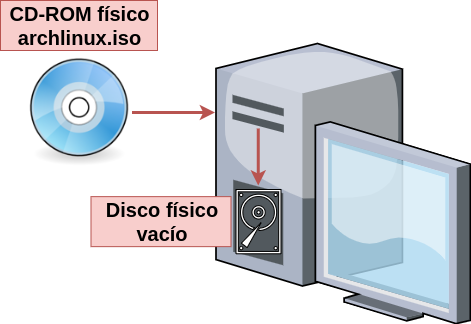

    Esquema de instalación de SO con sistema físico

El esquema real que usaremos para la instalación será con una máquina virtual y la imagen .iso de Arch Linux:

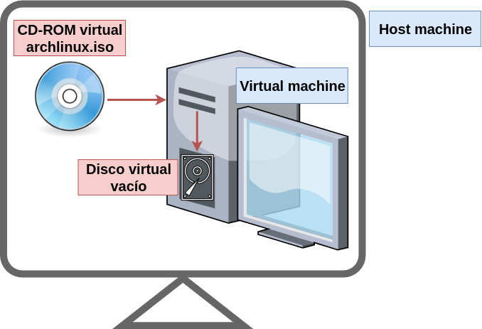

    Esquema de instalación de SO con sistema virtual

Creando la VM en VirtualBox
'''''''''''''''''''''''''''

El procedimiento de creación de la VM será usando VirtualBox:

1. Crear una nueva VM en VirtualBox presionando el botón :guilabel:`New`:

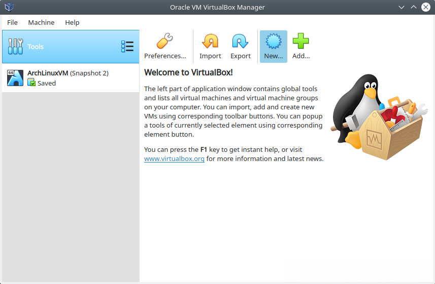

    Creando la VM en VirtualBox - Botón :guilabel:`New`

2. Escribir un nombre en :guilabel:`Name` y una ubicación para la VM:

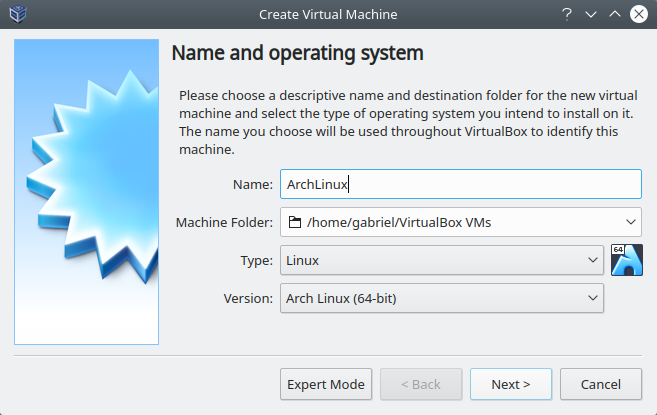

    Creando la VM en VirtualBox - Name and operating system

3. Asignar la cantidad de memoria RAM deseada a la VM:

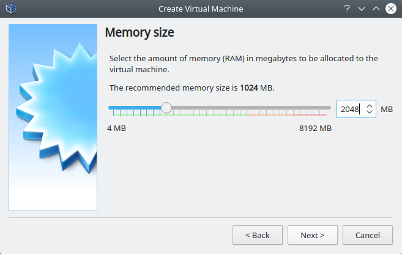

    Creando la VM en VirtualBox - Memory size

4. Crear un nuevo disco virtual, seleccionar la opción :guilabel:`Create a virtual hard disk now` :

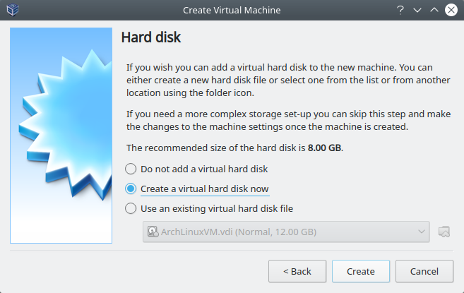

    Creando la VM en VirtualBox - Hard disk

5. Seleccionar el tipo de disco duro como :guilabel:`VDI (VirtualBox Disk Image)`, formato nativo de VirtualBox:

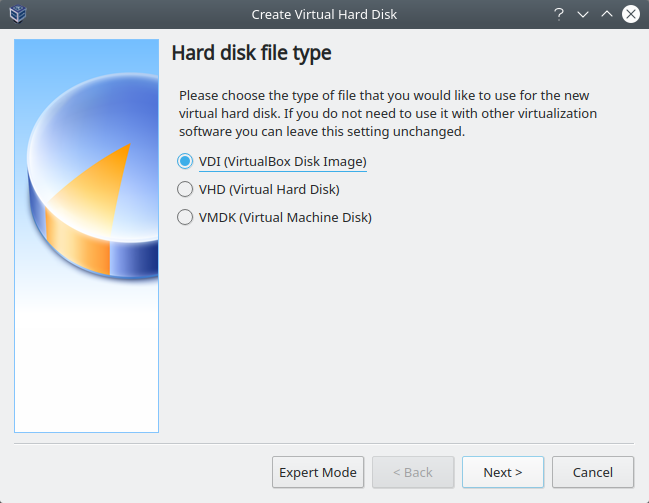

    Creando la VM en VirtualBox - Hard disk file type

6. Seleccionar el tipo de asignación que se le dará al disco como :guilabel:`Dynamically allocated`:

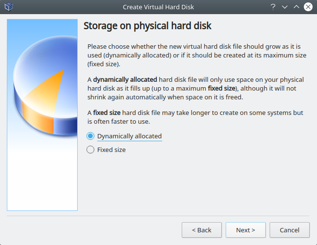

    Creando la VM en VirtualBox - Storage on physical hard disk

7. Asignar un tamaño virtual al disco:

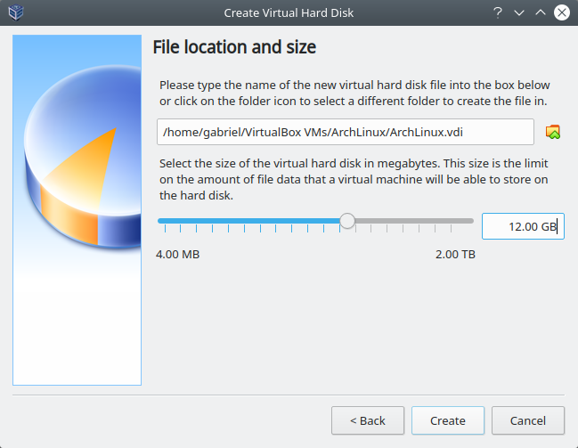

    Creando la VM en VirtualBox - File location and size

8. Clic en el botón :guilabel:`Create`.

Configurando la VM
------------------

Luego de haber creado la VM, la veremos listada en la ventana principal de VirtualBox. Ahora deberemos configurarla:

1. Seleccionar la VM recién creada y hacer clic en el botón :guilabel:`Settings`:

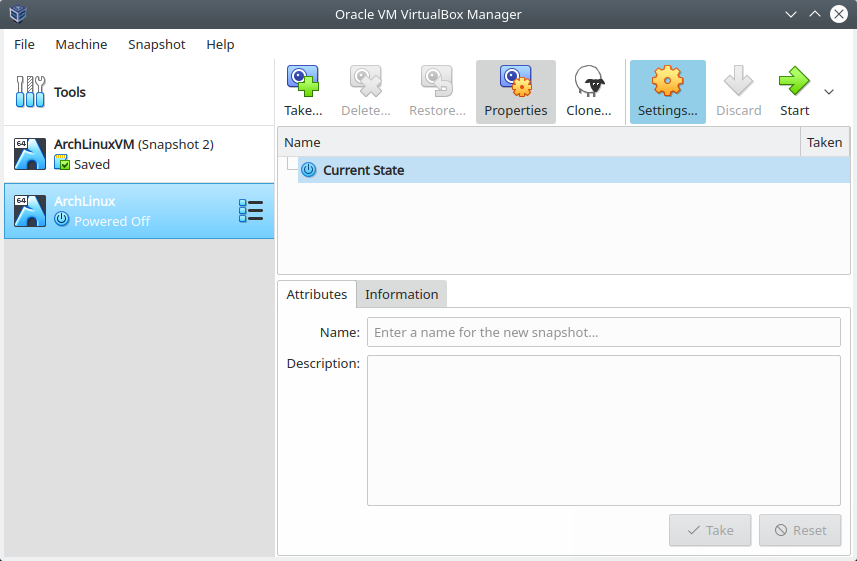

    Configurando la VM en VirtualBox - Botón :guilabel:`Settings`

2. En la nueva ventana, clic en la sección :guilabel:`System`, pestaña :guilabel:`Processor`. Seleccionar la cantidad de CPUs que deseamos asignar a nuestra VM:

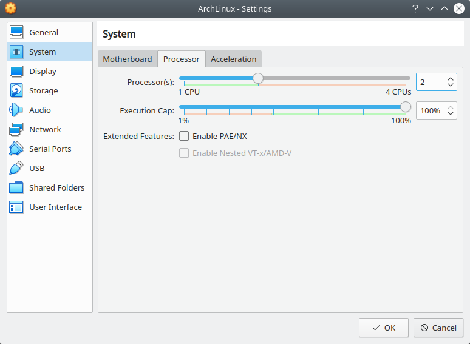

    Configurando la VM en VirtualBox - sección :guilabel:`System`, pestaña :guilabel:`Processor`

3. Clic en la sección :guilabel:`Display`, pestaña :guilabel:`Screen`. En cantidad de :guilabel:`Video Memory` asignar 128 MB y elegir ``VBoxVGA`` como :guilabel:`Graphics Controller`:

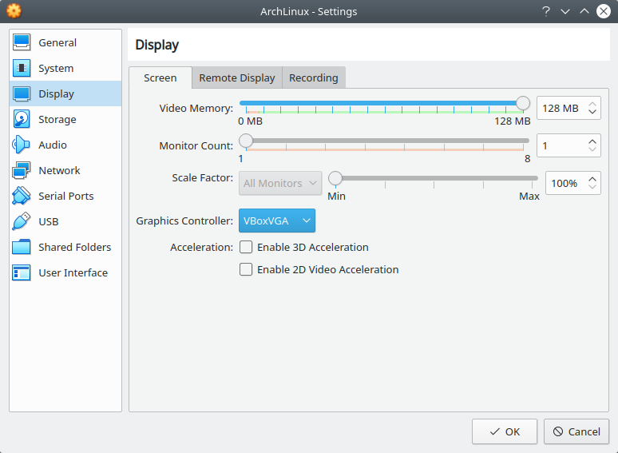

    Configurando la VM en VirtualBox - sección :guilabel:`Display`, pestaña :guilabel:`Screen`

4. Para tener conexión a Internet desde nuestra VM, clic en la sección :guilabel:`Network`, pestaña :guilabel:`Adapter1`. Seleccionar ``NAT`` como la red a la cual conectaremos la VM:

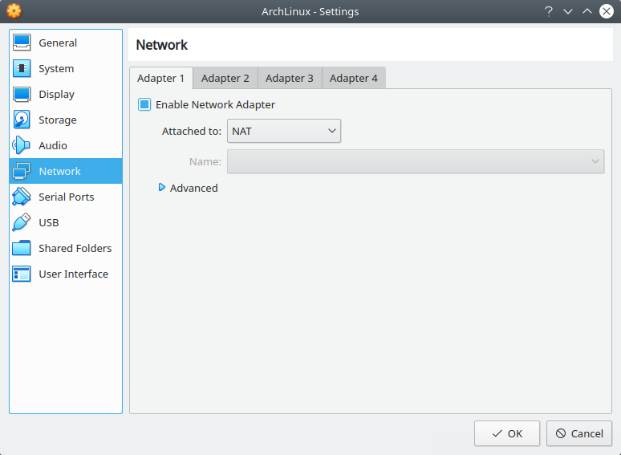

    Configurando la VM en VirtualBox - sección :guilabel:`Network`, pestaña :guilabel:`Adapter1`

5. Clic en la sección :guilabel:`Storage`. Seleccionar el ícono de un disco con un :guilabel:`+` (:guilabel:`Adds optical drive`):

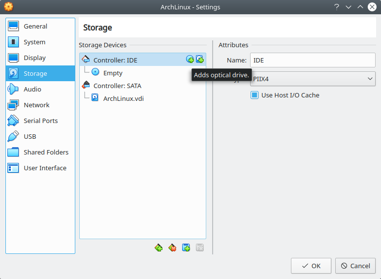

    Configurando la VM en VirtualBox - :guilabel:`Adds optical drive`

6. En la ventana emergente seleccionar el botón :guilabel:`Choose disk`:

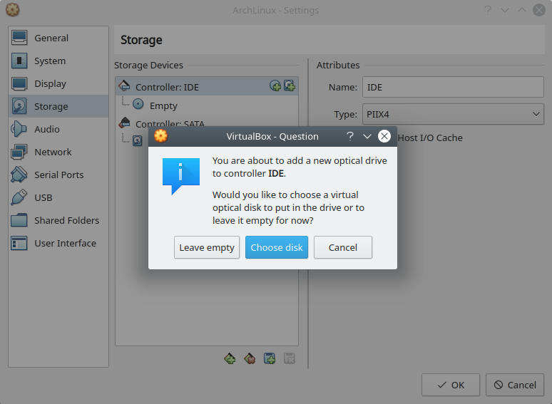

    Configurando la VM en VirtualBox - botón :guilabel:`Choose disk`:

7. En la nueva ventana seleccionar el botón :guilabel:`Add...` (:guilabel:`Add Disk Image`)

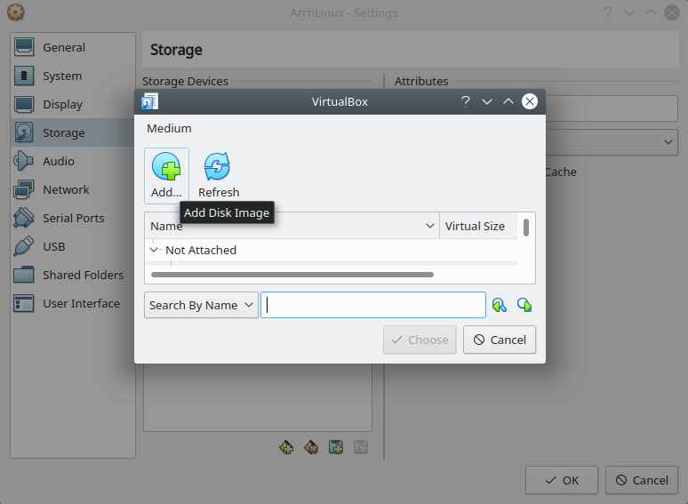

    Configurando la VM en VirtualBox - botón :guilabel:`Add...`:

8. Buscar la imagen .iso del SO en el navegador de archivos y clic en :guilabel:`Open`:

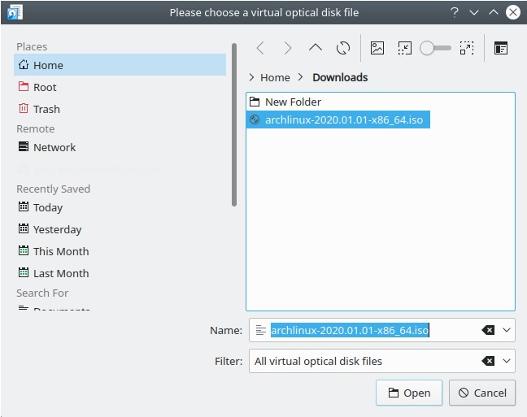

    Configurando la VM en VirtualBox - seleccionar la imagen .iso

9. En la ventana previa ahora aparecerá cargada la imagen .iso. Clic en :guilabel:`Choose`:

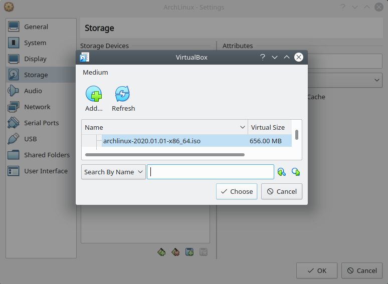

    Configurando la VM en VirtualBox - seleccionar la imagen .iso

10. Verificar que la imagen .iso se haya cargado en la parte de dispositivos de almacenamiento. Clic en :guilabel:`OK`:

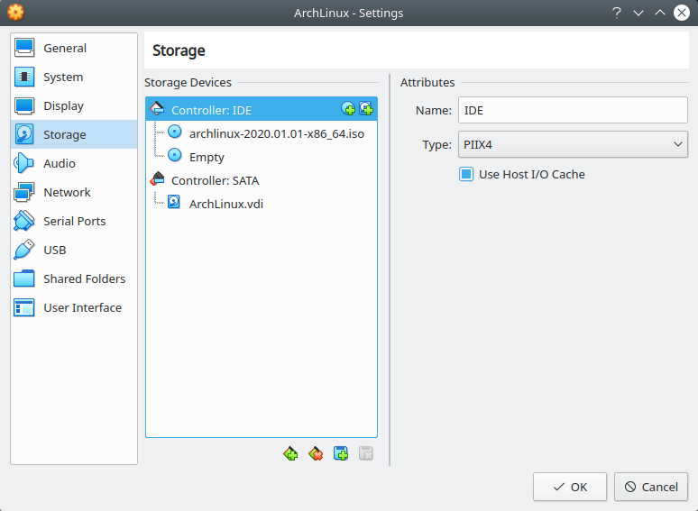

    Configurando la VM en VirtualBox

11. Finalmente, seleccionar la VM y clic en el botón :guilabel:`Start`:

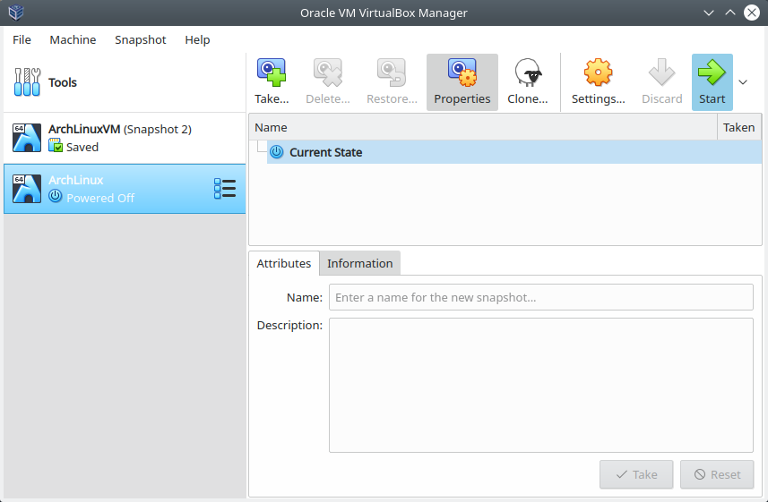

    Configurando la VM en VirtualBox - botón :guilabel:`Start`

Proceso de instalación de Arch Linux
------------------------------------

Al iniciar nuestro sistema desde la imagen de Arch Linux veremos la pantalla de arranque de Arch Linux, seleccionar la opción :guilabel:`Boot Arch Linux (x86_64)`:

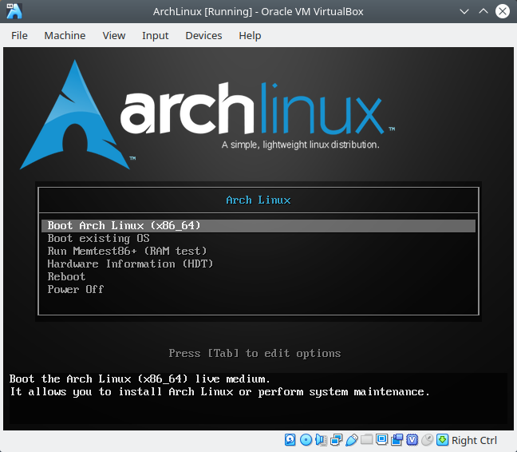

    Pantalla de arranque de la imagen de Arch Linux - opción :guilabel:`Boot Arch Linux (x86_64)`

Cuando haya terminado de cargar el arranque de la imagen iniciaremos sesión automáticamente como usuarios ``root`` bajo el prompt:

.. code-block:: bash

    root@archiso ~ '#'

A partir de esto momento seguiremos los pasos indicados en la `guía de instalación oficial de la Wiki de Arch Linux`_

Pre-instalación
'''''''''''''''

.. Note::

    Para realizar los pasos de la guía remotamente desde el terminal del host realizar lo siguiente:

    1. En VirtualBox, sin apagar la VM, cambiar el tipo de red a la que está conectada el Adadptador 1 de la VM: de ``NAT`` a ``Bridge Adapter``:

    .. figure:: images/installing-arch/virtualbox-bridge-adapter.png
        :align: center

        VM conectada por Bridge Adapter
    
    2. En la VM, pedir configuración de red por DHCP:

    .. code-block:: bash

        '#' dhclient -v enp0s3
    
    3. Crear un nuevo usuario en la VM:

    .. code-block:: bash

        '#' useradd -md /home/user1 -s /bin/bash user1
        '#' passwd user1
        '#' usermod -aG wheel user1
        '#' visudo /etc/sudoers

            root ALL=(ALL) ALL

            ## Uncomment to allow members of group wheel to execute any command
            %wheel ALL=(ALL) ALL

    4. Instalar sudo y SSH en la VM:

    .. code-block:: bash

        '#' pacman -Sy
        '#' pacman -S openssh
        '#' pacman -S sudo
    
    5. Habilitar openSSH server

    .. code-block:: bash

        '#' systemctl restart sshd
        '#' systemctl status sshd
    
    6. Desde un terminal en el host conectarnos por SSH a la VM y cambiar a ``root``:

    .. code-block:: bash

        $ ssh user1@192.168.1.24
        [user1@archiso ~]$ sudo su
        root@archiso /home/user1 '#' cd ~
        root@archiso ~ '#'

1. Configurar la distribución del teclado (keyboard layout) a español latino:

.. code-block:: bash

    '#' ls /usr/share/kbd/keymaps/**/*.map.gz | grep la-
    '#' loadkeys la-latin1

2. Comprobar conectividad a Internet:

.. code-block:: bash

    '#' ping archlinux.org

3. Actualizar el reloj del sistema

.. code-block:: bash

    '#' timedatectl set-ntp true
    '#' timedatectl list-timezones | grep Lima

        America/Lima

    '#' timedatectl set-timezone America/Lima
    '#' timedatectl status

                              Local time: Mon 2020-01-20 15:58:09 -05
                          Universal time: Mon 2020-01-20 20:58:09 UTC
                                RTC time: Mon 2020-01-20 20:58:09
                               Time zone: America/Lima (-05, -0500)
               System clock synchronized: yes
        systemd-timesyncd.service active: yes
                         RTC in local TZ: no

4. Listar dispositivos y particiones identificados en el sistema (con ``lblk`` o ``fdisk``):

- Con ``lsblk``:

.. code-block:: bash

    $ lsblk
    NAME  MAJ:MIN RM   SIZE RO TYPE MOUNTPOINT
    loop0   7:0    0 541.5M  1 loop /run/archiso/sfs/airootfs
    sda     8:0    0    12G  0 disk 
    sr0    11:0    1   656M  0 rom  /run/archiso/bootmnt
    sr1    11:1    1  1024M  0 rom

- Con ``fdisk``:

.. code-block:: bash

    $ sudo fdisk -l
    Disk /dev/sda: 12 GiB, 12884901888 bytes, 25165824 sectors
    Disk model: VBOX HARDDISK   
    Units: sectors of 1 * 512 = 512 bytes
    Sector size (logical/physical): 512 bytes / 512 bytes
    I/O size (minimum/optimal): 512 bytes / 512 bytes

    Disk /dev/loop0: 541.5 MiB, 567787520 bytes, 1108960 sectors
    Units: sectors of 1 * 512 = 512 bytes
    Sector size (logical/physical): 512 bytes / 512 bytes
    I/O size (minimum/optimal): 512 bytes / 512 bytes

Vemos que tenemos un único disco de 12 GiB (``sda``), en el que haremos las particiones e instalaremos el sistema.

5. Particionar disco(s) (con ``fdisk`` o ``cfdisk``) (`Guía - How to use fdisk to Manager Partitions on Linux`_):

.. _Guía - How to use fdisk to Manager Partitions on Linux: https://www.howtogeek.com/106873/how-to-use-fdisk-to-manage-partitions-on-linux/

.. Note::

    ``fdisk`` y ``cfdisk`` hacen lo mismo, pero ``cfdisk`` es más interactivo

Queremos el siguiente esquema de particiones:

    * Label Type: DOS (para sistemas legacy BIOS) / GPT (para sistemas UEFI)

    - Partición 1:
        - Size: 10GB/12GB
        - Primary
        - Type: Linux (83)(default)
        - Bootable (``Boot *``)
    - Partición 2:
        - Size: 1GB/12GB
        - Primary
        - Type: Linux swap (82)

5.1 Usar el comando fdisk sobre la partición del disco seleccionado para la instalación del SO:

.. code-block:: bash

    $ fdisk /dev/sda 

    Welcome to fdisk (util-linux 2.34).                                      
    Changes will remain in memory only, until you decide to write them.
    Be careful before using the write command.

    Device does not contain a recognized partition table.
    Created a new DOS disklabel with disk identifier 0x82871abf.

5.2 Imprimir la tabla de particiones con la opción ``p``:

.. code-block:: bash

    Command (m for help): p
    Disk /dev/sda: 12 GiB, 12884901888 bytes, 25165824 sectors
    Disk model: VBOX HARDDISK   
    Units: sectors of 1 * 512 = 512 bytes
    Sector size (logical/physical): 512 bytes / 512 bytes
    I/O size (minimum/optimal): 512 bytes / 512 bytes
    Disklabel type: dos
    Disk identifier: 0x82871abf

5.3 Crear una nueva partición con la opción ``n``. En este caso creamos una partición primaria de 10GiB de tamaño y tipo Linux (por defecto):

.. code-block:: bash

    Command (m for help): n
    Partition type
       p   primary (0 primary, 0 extended, 4 free)
       e   extended (container for logical partitions)
    Select (default p): p
    Partition number (1-4, default 1): 1
    First sector (2048-25165823, default 2048): 
    Last sector, +/-sectors or +/-size{K,M,G,T,P} (2048-25165823, default 25165823): +10G

    Created a new partition 1 of type 'Linux' and of size 10 GiB.

5.4 Crear otra nueva partición con la opción ``n``. En este caso creamos una partición primaria de 1GiB de tamaño y tipo Linux (por defecto):

.. code-block:: bash

    Command (m for help): n
    Partition type
       p   primary (1 primary, 0 extended, 3 free)
       e   extended (container for logical partitions)
    Select (default p): p
    Partition number (2-4, default 2): 
    First sector (20973568-25165823, default 20973568):
    Last sector, +/-sectors or +/-size{K,M,G,T,P} (20973568-25165823, default 25165823): +1G

5.5 Cambiaremos el tipo de la última partición con la opción ``t``, de Linux (83) a swap (82):

::

    Created a new partition 2 of type 'Linux' and of size 1 GiB.

    Command (m for help): t
    Partition number (1,2, default 2): 2
    Hex code (type L to list all codes): L

     0  Empty           24  NEC DOS         81  Minix / old Lin bf  Solaris        
     1  FAT12           27  Hidden NTFS Win 82  Linux swap / So c1  DRDOS/sec (FAT-
     2  XENIX root      39  Plan 9          83  Linux           c4  DRDOS/sec (FAT-
     3  XENIX usr       3c  PartitionMagic  84  OS/2 hidden or  c6  DRDOS/sec (FAT-
     4  FAT16 <32M      40  Venix 80286     85  Linux extended  c7  Syrinx         
     5  Extended        41  PPC PReP Boot   86  NTFS volume set da  Non-FS data    
     6  FAT16           42  SFS             87  NTFS volume set db  CP/M / CTOS / .
     7  HPFS/NTFS/exFAT 4d  QNX4.x          88  Linux plaintext de  Dell Utility   
     8  AIX             4e  QNX4.x 2nd part 8e  Linux LVM       df  BootIt         
     9  AIX bootable    4f  QNX4.x 3rd part 93  Amoeba          e1  DOS access     
     a  OS/2 Boot Manag 50  OnTrack DM      94  Amoeba BBT      e3  DOS R/O        
     b  W95 FAT32       51  OnTrack DM6 Aux 9f  BSD/OS          e4  SpeedStor      
     c  W95 FAT32 (LBA) 52  CP/M            a0  IBM Thinkpad hi ea  Rufus alignment
     e  W95 FAT16 (LBA) 53  OnTrack DM6 Aux a5  FreeBSD         eb  BeOS fs        
     f  W95 Ext'd (LBA) 54  OnTrackDM6      a6  OpenBSD         ee  GPT            
    10  OPUS            55  EZ-Drive        a7  NeXTSTEP        ef  EFI (FAT-12/16/
    11  Hidden FAT12    56  Golden Bow      a8  Darwin UFS      f0  Linux/PA-RISC b
    12  Compaq diagnost 5c  Priam Edisk     a9  NetBSD          f1  SpeedStor      
    14  Hidden FAT16 <3 61  SpeedStor       ab  Darwin boot     f4  SpeedStor      
    16  Hidden FAT16    63  GNU HURD or Sys af  HFS / HFS+      f2  DOS secondary  
    17  Hidden HPFS/NTF 64  Novell Netware  b7  BSDI fs         fb  VMware VMFS    
    18  AST SmartSleep  65  Novell Netware  b8  BSDI swap       fc  VMware VMKCORE 
    1b  Hidden W95 FAT3 70  DiskSecure Mult bb  Boot Wizard hid fd  Linux raid auto
    1c  Hidden W95 FAT3 75  PC/IX           bc  Acronis FAT32 L fe  LANstep        
    1e  Hidden W95 FAT1 80  Old Minix       be  Solaris boot    ff  BBT            
    Hex code (type L to list all codes): 82

    Changed type of partition 'Linux' to 'Linux swap / Solaris'.

5.6 Listar las particiones con la opción ``p`` y asegurarnos que están conformes con nuestros requerimientos:

.. code-block:: bash

    Command (m for help): p

    Disk /dev/sda: 12 GiB, 12884901888 bytes, 25165824 sectors
    Disk model: VBOX HARDDISK   
    Units: sectors of 1 * 512 = 512 bytes
    Sector size (logical/physical): 512 bytes / 512 bytes
    I/O size (minimum/optimal): 512 bytes / 512 bytes
    Disklabel type: dos
    Disk identifier: 0x82871abf

    Device     Boot    Start      End  Sectors Size Id Type
    /dev/sda1           2048 20973567 20971520  10G 83 Linux
    /dev/sda2       20973568 23070719  2097152   1G 82 Linux swap / Solaris

5.7 Escribir los cambios hechos al disco con la opción ``w``:

.. code-block:: bash

    Command (m for help): w
    The partition table has been altered.
    Calling ioctl() to re-read partition table.
    Syncing disks.

5.8 Listar los discos y particiones para confirmar que hemos creado las particiones correctamente:

.. code-block:: bash

    '#' lsblk
    NAME   MAJ:MIN RM   SIZE RO TYPE MOUNTPOINT
    loop0    7:0    0 541.5M  1 loop /run/archiso/sfs/airootfs
    sda      8:0    0    12G  0 disk 
    ├─sda1   8:1    0    10G  0 part 
    └─sda2   8:2    0     1G  0 part 
    sr0     11:0    1   656M  0 rom  /run/archiso/bootmnt
    sr1     11:1    1  1024M  0 rom

6. Formatear la partición Linux para crear un filesystem tipo ``ext4``:

.. code-block:: bash

    '#' mkfs.ext4 /dev/sda1

    mke2fs 1.45.4 (23-Sep-2019)
    Creating filesystem with 2621440 4k blocks and 655360 inodes
    Filesystem UUID: b6a91f40-6a90-4093-88ff-ca45d4eea178
    Superblock backups stored on blocks: 
            32768, 98304, 163840, 229376, 294912, 819200, 884736, 1605632

    Allocating group tables: done                            
    Writing inode tables: done                            
    Creating journal (16384 blocks): done
    Writing superblocks and filesystem accounting information: done

7. Formatear la partición swap:

.. code-block:: bash

    '#' mkswap /dev/sda2
    Setting up swapspace version 1, size = 1024 MiB (1073737728 bytes)
    no label, UUID=d4b01b51-459a-4171-a6df-676646f4ff94

.. code-block:: bash

    '#' swapon /dev/sda2

8. Montar el filesystem de la partición Linux:

.. code-block:: bash

    '#' mount /dev/sda1 /mnt/

Instalación
'''''''''''

1. Seleccionar los mirrors. En el archivo ``/etc/pacman.d/mirrorlist`` definimos la lista de servidores mirror de donde se descargarán los paquetes. Eliminar servidores que no deseemos con un editor de texto (``vim`` o ``nano``):

.. Note::

    En el archivo ``/etc/pacman.d/mirrorlist`` donde se listan los mirrors, cuanto más arriba se posicione un mirror en la lista, más prioridad tendrá al descargar un paquete.

.. code-block:: bash

    '#' vim /etc/pacman.d/mirrorlist

.. code-block:: bash

    '#' cat /etc/pacman.d/mirrorlist 
    ##
    ## Arch Linux repository mirrorlist
    ## Filtered by mirror score from mirror status page
    ## Generated on 2020-01-01
    ##

    ## United States
    Server = http://mirror.dal10.us.leaseweb.net/archlinux/$repo/os/$arch
    ## United States
    Server = http://archlinux.surlyjake.com/archlinux/$repo/os/$arch
    ## United States
    Server = http://ca.us.mirror.archlinux-br.org/$repo/os/$arch
    ## United States
    Server = http://mirror.kaminski.io/archlinux/$repo/os/$arch

2. Instalar paquetes esenciales del sistema Arch Linux

.. code-block:: bash

    '#' pacstrap /mnt base linux linux-firmware

Configurar el sistema
'''''''''''''''''''''

1. Generar un archivo fstab (filesystem table) para montar correctamente las particiones:

.. code-block:: bash

    '#' genfstab -U /mnt >> sudo /mnt/etc/fstab

2. Cambiar root (``chroot``) en el nuevo sistema:

Más `información de chroot de Wiki de Arch`_.

.. _información de chroot de Wiki de Arch: https://wiki.archlinux.org/index.php/Chroot

.. code-block:: bash

    root@archiso ~ '#' arch-chroot /mnt
    [root@archiso /]'#'

3. Configurar el time zone:

    '#' ln -sf /usr/share/zoneinfo/America/Lima /etc/localetime
    '#' hwclock --systohc

4. Instalar un editor de texto en el entorno chroot (`comandos no encontrados en chroot`_):

.. _comandos no encontrados en chroot: https://superuser.com/questions/1499709/nano-command-not-found-after-entering-chroot-during-arch-install

.. code-block:: bash

    '#' pacman -S vim

5. Localización. 

5.1 Descomentar la línea ``es_PE.UTF-8 UTF-8`` del archivo ``/etc/locale.gen``:

.. code-block:: bash
    :emphasize-lines: 7,11

    '#' vim /etc/locale.gen

    '#' cat /etc/locale.gen
        
        ...
        #en_SG.UTF-8 UTF-8
        en_US.UTF-8 UTF-8
        #en_US ISO-8859-1
        ...
        #es_PA ISO-8859-1
        es_PE.UTF-8 UTF-8
        #es_PE ISO-8859-1
        ...

5.2 

.. code-block:: bash

    '#' locale-gen
    
    Generating locales...
    en_US.UTF-8... done
    es_PE.UTF-8... done
    Generation complete.

5.3 Crear el archivo ``locale.conf`` con la variable ``LANG`` (``LANG=en_US.UTF-8`` para idioma inglés y ``LANG=es_PE.UTF-8`` para español):

.. code-block:: bash

    '#' echo LANG=en_US.UTF-8 > /etc/locale.conf # export LANG=en_US.UTF-8
    
    '#' cat /etc/locale.conf

        LANG=en_US.UTF-8

5.4 Para realizar los cambios hechos anteriormente del keyboard layout, editar el archivo ``/etc/vconsole.conf``:

.. code-block:: bash

    '#' vim /etc/vconsole.conf

    '#' cat /etc/vconsole.conf

        KEYMAP=la-latin1

6. Configuración de red

6.1 Crear el archivo ``/etc/hostname``:

.. code-block:: bash

    '#' echo arch > /etc/hostname
    '#' cat /etc/hostname
    
        arch

6.2 Editar el archivo ``/etc/hosts/`` y agregar 3 líneas:

.. code-block:: bash

    '#' vim /etc/hosts
    '#' cat /etc/hosts
    
        127.0.0.1	localhost
        ::1		    localhost
        127.0.1.1	arch.localdomain	arch

7. Configurar una contraseña root:

.. code-block:: bash

    '#' passwd

        New password:
        Retype new password:
        passwd: password updated successfully

8. Bootloader:

8.1 Descargar los paquetes de grub:

.. code-block:: bash

    '#' pacman -S grub

8.2 Instalemos grub en el disco:

.. code-block:: bash

    '#' grub-install /dev/sda

    Installing for i386-pc platform.
    Installation finished. No error reported.

8.3 Crearemos un archivo de configuración de grub:

.. code-block:: bash

    '#' grub-mkconfig -o /boot/grub/grub.cfg

    Generating grub configuration file ...
    Found linux image: /boot/vmlinuz-linux
    Found initrd image: /boot/initramfs-linux.img
    Found fallback initrd image(s) in /boot: initramfs-linux-fallback.img
    done

9. Habilitar el servicio de DHCP ``dhcpcd``:

.. code-block:: bash

    '#' pacman -S dhcpcd

    '#' systemctl enable dhcpcd
    Created symlink /etc/systemd/system/multi-user.target.wants/dhcpcd.service → /usr/lib/systemd/system/dhcpcd.service.

Cuando reiniciemos nuestro SO recién instalado, debería habilitar DHCP automáticamente.

10. Crear un nuevo usuario con permisos de sudo:

.. code-block:: bash

    '#' useradd -md /home/user1 -s /bin/bash user1
    '#' passwd user1
    '#' usermod -aG wheel user1

    '#' pacman -S sudo
    '#' visudo /etc/sudoers

            root ALL=(ALL) ALL

            ## Uncomment to allow members of group wheel to execute any command
            %wheel ALL=(ALL) ALL

Agregar al usuario a demás grupos:

.. code-block:: bash

    '#' usermod -aG audio,video,optical,storage

11. Salir de chroot y apagar la VM:

.. code-block:: bash

    [root@archiso /]'#' exit
    [user1@archiso ~]$ sudo shutdown now

Reconfigurando la VM e iniciando el sistema
-------------------------------------------

1. Cuando la VM se haya apagado, debemos remover el medio de instalación. En VirtuaBox, ir a :guilabel:`Settings` de la VM, sección :guilabel:`Storage` y remover el disco .iso con el botón inferior:

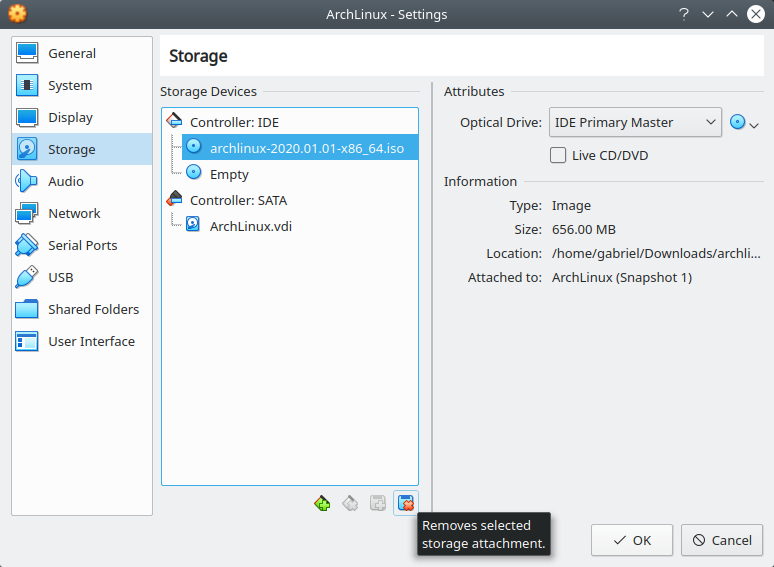

    Arch Linux instalado - Remover imagen .iso

2. Iniciar la VM y veremos que inicia el Grub con las opciones de arranque. Seleccionar :guilabel:`Arch Linux`:

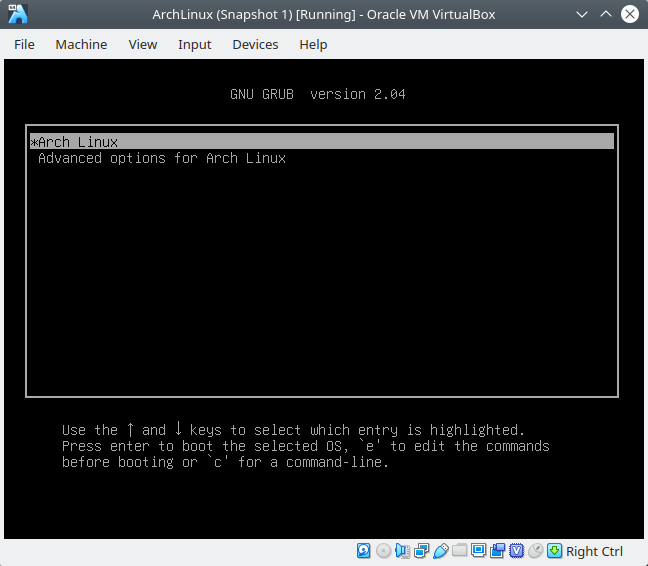

    Arch Linux instalado - Grub

3. Veremos la pantalla de inicio del SO de Arch Linux:

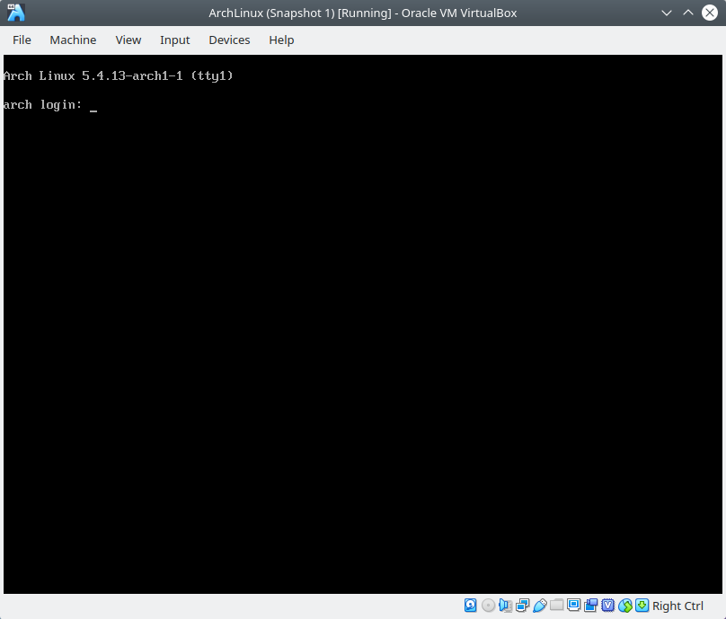

    Arch Linux instalado - Grub

Referencias
-----------

- `guía de instalación oficial de la Wiki de Arch Linux`_
- `página de descargas de Arch Linux`_
- `Guía - How to use fdisk to Manager Partitions on Linux`_
- `información de chroot de Wiki de Arch`_
- `comandos no encontrados en chroot`_
- `Videotutorial - Arch Linux Installation Guide (2019)`_
- `Arch Linux Guía básica de instalación actualizada`_

.. _Videotutorial - Arch Linux Installation Guide (2019): https://www.youtube.com/watch?v=HpskN_jKyhc
.. _Arch Linux Guía básica de instalación actualizada: https://blog.desdelinux.net/arch-linux-guia-basica-de-instalacion-actualizada/

- `Wiki Arch Linux - Install Arch Linux on a USB key`_
- `Wiki Arch Linux - Install Arch Linux from existing Linux`_
- `Wiki Arch Linux - Network configuration`_
- `Wiki Arch Linux - Users and groups`_

.. _Wiki Arch Linux - Install Arch Linux on a USB key: https://wiki.archlinux.org/index.php/Install_Arch_Linux_on_a_USB_key
.. _Wiki Arch Linux - Install Arch Linux from existing Linux: https://wiki.archlinux.org/index.php/Install_Arch_Linux_from_existing_Linux
.. _Wiki Arch Linux - Network configuration: https://wiki.archlinux.org/index.php/Network_configuration
.. _Wiki Arch Linux - Users and groups: https://wiki.archlinux.org/index.php/Users_and_groups