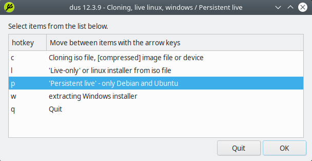
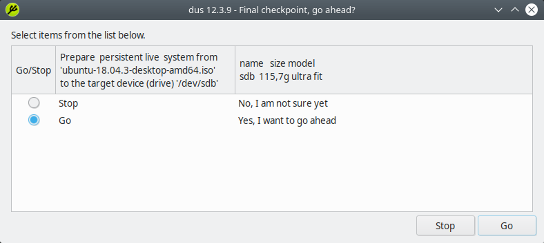
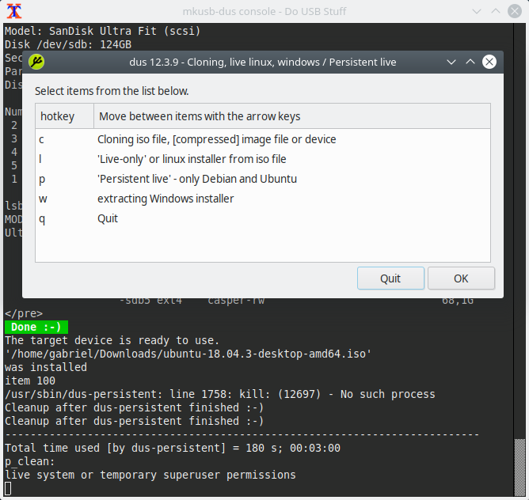

Instalando Ubuntu en un USB con mkusb
=====================================

.. contents:: Table of Contents

En el método de creación de un **Linux live USB**, todo cambios que hagamos al sistema se perderá luego de un reinicio. Por otro lado, el método **Persistent Storage Live USB** guarda cualquier cambio que hagamos al live system, permaneciendo luego de un reinicio del sistema.

Esta documentación muestra cómo crear un persistent live USB con la distribución de Ubuntu (y cualquiera de sus flavors Xubuntu, Kubuntu, Ubuntu Mate, Lubuntu, etc), Linux Mint, Debian o Elementary OS. Esto lo realizaremos usando la herramienta ``mkusb``, la cual puede ser instalada desde Ubuntu, Linux Mint o Debian.

``mkusb`` puede crear persistent live drives que funcionan con los modos **UEFI** y **BIOS**. La partición permanente que crea mkusb usa ``casper-rw``, lo cual le permite tener un tamaño mayor a 4GB.

``mkusb`` además tiene otras funcionalidades como crear live USB booteables regulares de Linux, vaciar un dispositivo, y otras más. La interfaz gráfica de ``mkusb`` usa Zenity.

Instalando ``mkusb``
--------------------

En Ubuntu, Linux Mint, Elementary OS
''''''''''''''''''''''''''''''''''''

Instalar ``mkusb`` en Ubuntu, Linux Mint, Elementary OS y otras distribuciones/flavors basados en Ubuntu mediante su PPA oficial:

.. code-block:: bash

    $ sudo add-apt-repository ppa:/mkusb/ppa
    $ sudo apt update
    $ sudo apt install --install-recommends mkusb mkusb-nox usb-pack-efi

En Debian
'''''''''

A diferencia de la mayoría de repositorios PPA en Debian, podemos usar el mismo PPA usando para Ubuntu. Esto debido a que ``mkusb`` es un conjunto de scripts que no depende de versiones de paquetes de Ubuntu.

Agregar el PPA de ``mksub`` manualmente e instalar el programa en Debian:

.. code-block:: bash

    $ echo "deb http://ppa.launchpad.net/mkusb/ppa/ubuntu bionic main" | sudo tee /etc/apt/sources.list.d/mkusb.list

    $ sudo apt-key adv --keyserver keyserver.ubuntu.com --recv 54B8C8AC
    $ sudo apt update
    $ sudo apt install --install-recommends mkusb mkusb-nox usb-pack-efi

Instalando el SO con ``mkusb``
------------------------------

1. Abrir la aplicación ``mkusb``. Nos preguntará si deseamos que ``mkusb`` corra en la versión ``dus`` (una interfaz renovada de ``mkusb``):

.. figure:: images/ubuntu-usb-mkusb/mkusb-1.png
    :align: center

    ``mkusb`` - Correr la versión ``dus``

Seleccionar :guilabel:`Yes`.

2. Aparecerá una ventana con un terminal y otra ventana pidiendo la contraseña ``sudo``:

.. figure:: images/ubuntu-usb-mkusb/mkusb-2.png
    :align: center

    ``mkusb`` - Ingresar contraseña root

Ingresar la contraseña y clic en :guilabel:`OK`. Luego aparecerá una ventana de advertencia.

.. figure:: images/ubuntu-usb-mkusb/mkusb-3.png
    :align: center

    ``mkusb``

Clic en :guilabel:`OK`.

3. Luego ``mkusb`` mostrará otra ventana con una acciones a realizar:

    ``mkusb`` - lista de acciones

Seleccionar :guilabel:`Install (make a boot device)` y luego clic en :guilabel:`OK`.

4. La siguiente pantalla mostrará otra lista de opciones:

    ``mkusb`` - lista de acciones 2

Seleccionar :guilabel:`Persistent live - only Debian and Ubuntu`. Clic en :guilabel:`OK`.

5. Nos aparecerá un navegador de archivos para que seleccionemos el archivo ISO o IMG que queremos instalar en el USB:

    ``mkusb`` - seleccionar imagen ISO o IMG

Seleccionar la imagen de Ubuntu, Debian o Linux Mint de nuestro sistema. Clic en :guilabel:`OK`.

6. Luego, ``mkusb`` presentará una lista de dispositivos de almacenamiento. Seleccionar el dispositivo USB al cual le queremos instalar el SO:

    ``mkusb`` - seleccionar dispositivo de almacenamiento USB

Clic en :guilabel:`OK` y vuelve a confirmar que el dispositivo seleccionado es el indicado:

.. figure:: images/ubuntu-usb-mkusb/mkusb-8.png
    :align: center

    ``mkusb`` - confirmar selección de dispositivo

Clic en :guilabel:`Yes`.

.. Danger::

    Seleccionar la unidad de almacenamiento correcta, pues toda la información dentro de esta será eliminada.

7. Luego se nos presenta una lista de configuración del dispositivo:

    ``mkusb`` - opción :guilabel:`upefi`

Seleccionar la opción :guilabel:`upefi` (del paquete ``usb-pack-efi`` usado por ``mkusb``), en el cual Grub puede trabajar en modos BIOS y UEFI.

8. Seleccionar el porcentaje de espacio disponible permanente que será asignado al sistema operativo instalado (partición llamada ``casper-rw``):

    ``mkusb`` - porcentaje de almacenamiento permanente

El espacio restante que no sea asignado a la distribución Linux instalada se usará para una partición llamada ``usbdata`` formateada como NTFS, que puede ser accedida desde cualquier sistema operativo Linux, Windows, macOS. Así, podemos usarlo como un USB de almacenamiento tradicional, guardando datos que sean accesibles desde otros sistemas operativos.

9. En este último paso debemos aceptar la reconfiguración de nuestro USB con los opciones seleccionadas anteriormente:

    ``mkusb`` - aceptar configuración con :guilabel:`Go`

Si estamos de acuerdo con la configuración seleccionar :guilabel:`Go` para que ``mkusb`` comience con el proceso de creación del live USB con almacenamiento permanente de Ubuntu, Linux Mint o Debian.

Veremos algunas pantallas de procesos:

.. figure:: images/ubuntu-usb-mkusb/mkusb-12.png
    :align: center

    ``mkusb`` - proceso

    ``mkusb`` - proceso

.. figure:: images/ubuntu-usb-mkusb/mkusb-14.png
    :align: center

    ``mkusb`` - proceso

10. Finalmente, si todo ha sido configurado correctamente, obtenedremos una ventana con un mensaje como el siguiente:

    ``mkusb`` - pantalla de finalización

Clic en :guilabel:`OK` para acabar con el proceso. Volveremos a un menú de ``mkusb``, donde simplemente debemos seleccionar la opción :guilabel:`Quit`:

    ``mkusb`` - opción :guilabel:`Quit`

Y en la ventana con el terminal presionar :guilabel:`Enter` para cerrar la aplicación:

    ``mkusb`` - presionar :guilabel:`Enter`

Lo único que resta es conectar nuestro USB a una PC y arrancar el sistema desde este dispositivo.

Referencias
-----------

- `Create A Persistent Storage Live USB With Ubuntu Linux Mint Or Debian`_
- `Rufus Creating A Persistent Storage Live USB With Ubuntu Or Debian From Windows`_

.. _Create A Persistent Storage Live USB With Ubuntu Linux Mint Or Debian: https://www.linuxuprising.com/2019/03/create-persistent-storage-live-usb-with.html
.. _Rufus Creating A Persistent Storage Live USB With Ubuntu Or Debian From Windows: https://www.linuxuprising.com/2019/08/rufus-creating-persistent-storage-live.html
