Kickstart Methods - usando Virtualbox
=====================================

.. contents:: Table of Contents

**Descripción de la documentación**: Método de instalación de un SO basado en Red Hat Enterprise Linux usando VirtualBox y un archivo ISO como medio de instalación. Este procedimiento sirve como un escenario de pruebas fácil de implementar, con el fin de probar archivos Kickstart que automaticen la instalación del SO.

Creación de VM en VirtualBox
----------------------------

1. En VirtualBox, crear una nueva VM haciendo clic en el botón :guilabel:`New`:

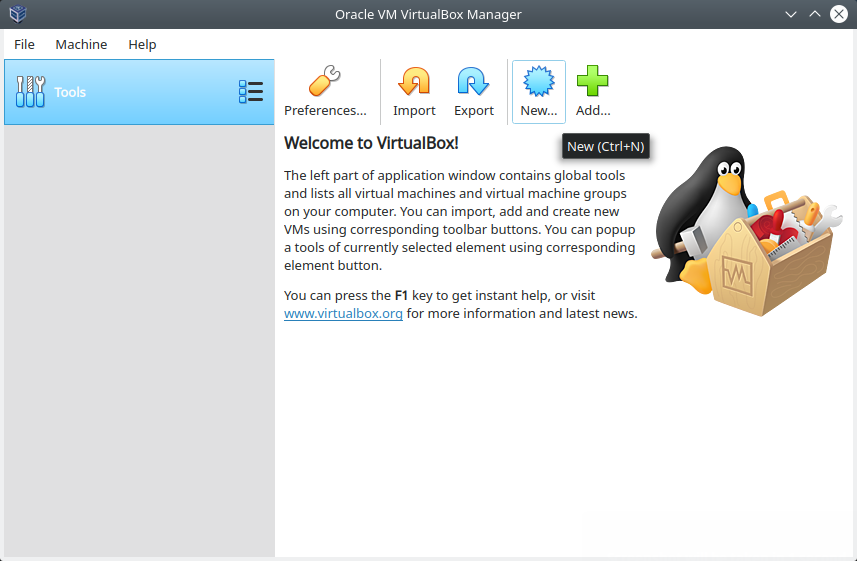

    VirtualBox - Crear una nueva VM

2. Nombrar el nombre de la VM y seleccionar el SO que deseemos instalar; en este caso, es un SO basado em Red Hat:

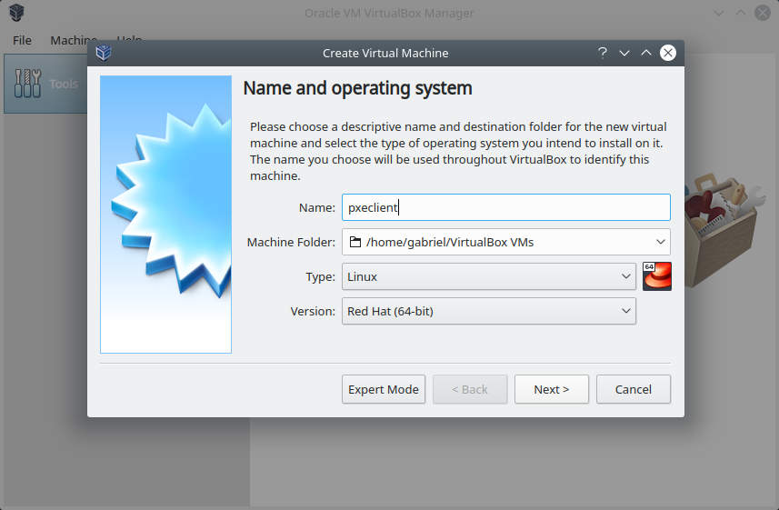

    VirtualBox - Nombrar la VM y seleccionar el SO

3. Elegir la cantidad de memoria RAM que deseemos asignarle a nuestra VM:

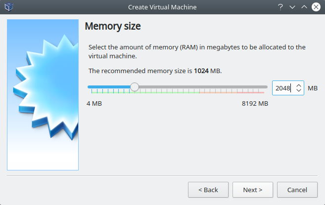

    VirtualBox - Seleccionar la cantidad de RAM

4. Seleccionar como tipo de disco duro :guilabel:`VDI (VirtualBox Disk Image)`:

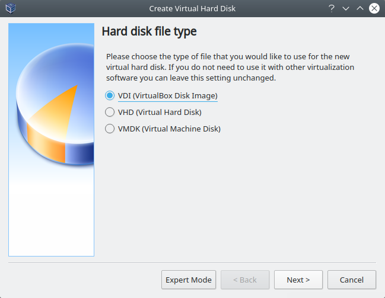

    VirtualBox - Seleccionar el tipo de disco duro que será creado y conectado a la VM

5. Para el provisionamiento de espacio en el disco elegir la opción :guilabel:`Dynamically Allocated`:

    VirtualBox - Seleccionar :guilabel:`Dynamically Allocated`

6. Determinar la ubicación y tamaño del disco:

    VirtualBox - Seleccionar la ubicación y tamaño del disco

Finalmente, clic en el botón :guilabel:`Create`.

Configuración de VM en VirtualBox
---------------------------------

1. Clic en el botón :guilabel:`Settings` para configurar la VM:

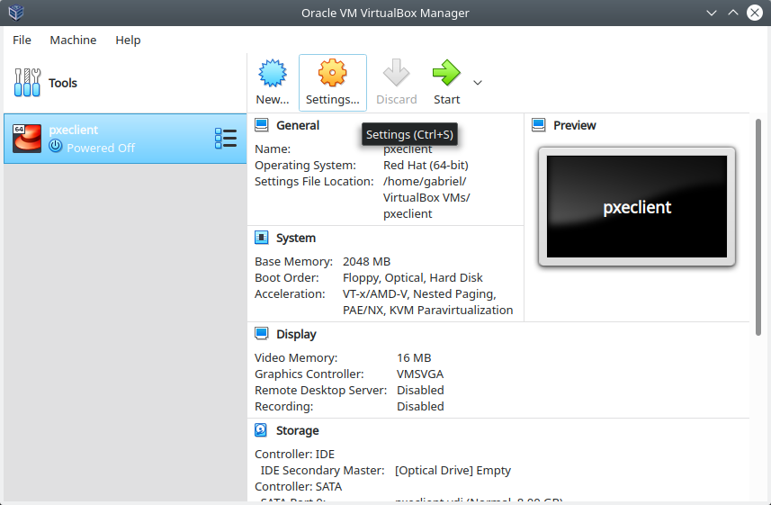

    VirtualBox - Seleccionar la opción :guilabel:`Settings`

2. Seleccionar la pestaña :guilabel:`System` cambiar el orden de arranque, poniendo primero :guilabel:`Hard Disk` y luego :guilabel:`Optical`:

    VirtualBox - Cambiar el orden de arranque del sistema en la pestaña :guilabel:`System`

3. Seleccionar la pestaña :guilabel:`Storage` y clic sobre el ícono de disco con nombre Empty:

    VirtualBox - Cambiar a la pestaña :guilabel:`Storage`

El método de instalación del sistema operativo usando en esta guía será a través un archivo ISO de CentOS 7 que contiene el medio de instalación.

Previamente debemos haber descargado el instalador de CentOS 7 en formato ``.iso`` de alguno de los `Mirrors oficiales de imágenes ISO de CentOS 7`_:

.. _Mirrors oficiales de imágenes ISO de CentOS 7: http://isoredirect.centos.org/centos/7/isos/x86_64/

4. Clic el botón con ícono de disco en la parte derecha y seleccionar la opción :guilabel:`Choose Virtual Optical Disk File...`:

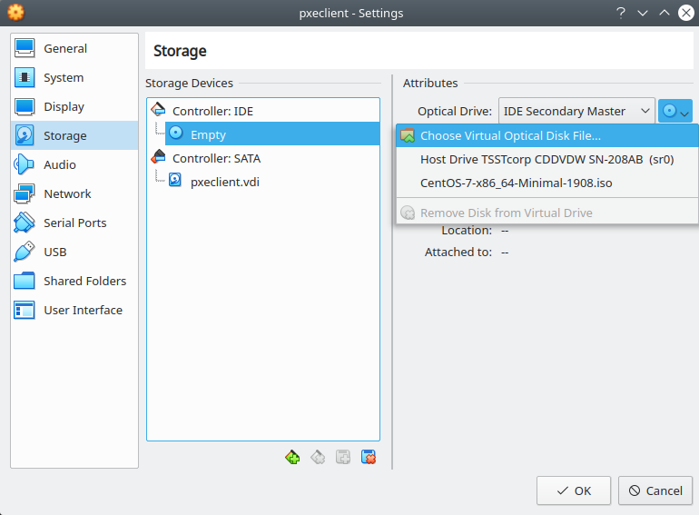

    VirtualBox - Seleccionar el ícono del disco y elegir :guilabel:`Choose Virtual Optical Disk File...`

5. En el navegador de archivos, elegir el archivo ISO que servirá como medio de instalación del SO:

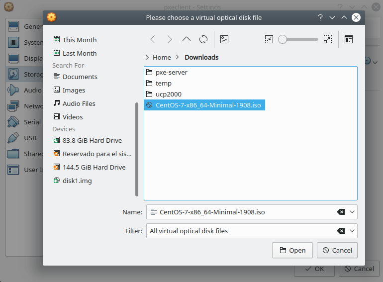

    VirtualBox - Elegir el archivo ``.iso`` del instalador del SO desde el navegador de archivos

6. Verificar que el archivo ISO se haya cargado en el controlador IDE. Luego clic en :guilabel:`OK`

    VirtualBox - Revisar la configuración de Storage y clic en :guilabel:`OK`

7. Iniciar la VM haciendo clic en la opción :guilabel:`Start`:

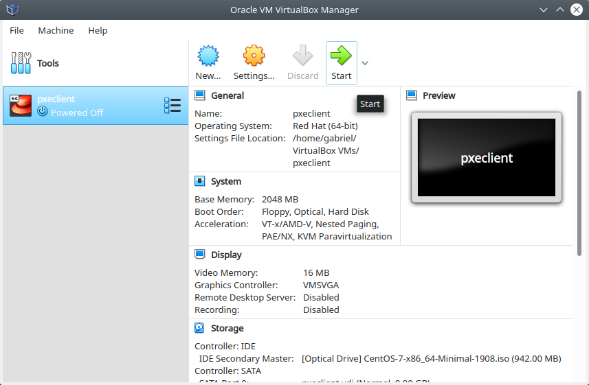

    VirtualBox - Arrancar la VM con el botón :guilabel:`Start`

8. Una vez cargue la página principal del instalador del SO, debemos presionar en el teclado la tecla :guilabel:`Esc` para ingresar a la opciones de :guilabel:`boot`:

    Centos 7 VM - En la página principal de carga para instalar el SO, presionar la tecla :guilabel:`Esc`

Referencia: `Editing boot options`_

.. _Editing boot options: https://docs.centos.org/en-US/8-docs/standard-install/assembly_booting-installer/#editing-boot-options_booting-the-installer

9. Verificar que cargue la siguiente pantalla con el prompt de ``boot:``:

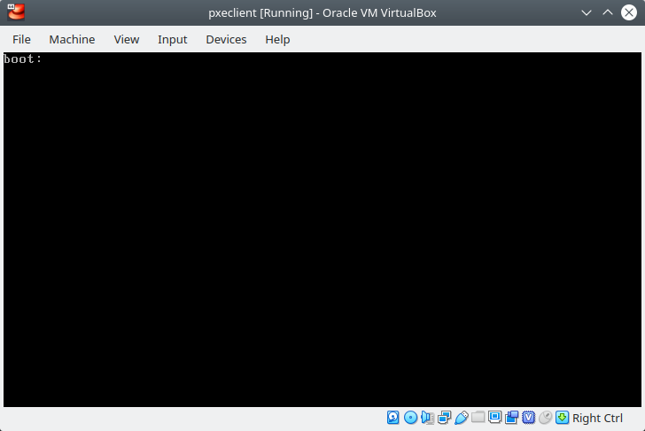

    Centos 7 VM - Cargará una página con el mensaje ``boot:``

Formas de pasar el archivo kickstart
------------------------------------

Existen distintas formas de pasar el archivo Kickstart al medio de instalación con el fin de automatizar el proceso de instalación.

En el prompt de ``boot:`` podemos emplear el parámetro ``ks=`` e indicar a través de qué medio se pasará el archivo kickstart. Entre los métodos soportados para pasar el archivo kickstart están NFS (``nfs``), HTTP (``http``), Diskette (``floppy``), disco montado (``hd``), file system sin montar (``file``) y CD-ROM (``cdrom``).

Referencia 1: `Starting a Kickstart installation`_

Referencia 2: `Fuentes de archivo kickstart`_

.. _`Starting a Kickstart installation`: https://access.redhat.com/documentation/en-us/red_hat_enterprise_linux/5/html/installation_guide/s1-kickstart2-startinginstall

.. _`Fuentes de archivo kickstart`: https://www.ibm.com/support/knowledgecenter/linuxonibm/liaae/liaaekickstart.html

Archivo Kickstart pasado por HTTP
'''''''''''''''''''''''''''''''''

En este método, obtenemos el archivo kickstart de un servidor a través de HTTP. Para esto, pasamos la URL de la página que tiene el archivo kickstart como en el siguiente ejemplo:

.. code-block:: text

    boot: linux ks=http://raw.githubusercontent.com/mogago/kickstartfiles/master/ks1.cfg

.. figure:: images/ks_virtualbox/16-instalacion_centos7-kickstart-cdrom.png
    :align: center

    Centos 7 VM - Ingresar la dirección URL correcta para obtener el archivo kickstart

.. Important::

    La página que contiene el archivo kickstart no debe tener ningún tipo de equitas HTML ni formatos extra, solo debe contener el archivo kickstart en texto plano. Comprobar esto usando ``wget`` con la página web en un terminal de comandos.

.. Note::

    Opcionalmente, podemos usar ``ks=https:`` en lugar de ``ks=http:``, si la página tiene habilitado el protocolo HTTPS o en caso el servidor web no redirija automáticamente las solicitudes HTTP a HTTPS.

En este ejemplo se está usando GitHub como repositorio de los archivos Kickstart:

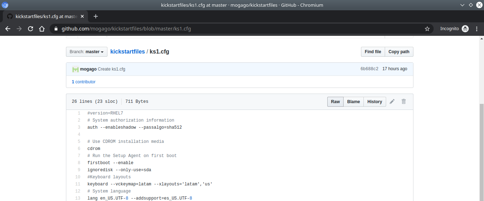

    GitHub - Archivo Kickstart de ejemplo

Pero para obtener el archivo Kickstart en texto plano debemos seleccionar el botón :guilabel:`Raw` en la página anterior, lo cual nos redirigirá a otra URL:

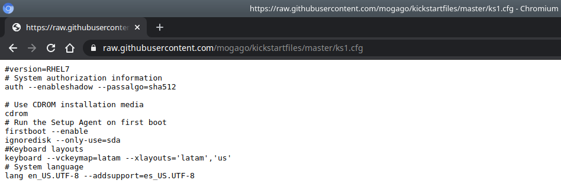

    GitHub - Archivo Kickstart de ejemplo en formato raw

Ya que en esta página solo obtenemos el archivo Kickstart en texto plano, podremos emplear esta dirección URL como parámetro de ``ks=http://``.

.. Important::

    Este método requiere conexión al servidor web remoto que proporcione el archivo Kickstart. En caso el archivo Kickstart se encuentre en la web, podemos tener una interfaz conectada a una red con un servidor DHCP y obtener una IP y salida a Internet. Por ejemplo, en VirtualBox podemos usar una red NAT o Bridged.

Instalación de CentOS 7
-----------------------

1. Inmediatamente luego de presionar el botón :guilabel:`Enter` en el prompt de ``boot:`` comenzará el proceso de instalación automatizado con el archivo Kickstart que hemos pasado:

.. figure:: images/ks_virtualbox/17-instalacion_centos7.png
    :align: center

    Centos 7 VM - Iniciará el proceso de instalación automatizado leyendo la plantilla en Kickstart

2. Una vez acabada la instalación desatentidada del SO, la VM se reiniciará automáticamente y cargará desde el disco instalado: 

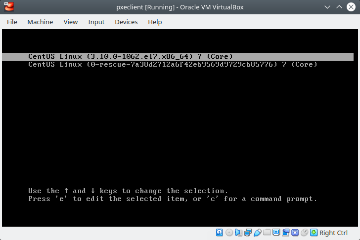

    Centos 7 VM - Iniciará el sistema CentOS 7 instalado

3. Finalmente, iniciará el SO CentOS instalado automáticamente con Kickstart:

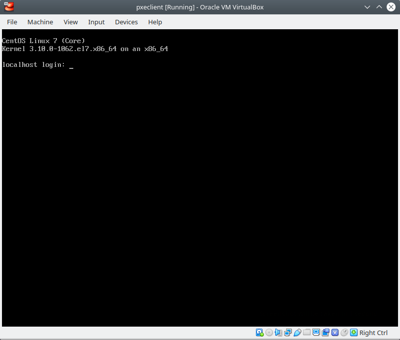

    Centos 7 VM - Sistema operativo CentOS 7 funcionando
