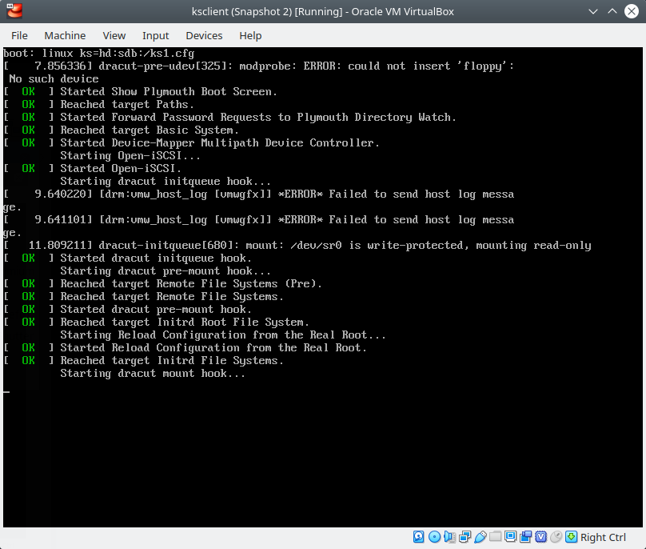
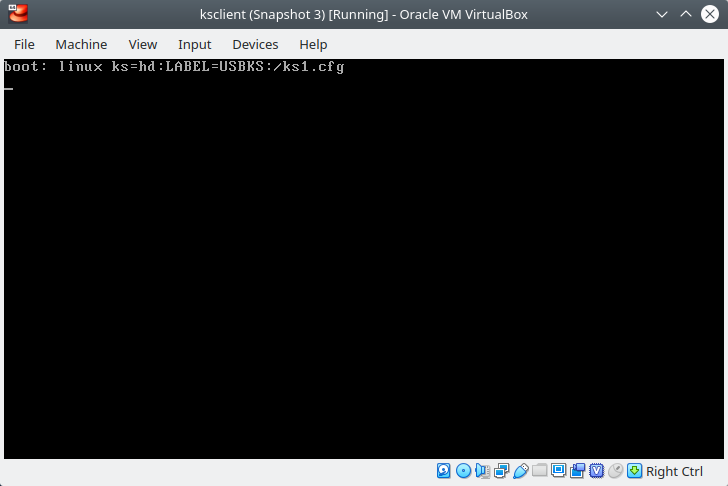
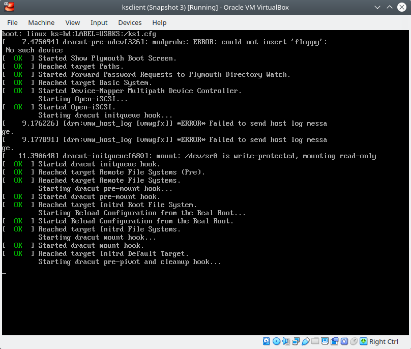

Kickstart Methods - usando Virtualbox
=====================================

.. contents:: Table of Contents

**Descripción de la documentación**: Método de instalación de un SO basado en Red Hat Enterprise Linux usando VirtualBox y un archivo ISO como medio de instalación. Este procedimiento sirve como un escenario de pruebas fácil de implementar, con el fin de probar archivos Kickstart que automaticen la instalación del SO.

Creación de VM en VirtualBox
----------------------------

1. En VirtualBox, crear una nueva VM haciendo clic en el botón :guilabel:`New`:

.. figure:: images/ks_virtualbox/01-virtualbox_new_vm_ks.png
    :align: center

    VirtualBox - Crear una nueva VM

2. Nombrar el nombre de la VM y seleccionar el SO que deseemos instalar; en este caso, es un SO basado em Red Hat:

.. figure:: images/ks_virtualbox/02-virtualbox_new_vm_ks.png
    :align: center

    VirtualBox - Nombrar la VM y seleccionar el SO

3. Elegir la cantidad de memoria RAM que deseemos asignarle a nuestra VM:

.. figure:: images/ks_virtualbox/03-virtualbox_new_vm_ks.png
    :align: center

    VirtualBox - Seleccionar la cantidad de RAM

4. Seleccionar la opción :guilabel:`Create a virtual hard disk now`:

.. figure:: images/ks_virtualbox/04-virtualbox_new_vm_ks.png
    :align: center

5. Seleccionar como tipo de disco duro :guilabel:`VDI (VirtualBox Disk Image)`:

.. figure:: images/ks_virtualbox/05-virtualbox_new_vm_ks.png
    :align: center

    VirtualBox - Seleccionar el tipo de disco duro que será creado y conectado a la VM

6. Para el provisionamiento de espacio en el disco elegir la opción :guilabel:`Dynamically Allocated`:

.. figure:: images/ks_virtualbox/06-virtualbox_new_vm_ks.png
    :align: center

    VirtualBox - Seleccionar :guilabel:`Dynamically Allocated`

7. Determinar la ubicación y tamaño del disco:

    VirtualBox - Seleccionar la ubicación y tamaño del disco

Finalmente, clic en el botón :guilabel:`Create`.

Configuración de VM en VirtualBox
---------------------------------

1. Clic en el botón :guilabel:`Settings` para configurar la VM:

.. figure:: images/ks_virtualbox/08-virtualbox_new_vm_ks.png
    :align: center

    VirtualBox - Seleccionar la opción :guilabel:`Settings`

2. Seleccionar la pestaña :guilabel:`System` cambiar el orden de arranque, poniendo primero :guilabel:`Hard Disk` y luego :guilabel:`Optical`:

.. figure:: images/ks_virtualbox/09-virtualbox_new_vm_ks.png
    :align: center

    VirtualBox - Cambiar el orden de arranque del sistema en la pestaña :guilabel:`System`

3. Seleccionar la pestaña :guilabel:`Storage` y clic sobre el ícono de disco con nombre Empty:

.. figure:: images/ks_virtualbox/10-virtualbox_new_vm_ks.png
    :align: center

    VirtualBox - Cambiar a la pestaña :guilabel:`Storage`

El método de instalación del sistema operativo usando en esta guía será a través un archivo ISO de CentOS 7 que contiene el medio de instalación.

Previamente debemos haber descargado el instalador de CentOS 7 en formato ``.iso`` de alguno de los `Mirrors oficiales de imágenes ISO de CentOS 7`_:

.. _Mirrors oficiales de imágenes ISO de CentOS 7: http://isoredirect.centos.org/centos/7/isos/x86_64/

4. Clic el botón con ícono de disco en la parte derecha y seleccionar la opción :guilabel:`Choose Virtual Optical Disk File...`:

.. figure:: images/ks_virtualbox/11-virtualbox_new_vm_ks.png
    :align: center

    VirtualBox - Seleccionar el ícono del disco y elegir :guilabel:`Choose Virtual Optical Disk File...`

5. En el navegador de archivos, elegir el archivo ISO que servirá como medio de instalación del SO:

.. figure:: images/ks_virtualbox/12-virtualbox_new_vm_ks.png
    :align: center

    VirtualBox - Elegir el archivo ``.iso`` del instalador del SO desde el navegador de archivos

6. Verificar que el archivo ISO se haya cargado en el controlador IDE. Luego clic en :guilabel:`OK`

    VirtualBox - Revisar la configuración de Storage y clic en :guilabel:`OK`

7. Iniciar la VM haciendo clic en la opción :guilabel:`Start`:

    VirtualBox - Arrancar la VM con el botón :guilabel:`Start`

8. Una vez cargue la página principal del instalador del SO, debemos presionar en el teclado la tecla :guilabel:`Esc` para ingresar a la opciones de :guilabel:`boot`:

    Centos 7 VM - En la página principal de carga para instalar el SO, presionar la tecla :guilabel:`Esc`

Referencia: `Editing boot options`_

.. _Editing boot options: https://docs.centos.org/en-US/8-docs/standard-install/assembly_booting-installer/#editing-boot-options_booting-the-installer

9. Verificar que cargue la siguiente pantalla con el prompt de ``boot:``:

.. figure:: images/ks_virtualbox/16-instalacion_centos7_ks.png
    :align: center

    Centos 7 VM - Cargará una página con el mensaje ``boot:``

.. Important::

    Pasar el archivo Kickstart por el prompt de ``boot:`` es una forma equivalente a editar las opciones de arranque del instalador definidas en sus respectivos archivos. Para pasar un archivo Kickstart en el prompt de ``boot:`` escribiríamos ``linux ks=...``. En el archivo de instalación de un sistema **Legacy** usaríamos ``ks=...`` y en un sistema **UEFI** usaríamos ``inst.ks=...``

Formas de pasar el archivo kickstart
------------------------------------

Existen distintas formas de pasar el archivo Kickstart al medio de instalación con el fin de automatizar el proceso de instalación.

En el prompt de ``boot:`` podemos emplear el parámetro ``ks=`` e indicar a través de qué medio se pasará el archivo kickstart. Entre los métodos soportados para pasar el archivo kickstart están NFS (``nfs``), HTTP (``http``), Diskette (``floppy``), disco montado (``hd``), file system sin montar (``file``) y CD-ROM (``cdrom``).

Referencia 1: `Starting a Kickstart installation`_

Referencia 2: `Fuentes de archivo kickstart`_

.. _`Starting a Kickstart installation`: https://access.redhat.com/documentation/en-us/red_hat_enterprise_linux/6/html/installation_guide/s1-kickstart2-startinginstall

.. _`Fuentes de archivo kickstart`: https://www.ibm.com/support/knowledgecenter/linuxonibm/liaae/liaaekickstart.html

Archivo Kickstart pasado por HTTP
'''''''''''''''''''''''''''''''''

.. Note::

    Este método es recomendable usarlo cuando el servidor al cual vamos a instalar el sistema operativo tiene un servidor DHCP con una configuración para salir a Internet. Esto, con el fin de obtener el archivo Kickstart de forma remota.

En este método obtenemos el archivo kickstart de un servidor a través de HTTP. Para esto, pasamos la URL de la página que tiene el archivo kickstart como en el siguiente ejemplo:

.. code-block:: text

    boot: linux ks=http://raw.githubusercontent.com/mogago/kickstartfiles/master/ks1.cfg

.. figure:: images/ks_virtualbox/17-instalacion_centos7_ks_http.png
    :align: center

    Centos 7 VM - Ingresar la dirección URL correcta para obtener el archivo kickstart

.. figure:: images/ks_virtualbox/18-instalacion_centos7_ks_http.png
    :align: center

.. Important::

    La página que contiene el archivo kickstart no debe tener ningún tipo de etiquetas HTML ni formatos extra, solo debe contener el archivo kickstart en texto plano. Comprobar esto usando ``wget`` con la página web en un terminal de comandos.

.. Note::

    Opcionalmente, podemos usar ``ks=https:`` en lugar de ``ks=http:``, si la página tiene habilitado el protocolo HTTPS o en caso el servidor web no redirija automáticamente las solicitudes HTTP a HTTPS.

En este ejemplo se está usando GitHub como repositorio de los archivos Kickstart:

.. figure:: images/ks_virtualbox/github-ks-sample-repo.png
    :align: center

    GitHub - Archivo Kickstart de ejemplo

Pero para obtener el archivo Kickstart en texto plano debemos seleccionar el botón :guilabel:`Raw` en la página anterior, lo cual nos redirigirá a otra URL:

.. figure:: images/ks_virtualbox/github-ks-sample-raw.png
    :align: center

    GitHub - Archivo Kickstart de ejemplo en formato raw

Ya que en esta página solo obtenemos el archivo Kickstart en texto plano, podremos emplear esta dirección URL como parámetro de ``ks=http://``.

.. Important::

    Este método requiere conexión al servidor web remoto que proporcione el archivo Kickstart. En caso el archivo Kickstart se encuentre en la web, podemos tener una interfaz conectada a una red con un servidor DHCP y obtener una IP y salida a Internet. Por ejemplo, en VirtualBox podemos usar una red NAT o Bridged.

Archivo Kickstart pasado por el mismo ISO de instalación (custom ISO image)
'''''''''''''''''''''''''''''''''''''''''''''''''''''''''''''''''''''''''''

.. Note::

    Este método es recomendable usarlo cuando queremos tener un medio de instalación con el archivo de Kickstart pre-cargado. Tenemos la opción de almacenar múltiples archivos Kickstart dentro de archivo ISO.

En este método obtendremos el archivo kickstart del mismo archivo ISO usado para obtener el medio de instalación (kernel, repos, etc.). Para lograr, esto deberemos modificar un imagen ISO oficial, agregarle nuestro archivo kickstart y volver a generar una imagen ISO modficada (también llamada **custom ISO image**). A este método de volver a generar una imagen ISO con ciertas modificaciones personalizadas se le llama **Repackaging de un Linux Install ISO**.

Para esto, primero crearemos nuestra imagen ISO personalizada a través de los siguientes pasos:

1. Crear un directorio para montar nuestro fuente ISO:

.. code-block:: bash

    sudo -i
    mkdir /tmp/bootiso

2. Hacer un **loop mount** de nuestra imagen ISO oficial (CentOS/RedHat) que modificaremos:

.. code-block:: bash

    mount -o loop ~/images/ISOS/CentOS-7-x86_64-Minimal-1908.iso /tmp/bootiso

3. Crear un directorio de trabajo para nuestro medio personalizado:

.. code-block:: bash

    mkdir /tmp/bootisoks

4. Copiar la fuente de medios al directorio de trabajo:

.. code-block:: bash

    cp -r /tmp/bootiso/* /tmp/bootisoks/

5. Desmontar la fuente ISO y eliminar el directorio:

.. code-block:: bash

    umount /tmp/bootiso
    rmdir /tmp/bootiso

6. Cambiar los permisos en el directorio de trabajo:

.. code-block:: bash

    chmod -R u+w /tmp/bootisoks

7. Copiar nuestro archivo kickstart personalizado en el directorio de trabajo, bajo el directorio ``isolinux/``:

.. code-block:: bash

    cp /path/to/someks.cfg /tmp/bootisoks/isolinux/ks1.cfg
    
    cat /tmp/bootisoks/isolinux/ks1.cfg

    # install
    # cdrom
    # bootloader --location=mbr
    # keyboard --vckeymap=latam --xlayouts='latam','us'
    # rootpw --iscrypted $1$WUDGBrnr$Bq8p.jk4ikcEr2JYJRMwE0
    # lang en_US.UTF-8 --addsupport=es_US.UTF-8
    # clearpart --all --initlabel
    # part / --fstype="ext4" --grow --ondisk=sda --size=1
    # timezone America/Lima
    # reboot

    # %packages
    # %end

8. (Opcional) Copiar cualquier RPM adicional a la estructura de directorio y actualizar la metadata:

.. code-block:: bash

    cp /path/to/*.rpm /tmp/bootisoks/Packages/.
    cd /tmp/bootisoks/Packages && createrepo -dpo .. .

9. (Opcional) Para que las opciones de instalación del menú inicial arranquen usen el archivo Kickstart debemos modificar las opciones de boot en el archivo ``isolinux.cfg``:

.. code-block:: bash

    sed -i 's/append\ initrd\=initrd.img/append initrd=initrd.img\ ks\=cdrom:\/ks1.cfg/' /tmp/bootisoks/isolinux/isolinux.cfg

10. Crear el nuevo archivo ISO personalizado y conceder permisos al usuario:

.. code-block:: bash

    cd /tmp/bootisoks

    mkisofs -o /tmp/boot.iso -b isolinux.bin -c boot.cat -no-emul-boot -boot-load-size 4 -boot-info-table -V "CentOS 7 x86_64" -R -J -v -T isolinux/. .

.. code-block:: bash

    chown mogago:mogago /tmp/boot.iso

11. (Opcional) Usar ``isohybrid`` si queremos aplicar ``dd`` sobre el archivo ISO en un dispositivo USB booteable:

.. code-block:: bash

    isohybrid /tmp/boot.iso

12. (Opcional) Añadir un MD5 checksum para permitir realizar pruebas con el medio:

.. code-block:: bash

    implantisomd5 /tmp/boot.iso

Ahora debemos cambiar la imagen ISO de CentOS por la que acabamos de crear en la interfaz de VirtualBox:

.. figure:: images/ks_virtualbox/19-instalacion_centos7_ks_cdrom.png
    :align: center

    VirtualBox - seleccionar la imagen ISO personalizada

Al momento de arrancar el medio de instalación, si no hemos usado el paso 9 para editar el archivo ``isolinux/isolinux.cfg`` y se agregue el archivo Kickstart a las opciones de instalación del menú inicial, deberemos entrar al prompt de ``boot:`` (tecla :guilabel:`Esc` al cargar  el medio de instalación). Aquí, escribiremos:

.. code-block:: text

    boot: linux ks=cdrom:/ks1.cfg

    Centos 7 VM - Ingresar la dirección al archivo kickstart (el directorio actual es ``isolinux/``)

.. figure:: images/ks_virtualbox/21-instalacion_centos7_ks_cdrom.png
    :align: center

- Referencia 1: `How to create a custom ISO image in CentOS`_
- Referencia 2: `mkisofs - Repackaging a Linux Install ISO`_
- Referencia 3: `Mkisofs Wiki`_

.. _How to create a custom ISO image in CentOS: https://serverfault.com/questions/517908/how-to-create-a-custom-iso-image-in-centos
.. _mkisofs - Repackaging a Linux Install ISO: https://bencane.com/2013/06/12/mkisofs-repackaging-a-linux-install-iso/
.. _Mkisofs Wiki: https://wiki.osdev.org/Mkisofs

Archivo Kickstart pasado por imagen de disco
''''''''''''''''''''''''''''''''''''''''''''

.. Note::

    Este método es recomendable usarlo cuando tenemos un disco duro o USB con el archivo Kickstart que podamos conectar al servidor donde instalaremos el sistema operativo (o un Virtual Hard Disk en una VM). Además, lo podemos usar si no deseamos modificar la imagen ISO con el medio de instalación, a diferencia del método por ``cdrom``.

En este método obtendremos el archivo kickstart mediante una imagen de disco. Para el caso de VirtualBox usaremos almacenaremos el archivo Kickstart en una images de disco tipo ``vdi``. Sin embargo, en servidores físicas podemos usar imágenes con formato raw (``.img``).

Siguiendo la guía :ref:`virtualdisk`:, usaremos las herramientas ``dd``, ``mkfs`` y ``mount`` para crear nuestro **disco virtual** (Virtual Hard Disk o VHD) y agregarle el contenido deseado. Luego lo desmontaremos con ``umount`` y lo converterimos de ``raw`` a ``vdi`` usado ``qemu-img``.

1. Crear una imagen que contenga el volumen virtual con ``dd``:

.. code-block:: bash

    sudo -i
    dd if=/dev/zero of=/media/disk1.img bs=100M count=1

        1+0 records in
        1+0 records out
        104857600 bytes (105 MB, 100 MiB) copied, 0,0962088 s, 1,1 GB/s

2. Formatear el archivo de la imagen VHD con ``mkfs``, por ejemplo con ``ext4``:

.. code-block:: bash

    mkfs -t ext4 /media/disk1.img

        mke2fs 1.44.1 (24-Mar-2018)
        Discarding device blocks: done                            
        Creating filesystem with 102400 1k blocks and 25688 inodes
        Filesystem UUID: c08e1aa7-8aff-45ed-a913-6aba75bbed9d
        Superblock backups stored on blocks: 
                8193, 24577, 40961, 57345, 73729

        Allocating group tables: done                            
        Writing inode tables: done                            
        Creating journal (4096 blocks): done
        Writing superblocks and filesystem accounting information: done

3. Crear un directorio y montar nuestra imagen de disco formateada:

.. code-block:: bash

    mkdir /mnt/vhd
    mount -t auto -o loop /media/disk1.img /mnt/vhd/

4. Revisar qué loop tiene el punto de montado

.. code-block:: bash

    lsblk | grep /mnt/vhd

        loop12   7:12   0   100M  0 loop /mnt/vhd

5. Asignar un LABEL a nuestra imagen de disco:

.. code-block:: bash

    e2label /dev/loop12 USBKS

Para comprobar que tiene el label asignado:

.. code-block:: bash

    lsblk -o name,mountpoint,label,size,uuid,type

6. Copiar el archivo Kickstart al directorio donde está montado el disco:

.. code-block:: bash

    cp /path/to/ks1.cfg /mnt/vhd/ks1.cfg

7. Desmontar el disco:

.. code-block:: bash

    umount /mnt/vhd

9. Para VirtualBox, usando ``qemu-img`` convertiremos la imagen de raw (``.img``) a ``VDI`` (formato especial para imágenes de discos de VirtualBox). Además cambiar de dueño y grupo del archivo para que VirtualBox pueda acceder:

.. code-block:: bash

    qemu-img convert -f raw -O vdi /media/disk1.img /home/mogago/Downloads/disk1.vdi

    chown mogago:mogago /home/mogago/Downloads/disk1.vdi

10. Revisar el UUID de la imagen de disco generada:

.. code-block:: bash

    virt-filesystems -a /home/mogago/Downloads/disk1.vdi --all --long --uuid -h

        Name     Type       VFS  Label MBR Size Parent UUID
        /dev/sda filesystem ext4 USBKS -   100M -      456b92c7-7c4e-424d-8bcc-5f13618d52ac
        /dev/sda device     -    -     -   100M -      -

- Referencia 1: `Convert images with qemu-img convert`_
- Referencia 2: `Check image UUID`_
- Referencia 3: `Changing label of ext2 ext3 and ext4 type partitions`_
- Referencia 4: `VBoxManage list vms`_

.. _Convert images with qemu-img convert: https://docs.openstack.org/image-guide/convert-images.html
.. _Check image UUID: https://stackoverflow.com/questions/42885042/qemu-how-to-get-image-uuid
.. _Changing label of ext2 ext3 and ext4 type partitions: https://www.tecmint.com/change-modify-linux-disk-partition-label-names/
.. _VBoxManage list vms: https://stackoverflow.com/questions/5379799/how-to-check-the-uuid-of-a-virtualbox-vdi

Una vez que tengamos la imagen de disco preparada podemos conectarlo en la máquina virtual:

Al momento de arrancar el medio de instalación debemos presionar la tecla :guilabel:`Esc` para pasar la dirección del archivo Kickstart como parámetro en el momento de arranque (``boot:``).

Usando el nombre ``sdX`` de la imagen de disco
""""""""""""""""""""""""""""""""""""""""""""""

Podemos indicar el dispositivo de la imagen de disco que contiene el archivo Kickstart usando su nombre ``sdX``. El dispositivo puede llamarse ``sda``, ``sdb``, ``sdc``, etc. dependiendo de la cantidad de dispositivos que tengamos conectados al sistema y el nombre arbitrario que se le haya asignado:

.. code-block:: text

    boot: linux ks=hd:sdb:/ks1.cfg

.. figure:: images/ks_virtualbox/23-instalacion_centos7_ks_hd_sdx.png
    :align: center

La máquina virtual tiene conectada dos discos (``/dev/sda`` y ``/dev/sdb``). Si bien hemos obtenido correctamente el archivo Kickstart del diso ``sdb``, en otras ocasiones el disco que contenga el archivo Kickstart podría ser el disco ``sda``. En el caso que elijamos el disco sin nuestro archivo Kickstart, obtendremos el siguiente log de fallo:

Una vez instalado el sistema operativo podemos comprobar que el tamaño virtual asignado a los discos sigue siendo identificable:

.. figure:: images/ks_virtualbox/26-instalacion_centos7_ks_hd_sdx.png
    :align: center

Usando el ``LABEL`` de la imagen de disco
"""""""""""""""""""""""""""""""""""""""""

El método de selección de la imagen de disco por su ``sdX`` puede resultar en fallo si es que no sabemos exactamente el nombre que el sistema le ha asignado a nuestro disco con el archivo Kickstart. Sin embargo, usar el ``LABEL`` o ``UUID`` del disco puede resultar más específico y evitar errores. Para usar el ``LABEL`` como parámetro de arranque usamos la siguiente forma:

.. code-block:: text

    boot: linux ks=hd:LABEL=USBKS:/ks1.cfg

.. Note::

    En el paso 5 del procedimiento de creación de una imagen de disco, le asignamos una LABEL a nuestro disco. En el paso 5 y el paso 10 comprobamos el nombre del LABEL asignado.

- Referencia: `Testcase Kickstart Hd Device Path Ks Cfg`_

.. _Testcase Kickstart Hd Device Path Ks Cfg: https://fedoraproject.org/wiki/QA:Testcase_Kickstart_Hd_Device_Path_Ks_Cfg

Usando el ``UUID`` de la imagen de disco
""""""""""""""""""""""""""""""""""""""""

Al igual que la selección de la imagen de disco por su ``LABEL``, la elección del disco por su ``UUID`` es un método más exacto y menos sujeto a errores. Para usar el ``UUID`` como parámetro de arranque usamos la siguiente forma:

.. code-block:: text

    boot: linux ks=hd:UUID=456b92c7-7c4e-424d-8bcc-5f13618d52ac:/ks1.cfg

.. figure:: images/ks_virtualbox/29-instalacion_centos7_ks_hd_uuid.png
    :align: center

.. figure:: images/ks_virtualbox/30-instalacion_centos7_ks_hd_uuid.png
    :align: center

.. Note::

    En el paso 10 del procedimiento de creación de una imagen de disco comprobamos el UUID.

Instalación de CentOS 7
-----------------------

1. Inmediatamente luego de presionar el botón :guilabel:`Enter` en el prompt de ``boot:`` comenzará el proceso de instalación automatizado con el archivo Kickstart que hemos pasado. Dependiendo de la configuración de Kickstart, una instalación en modo gráfico o en modo texto, obtendremos una de las siguientes dos pantallas:

    Centos 7 VM - Iniciará el proceso de instalación automatizado en modo gráfico

.. figure:: images/ks_virtualbox/instalacion_centos7_ks_text_mode.png
    :align: center

    Centos 7 VM - Iniciará el proceso de instalación automatizado en modo texto

2. Una vez acabada la instalación desatentidada del SO, la VM se reiniciará automáticamente y cargará desde el disco instalado:

.. figure:: images/ks_virtualbox/startup_centos7_1.png
    :align: center

    Centos 7 VM - Iniciará el sistema CentOS 7 instalado

3. Finalmente, iniciará el SO CentOS instalado automáticamente con Kickstart:

.. figure:: images/ks_virtualbox/startup_centos7_2.png
    :align: center

    Centos 7 VM - Sistema operativo CentOS 7 funcionando
