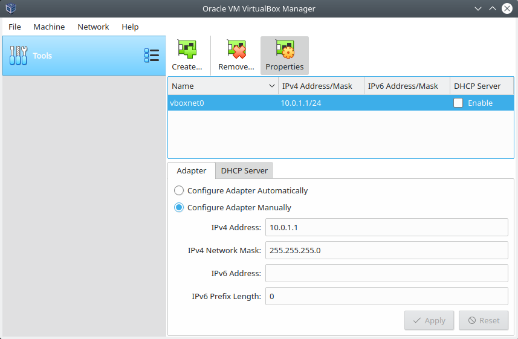
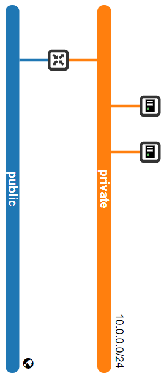

Despliegue de OpenStack Singlenode con Packstack, VirtualBox y Vagrant
----------------------------------------------------------------------

.. contents:: Table of Contents

Prerequisitos del sistema
'''''''''''''''''''''''''

Desde nuestro sistema Operativo (Windows, macOS, Linux) debemos tener instaladas los siguientes programas:

- VirtualBox
- Vagrant

Este escenario de OpenStack que será desplegado consta de 1 VM: un node que contiene las funcionalidades de controller, network, compute, etc. integradas. Se requiere al menos 8 GB de RAM y 4 CPUs.

Configuración de VirtualBox
'''''''''''''''''''''''''''

Host-only Network Adapter
"""""""""""""""""""""""""

1. Crear un Host-only Network Adapter haciendo clic en el botón :guilabel:`Global Tools`, :guilabel:`Host Network Manager`. Clic en el botón :guilabel:`Create`:

    Windows - VirtualBox v5.2 - Crear un nuevo adaptador

.. figure:: images/packstack-singlenode-deploy-packstack-virtualbox-vagrant/Linux-VirtualBox-HostNetworkManager-Create-Adapter-1.png
    :align: center

    Linux - VirtualBox v6.0 - Crear un nuevo adaptador

2. Se creará un adaptador con un nombre predefinido al cual podremos editar la dirección IPv4 respectiva. En este caso no será necesario activar la opción de DHCP:

.. figure:: images/packstack-singlenode-deploy-packstack-virtualbox-vagrant/Windows-VirtualBox-HostNetworkManager-Create-Adapter-2.png
    :align: center

    Windows - VirtualBox v5.2 - Configuración del adaptador

    Linux - VirtualBox v6.0 - Configuración del adaptador

.. Note::

    Sobre el adaptador de red creado:

    - El adaptador pertenece a la red de management
    - La dirección IP del adaptador es el Host-side de la red

NAT Provider Network
""""""""""""""""""""

1. Clic en :guilabel:`Preferences` (:guilabel:`Ctrl + G`):

.. figure:: images/packstack-singlenode-deploy-packstack-virtualbox-vagrant/Windows-VirtualBox-Preferences.png
    :align: center

    Windows - VirtualBox v5.2 - Clic en opción :guilabel:`Preferences`

.. figure:: images/packstack-singlenode-deploy-packstack-virtualbox-vagrant/Linux-VirtualBox-Preferences.png
    :align: center

    Linux - VirtualBox v6.0 - Clic en opción :guilabel:`Preferences`

2. En la sección :guilabel:`Network`, seleccionar el botón de creación de una nueva red:

.. figure:: images/packstack-singlenode-deploy-packstack-virtualbox-vagrant/Windows-VirtualBox-Preferences-Network.png
    :align: center

    Windows - VirtualBox v5.2 - Clic en sección :guilabel:`Network`

.. figure:: images/packstack-singlenode-deploy-packstack-virtualbox-vagrant/Linux-VirtualBox-Preferences-Network.png
    :align: center

    Linux - VirtualBox v6.0 - Clic en sección :guilabel:`Network`

3. Nombrar y definir un rango para la red NAT. También podemos dar soporte DHCP:

.. figure:: images/packstack-singlenode-deploy-packstack-virtualbox-vagrant/Windows-VirtualBox-Create-Provider-Network.png
    :align: center

    Windows - VirtualBox v5.2 - Definir propiedades de la red

.. figure:: images/packstack-singlenode-deploy-packstack-virtualbox-vagrant/Linux-VirtualBox-Create-Provider-Network.png
    :align: center

    Linux - VirtualBox v6.0 - Definir propiedades de la red

Definición del archivo ``Vagrantfile``
''''''''''''''''''''''''''''''''''''''

El archivo ``Vagrantfile`` se define de la siguiente forma:

.. code-block:: bash

    # -*- mode: ruby -*-
    # vi: set ft=ruby :
    servers=[
      {
        :hostname => "packstack",
        :box => "centos/7",
        :ram => 8192,
        :cpu => 4,
        :script => "sh /vagrant/packstack_setup.sh"
      }
    ]
    # All Vagrant configuration is done below. The "2" in Vagrant.configure
    # configures the configuration version (we support older styles for
    # backwards compatibility). Please don't change it unless you know what
    # you're doing.
    Vagrant.configure("2") do |config|
      servers.each do |machine|
        config.vm.define machine[:hostname] do |node|
          node.vm.box = machine[:box]
          node.vm.hostname = machine[:hostname]
          node.vm.provider "virtualbox" do |vb|
            vb.customize ["modifyvm", :id, "--memory", machine[:ram], "--cpus", machine[:cpu]]
            vb.customize ["modifyvm", :id, "--nic2", "hostonly", "--hostonlyadapter2", "VirtualBox Host-Only Ethernet Adapter #2"]
          end
          node.vm.provision "shell", inline: machine[:script], privileged: true, run: "once"
        end
      end
    end

.. Important::

    - Vagrant configura automáticamente la primera interfaz de red de una nueva VM en la red NAT. A través de esta red podemos acceder desde el sistema host al Dashboard o CLI del nodo.
    - La primera interfaz de red se usa para conectarnos a Internet.
    - La segunda interfaz sirve para proveer conectividad del sistema host a la VM con OpenStack.

Definición de archivo de configuración del nodo
'''''''''''''''''''''''''''''''''''''''''''''''

En el mismo directorio donde tenemos almacenado el archivo ``Vagrantfile`` guardaremos el script ``.sh`` que se correrá cuando Vagrant lance la VM dentro del nodo:

Controller (``packstack_setup.sh``)
"""""""""""""""""""""""""""""""""""

.. code-block:: bash

    #! /bin/sh

        export LANG=en_US.utf-8
        export LC_ALL=en_US.utf-8

        sed -i -e 's/enabled=1/enabled=0/g' /etc/yum/pluginconf.d/fastestmirror.conf

        cat <<- EOF > /etc/sysconfig/network-scripts/ifcfg-eth1
        DEVICE="eth1"
        DEFROUTE="no"
        BOOTPROTO="static"
        IPADDR="10.0.0.20"
        NETMASK="255.255.255.0"
        DNS1="8.8.8.8"
        TYPE="Ethernet"
        ONBOOT=yes
        EOF

        ifdown eth1
        ifup eth1

        cat <<- EOF > /etc/hosts
        127.0.0.1 localhost
        10.0.0.20 packstack
        EOF

        echo 'centos' >/etc/yum/vars/contentdir

        systemctl disable firewalld
        systemctl stop firewalld
        systemctl disable NetworkManager
        systemctl stop NetworkManager
        systemctl enable network
        systemctl start network

        yum install -y centos-release-openstack-queens
        yum update -y
        yum install -y openstack-packstack
        yum install -y lvm2

        packstack --install-hosts="10.0.0.20" --os-heat-install=y --os-heat-cfn-install=y --os-neutron-lbaas-install=y --keystone-admin-passwd="openstack" --keystone-demo-passwd="openstack"

Correr el entorno Vagrant e Instalación de OpenStack con Packstack
''''''''''''''''''''''''''''''''''''''''''''''''''''''''''''''''''

En el terminal, cambiar de directorio al lugar donde tenemos almacenado el archivo ``Vagrantfile`` y el script ``.sh`` del nodo. Luego, desplegar la máquina virtual con ``vagrant up``:

.. code-block:: bash

    $ cd singlenode-packstack-vagrant

    $ vagrant up

Comenzará la configuración y despliegue de la máquina virtual en VirtualBox conforme se ha especificado en el archivo ``Vagrantfile``, luego correrá automáticamente el script ``.sh`` que se ha definido para la VM:

.. figure:: images/packstack-singlenode-deploy-packstack-virtualbox-vagrant/vagrant-deploy-virtualbox-vm.png
    :align: center

    VirtualBox - VM desplegada por Vagrant

La instalación de Packstack en este nodo iniciará automáticamente. Luego de media hora aproximadamente, la instalación de OpenStack con Packstack habrá finalizado y podremos ingresar al Dashboard o al CLI de OpenStack.

.. Note::

    El Dashboard de OpenStack podría demorar un corto tiempo para arrancar la primera vez luego de haber instalado OpenStack.

Pruebas en el entorno OpenStack desplegado
''''''''''''''''''''''''''''''''''''''''''

Ubicándonos el mismo directorio donde tenemos el archivo ``Vagrantfile`` entraremos al terminal de la VM ``packstack`` con el siguiente comando:

.. code-block:: bash

    $ vagrant ssh packstack
    $ sudo su
    $ cd /root

Ahora realizaremos una prueba de despliegue desde el CLI:

.. Important::

    La imagen de CirrOS que se crea por defecto como ``demo`` al instalar Packstack tiene fallos pues tiene un tamaño reducido de 273 bytes. La causa de esto es que puede ser que se haya descargado sin la opción ``-L`` del comando ``curl``. Por lo tanto, crearemos nuestra propia imagen CirrOS:

La topología que se desea lograr es la siguiente:

    OpenStack - Topología desplegada

Y los comandos que ejecutaremos en el nodo controller serán los siguientes:

.. code-block:: bash

    '#' source keystonerc_admin

    '#' mkdir images
    '#' curl -o /root/images/cirros-0.4.0-x86_64-disk.img -L http://download.cirros-cloud.net/0.4.0/cirros-0.4.0-x86_64-disk.img
    '#' openstack image create --min-disk 1 --min-ram 128 --public --disk-format qcow2 --file /root/images/cirros-0.4.0-x86_64-disk.img cirros1

    '#' source keystonerc_demo

    '#' openstack network list

    +--------------------------------------+---------+--------------------------------------+
    | ID                                   | Name    | Subnets                              |
    +--------------------------------------+---------+--------------------------------------+
    | 2355d395-0b86-4b04-aedf-56c22ea87bf1 | private | 623a8170-54d0-47be-b8bc-fca4fdebe4cb |
    | 273ed9aa-63e1-4178-9237-32a6095f9840 | public  | c04cf225-a94d-4237-869d-d0bd08e40f37 |
    +--------------------------------------+---------+--------------------------------------+

    '#' openstack server create --image cirros1 --flavor 1 --min 2 --max 2 --nic net-id=2355d395-0b86-4b04-aedf-56c22ea87bf1 test

En este despliegue de prueba se han creado dos instancias al mismo tiempo y con las mismas características corriendo en el mismo nodo (o equivalentemente, en el mismo hypervisor).

.. figure:: images/packstack-singlenode-deploy-packstack-virtualbox-vagrant/openstack-singlenode-test-instances.png
    :align: center

    OpenStack - Instancias desplegadas

Podremos ingresar a la consola de cada instancia desde el dashboard y probar conectividad entre ellas:

    OpenStack - Consola ``test-1``
