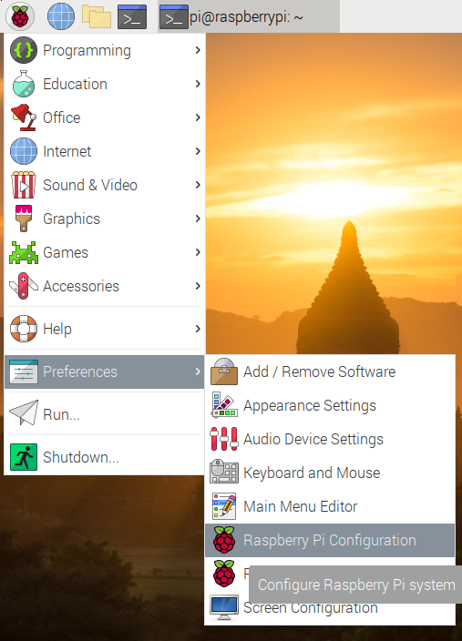
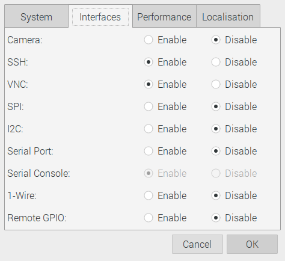

.. _remote-access:

Habilitar acceso remoto
=======================

Para habilitar el acceso remoto vía SSH y VNC ir a :guilabel:`Preferences` -->  :guilabel:`Raspberry Pi Configuration`:

    :guilabel:`Preferences` -->  :guilabel:`Raspberry Pi Configuration`

En la pestaña :guilabel:`Interfaces`, habilitar SSH y VNC, poniéndolos en estado :guilabel:`Enable`. Seleccionar :guilabel:`OK`:

    Pestaña :guilabel:`Interfaces`, habilitar SSH y VNC, seleccionar :guilabel:`OK`
