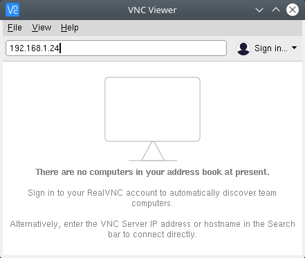
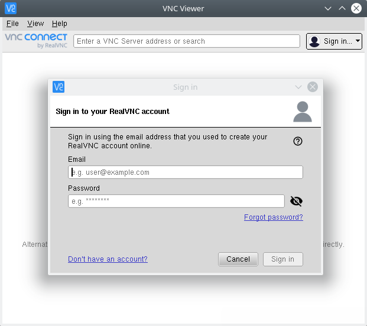
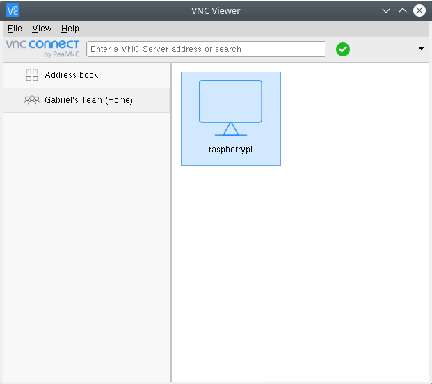
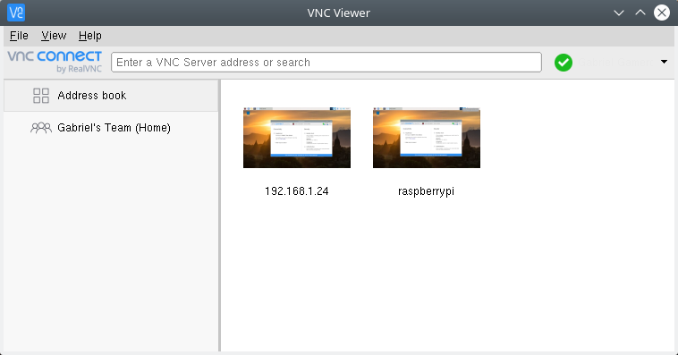

VNC (Virtual Network Computing)
===============================

Basado en: `Documentation Raspberry Pi - Remote Access - VNC`_

.. _Documentation Raspberry Pi - Remote Access - VNC: https://www.raspberrypi.org/documentation/remote-access/vnc/

Podemos usar el Raspberry Pi remotamente a través de VNC. Esta aplicación nos permite controlar la interfaz de escritorio de una computadora en la que esté corriendo un **VNC Server** desde otra computadora corriendo un **VNC Viewer**. La idea es que podamos controlar el Raspberry Pi desde una ventana en nuestra computadora o una aplicación en nuestro smartphone como si estuviésemos trabajando frente al Raspberry Pi mismo.

**VNC Connect** de **RealVNC** viene incluido en la distribución Raspbian. Esta consiste de un VNC Server y un VNC Viewer.

Debemos `habilitando el VNC Server`_ antes de poder usarlo, dándonos acceso remoto a la interfaz gráfica que corre en el Raspberry Pi. Sin embargo, también podemos usar el VNC Server para obtener acceso gráfico a nuestro Raspberry Pi si es **headless** (es decir, no está conectado a un monitor) o no está corriendo un escritorio gráfico. Ver la sección `Creando un escritorio virtual`_.

Habilitando el VNC Server
-------------------------

En el Raspberry Pi asegurarnos que tenemos la última versión de VNC Connect:

.. code-block:: bash

    $ sudo apt update
    $ sudo apt install realvnc-vnc-server realvnc-vnc-viewer

Para habilitar VNC Server podemos hacerlo de forma gráfica o por el terminal:

Habilitando VNC Server de forma gráfica
'''''''''''''''''''''''''''''''''''''''

Seguir documentación: :ref:`remote-access`

Habilitando VNC Server en el terminal
'''''''''''''''''''''''''''''''''''''

.. code-block:: bash

    $ sudo raspi-config

Escoger la opción :guilabel:`Interfacing Options` y seleccionar :guilabel:`VNC > Yes`.

Estableciendo conexión a nuestro Raspberry Pi con VNC Viewer
------------------------------------------------------------

Existen 2 formas para conectarnos a nuestro Raspberry Pi:

Estableciendo una conexión directa
''''''''''''''''''''''''''''''''''

Las conexiones directas son una forma simple y rápida de conexión a través de la misma red de nuestro Raspberry Pi.

1. Obtener la dirección IP de la interfaz de red de nuestro Raspberry Pi usando ``ifconfig`` o ``ip addr``.
2. Desde el dispositivo desde el cual controlaremos el Raspberry Pi, descargar VNC Viewer. Preferentemente la aplicación de RealVNC.
3. Ingresar la dirección IP de nuestro Raspberry Pi en el VNC Viewer de la computadora:

    Conexión directa a Rasberry Pi desde VNC Viewer

4. `Autenticándonos al VNC Server`_

Estableciendo una conexión cloud
''''''''''''''''''''''''''''''''

Podemos utilizar el servicio en la nube de RealVNC para conectarnos a nuestro Raspberry Pi a través de Internet. Las conexiones cloud son encriptadas end-to-end y no es necesaria una reconfiguración de firewall o router. Tampoco es necesario saber la dirección IP de nuestro Raspberry Pi.

1. Primero debemos `crear una cuenta en RealVNC`_ de forma gratuita.

.. _crear una cuenta en RealVNC: https://www.realvnc.com/en/raspberrypi/#sign-up

2. En el VNC Server del Raspberry Pi iniciar sesión yendo a la opción :guilabel:`Licensing`.

.. figure:: images/vnc/sign-in-vnc-server.png
    :align: center

    Iniciar sesión en el Raspberry Pi desde VNC Server

3. En la computadora que usaremos para controlar el Raspberry Pi, usar VNC Viewer (de RealVNC)

    Iniciar sesión en el Raspberry Pi desde VNC Server

4. Una vez que hemos iniciado sesión desde el VNC Viewer con la misma cuenta usada para el VNC Server del Raspberry Pi veremos un nuevo equipo disponible para conectarnos en la sección de ``Team``:

    Nuevo equipo disponible para conectarnos (Raspberry Pi) en la sección ``Team``

5. `Autenticándonos al VNC Server`_

Autenticándonos al VNC Server
'''''''''''''''''''''''''''''

Para completar cualquier método conexión, ya sea `Estableciendo una conexión directa`_ o `Estableciendo una conexión cloud`_, debemos autenticarnos en el VNC Server.

Si estamos conectándonos de una aplicación VNC Viewer compatible de RealVNC, ingresar el usuario y password del Raspberry Pi que normalmente usaríamos para usar loguearnos en nuestra cuenta de usuario. Por defecto, las credenciales son ``pi:raspberry``.

    Mismo equipo Raspberry Pi con 2 tipos de conexión: directa (izquierda) y cloud (derecha)

Creando un escritorio virtual
-----------------------------

Si nuestro Raspberry Pi es **headless** (es decir, no está conectado a un monitor) o no está corriendo un escritorio gráfico podemos usar **VNC Server** para crear un escritorio **virtual (virtual desktop)**. Brindándonos acceso remoto gráfico. Este escritorio virtual solo existe en la memoria de nuestro Raspberry Pi:

.. figure:: images/vnc/raspberry-pi-virtual.png
    :align: center

    Creating a virtual desktop - Fuente: https://www.raspberrypi.org/documentation/remote-access/vnc/

Para crear y conectarnos a un escritorio virtual:

1. En nuestro Raspberry Pi (usando el terminal o vía SSH) correr:

.. code-block:: bash

    $ vncserver

    VNC(R) Server 6.5.0 (r41824) ARMv6 (Aug 16 2019 00:24:44)

    [...]

    Running applications in /etc/vnc/xstartup

    VNC Server catchphrase: "Instant amigo printer. Russian Boston orca."
                signature: 61-7f-1d-5d-fa-37-a6-v7

    Log file is /home/pi/.vnc/raspberrypi:1.log
    New desktop is raspberrypi:1 (192.168.1.24:1)

.. Important::

    Tomar nota de la dirección IP y del identificador que VNC Server usa para este escritorio virtual creado (display number). En este caso: ``192.168.1.24:1``

2. En el dispositivo que usaremos para controlar el Raspberry Pi ingresar esta información en el VNC Viewer.

3. Para eliminar un escritorio virtual correr el siguiente comando:

.. code-block:: bash

    # vncserver -kill :<display-number>
    $ vncserver -kill :1
