Creando VMs con ``virt-manager``
================================

.. contents:: Table of Contents

El programa **virt-manager (Virtual Machine Manager)** es una interfaz de usuario de escritorio para administrar VMs a través de ``libvirt``. Se enfoca principalmente en VMs de KVM pero también es compatible con Xen y LXC. A través de un wizard, ``virt-manager`` nos permite crear, monitorear y configurar VMs. Se presenta una consola gráfica del guest domain mediante un VNC embebido y un cliente SPICE viewer.

A continuación se tratarán los 4 métodos de creación de una VM guest disponibles a través de ``virt-manager`` usando su wizard integrado.

Creación de VM con método Local installation media
--------------------------------------------------

Este método de instalación requiere que el medio de instalación sea insertado en la bandeja de CD-ROM del sistema físico, se encuentre disponible localmente en formato ISO o disponible a través de la red. Podemos guardar los archivos ISO es ``/var/lib/libvirt/images``, que sirve como el pool de almacenamiento por defecto de ``virt-manager``.

1. Ejecutemos Virtual Machine Manager desde un terminal con el comando ``virt-manager`` o buscando la aplicación de escritorio (:guilabel:`Alt + F2` o :guilabel:`Alt + Fn + F2`).

Por defecto nos encontraremos con una ventana en la que ya se encuentra configurada una conexión a un hypervisor local QEMU/KVM.

.. figure:: images/virt-manager-new-vm/virt-manager-blank.png
    :align: center

    virt-manager (Virtual Machine Manager)

2. Desde **Virtual Machine Manager** clic en el botón :guilabel:`Create a new virtual machine` en la barra de herramientas o seleccionar :guilabel:`File` | :guilabel:`New Virtual Machine` para abrir el wizard. Esto nos permitirá crear una nueva VM desde ``virt-manager``.

Los pasos que se siguen en el wizard para la creación de una VM son:

1. Escoger el medio de instalación
2. Configurar el medio de instalación
3. Configurar la memoria y CPU
4. Configurar el almacenamiento de la VM
5. Nombrar el SO guest y configurar networking.

3. En el primer paso seleccionar :guilabel:`Local installation media (ISO o CDROM)` como método de instalación del SO guest:

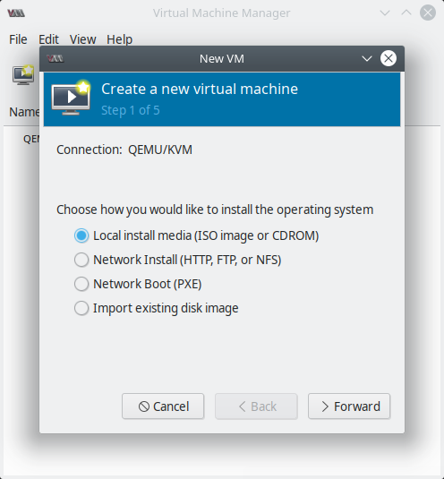

    virt-manager Step 1

4. Especificar la ubicación de la imagen ISO que emplearemos escribiendo la ruta manualemente o con el boton :guilabel:`Browse`. En el caso de que estemos usando un CDROM o DVD físico seleccionar la opción :guilabel:`Use CDROM or DVD`:

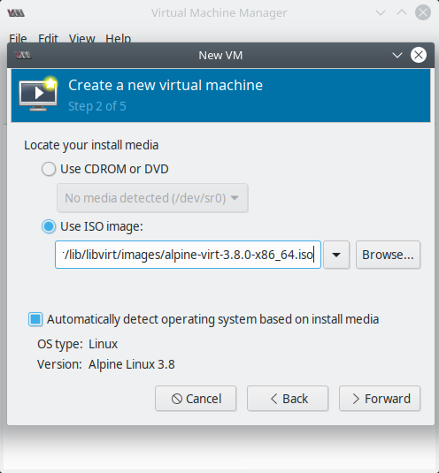

    virt-manager Step 2

.. Note::

    ``virt-manager`` detecta el SO basado en el medio de instalación automáticamente. ``libosinfo-bin`` provee una base de datos con más de 300 SOs (Windows, Linux, ...).
    
    1. Instalar ``libosinfo-bin``: ``sudo apt-get install libosinfo-bin``
    2. Con el comando ``osinfo-query os`` obtenemos detalled de varios SOs:

    +----------------+------------------+---------+----------------------------------------+
    | Short ID       | Name             | Version | ID                                     |
    +----------------+------------------+---------+----------------------------------------+
    | ubuntu18.04    | Ubuntu 18.04 LTS | 18.04   | http://ubuntu.com/ubuntu/18.04         |
    +----------------+------------------+---------+----------------------------------------+
    | centos7.0      | CentOS 7.0       | 7.0     | http://centos.org/centos/7.0           |
    +----------------+------------------+---------+----------------------------------------+
    | alpinelinux3.8 | Alpine Linux 3.8 | 3.8     | http://alpinelinux.org/alpinelinux/3.8 |
    +----------------+------------------+---------+----------------------------------------+
    | cirros0.4.0    | CirrOS 0.4.0     | 0.4.0   | http://cirros-cloud.net/cirros/0.4.0   |
    +----------------+------------------+---------+----------------------------------------+

5. Especificar la memoria y el CPU que deseemos asignar a la VM:

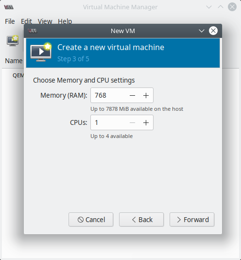

    virt-manager Step 3

El wizard muestra la cantidad máxima de CPUs y memoria que podemos asignar.

6. Configurar el almacenamiento para la VM:

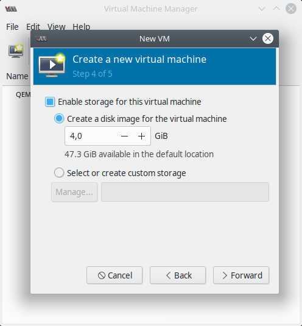

    virt-manager Step 4

Por defecto se creará un disco virtual en la dirección ``/var/lib/libvirt/qemu`` dentro del pool de almacenamiento predeterminado. Si deseamos usar otro pool personalizado seleccionar la opción :guilabel:`Select managed or other existing storage` e ingresar la ruta del disco manualmente o seleccionar el botón :guilabel:`Browse` donde tendremos la posibilidad de  seleccionar un volumen existente o crear uno nuevo del pool de almacenamiento definido.

.. Note::

    Mantener deseleccionada la opción :guilabel:`Allocate entire disk now` resultará en un **disco thin-provisioned** y seleccionarla generará un **disco thick provisioned** (también llamado **disco pre-allocated**).

7. El último paso es nombrar el guest y la configuración de networking. Para el nombre solo se permite letras, números, punto (.), guión bajo (_) y guión (-).

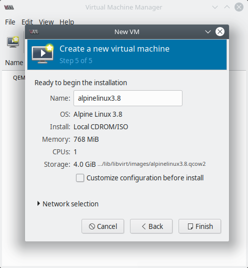

    virt-manager Step 5

Notar que el disco virtual en este caso tiene formato ``.qcow2`` y se almacena en el directorio ``/var/lib/libvirt/images``.

Expandir el menú :guilabel:`Network selection` mostrará la configuración de red virtual. Por defecto, KVM provee NAT-like bridged networking. Las VMs conectadas a esta NAT no aparecen en la red como sus propios dispositivos, pero tendrán acceso a la red a través del SO host.

.. Important::

    Si estamos pensando en correr software o un servidor web en nuestra VM y queremos que sea accesible por otros dispositivos en la red, debemos usar otra configuración de networking virtual como **Linux bridge** o **macvtap**.

Si deseamos seguir configurando el hardware de la VM, seleccionar la opción :guilabel:`Customize configuration before install` antes de seleccionar :guilabel:`Finish`. Accederemos a un wizard para agregar, remover o editar configuraciones de hardware de la VM.

8. Finalizado el proceso de creación de la VM, se creará una nueva ventana iniciando el proceso de instalación del SO guest. Además podremos ver la VM en la ventana principal de ``virt-manager``:

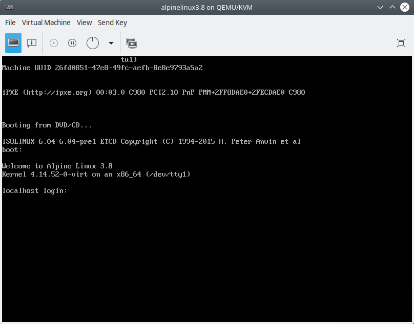

    virt-manager VM running

Creación de VM con método Importing existing disk image
-------------------------------------------------------

Con este método de instalación podes importar una imagen de disco previamente instalada y configurada con un SO booteable. Este método ayuda a desplegar VMs rápidamente y para transferir una VM a otro host de forma offline. Podemos usar nuestra propias imágenes de disco o importar un disco pre-configurado de alguna distribución de Linux pública:

Los pasos para crear una VM con este método son similares al proceso de `Creación de VM con método Local installation media`_. Solo haremos los siguientes cambios en Step 1 y Step 2:

1. Iniciar el wizard para crear una nueva VM desde ``virt-manager``, seleccionar :guilabel:`Import existing disk image` como método de instalación del SO.

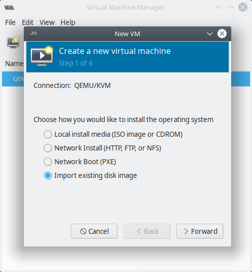

    virt-manager - método Importing existing disk image

2. Ingresar la ruta de la imagen, la cual deberá estar dentro de uno de los pools de almacenamiento:

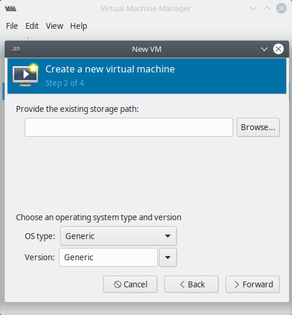

    virt-manager - Step 2

Este método no usa el paso de asignación de tamaño de almacenamiento pues el disco ya ha sido creado previamente y nosotros solo estamos importando este archivo de disco virtual.

Creación de VM con método Network Boot (PXE)
--------------------------------------------

El método Network Boot Preboot eXecution Environment(PXE) emplea un servidor dentro de la misma subred donde instalaremos la VM guest.

La red NAT por defecto creada por ``virt-manager`` no es compatible con este tipo de instalación, ya que, una VM conectada a NAT no aparece en la red como su propio dispositivo; y por tanto, el servidor PXE no puede verlo. Para usar una instalación de un guest OS mediante PXE, necesitamos usar o bien un **bridge de red de software** o una **red basada en macvtap** en el sistema host. En este ejemplo usaremos la macvtap.

Los pasos para crear una VM con este método son similares al proceso de `Creación de VM con método Local installation media`_. Solo haremos los siguientes cambios en Step 1 y Step 5:

1. Iniciar el wizard para crear una nueva VM desde ``virt-manager``, seleccionar :guilabel:`Network Boot (PXE)` como método de instalación del SO.

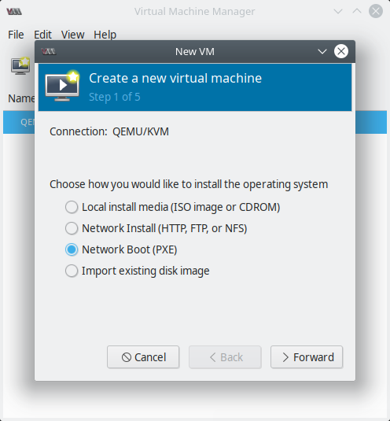

    virt-manager - método Network Boot (PXE)

2. En el paso 5 seleccionar expandir el menú :guilabel:`Network selection`, usar :guilabel:`Host device <interface>:macvtap` de la lista desplegable y seleccionar :guilabel:`Source mode` en :guilabel:`Bridge`. Clic en :guilabel:`Finish`.

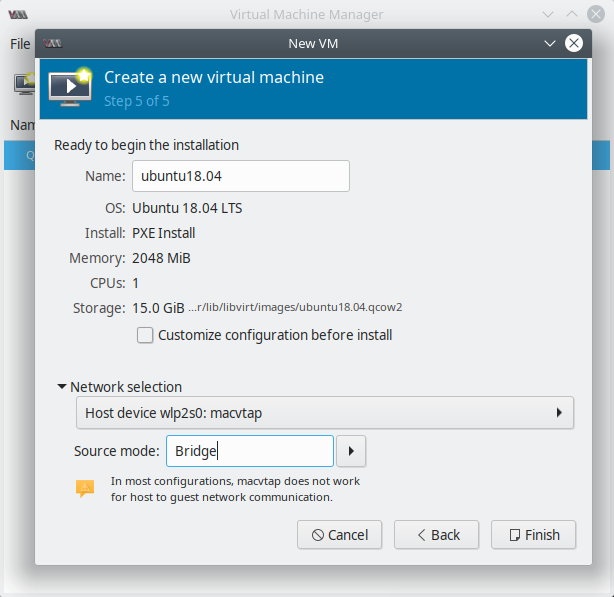

    virt-manager - Step 5

Creación de VM con método Network Install (HTTP, FTP o NFS)
-----------------------------------------------------------

El método de instalación por red consiste en pasar una URL con un mirror del SO que deseemos instalar. Esta dirección web contendrá el árbol de instalación del SO. Se repiten los pasos de la sección `Creación de VM con método Local installation media`_, solo haremos cambios en Step 1 y Step 5.

1. Seleccionar la opción :guilabel:`Network Install (HTTP, FTP o NFS)` como método de instalación del SO:

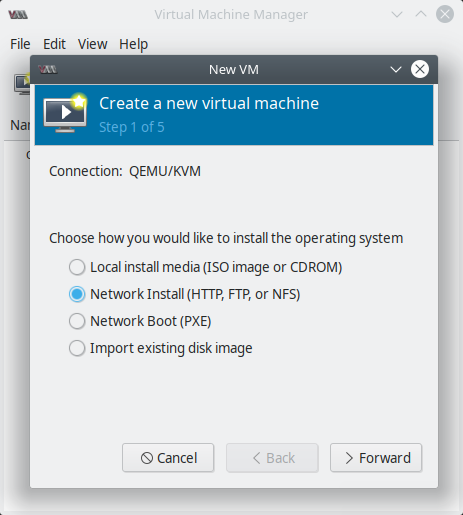

    virt-manager - método Network Install (HTTP, FTP o NFS)

2. Opcionalmente podemos pasar **opciones de kernel**, si es que existen. Para pasar un **archivo kisckstart** como opción de kernel podremos especificarlo a través de una URL comenzando con ``ks=``:

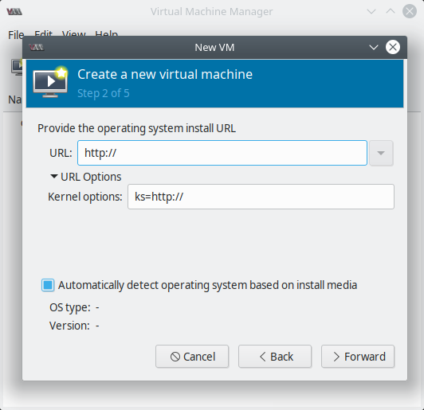

    virt-manager - Step 2

Referencias
-----------

- `CREATING GUESTS WITH VIRT-MANAGER - Red Hat Documents`_
- `Virtual Machine Manager Homepage`_

.. _CREATING GUESTS WITH VIRT-MANAGER - Red Hat Documents: https://access.redhat.com/documentation/en-us/red_hat_enterprise_linux/7/html/virtualization_deployment_and_administration_guide/sect-creating_guests_with_virt_manager
.. _Virtual Machine Manager Homepage: https://virt-manager.org/
