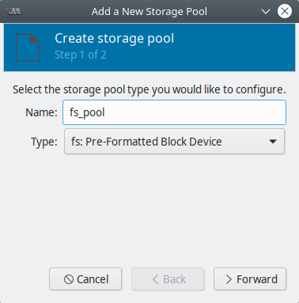
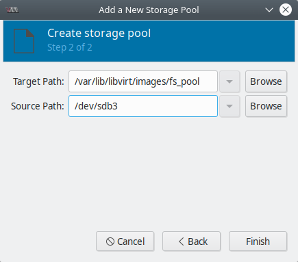
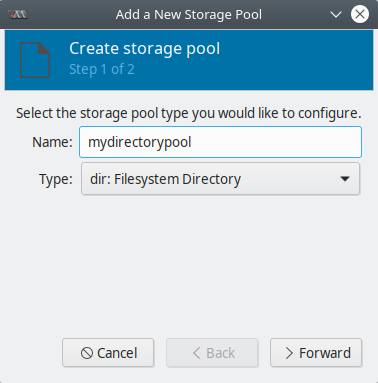
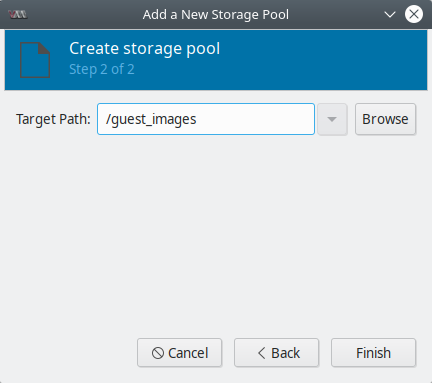
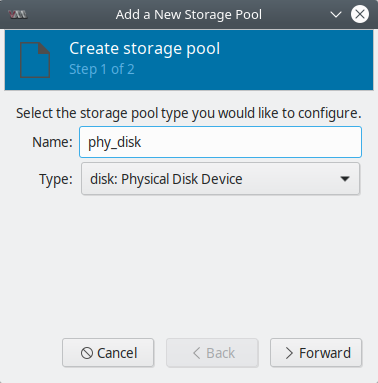
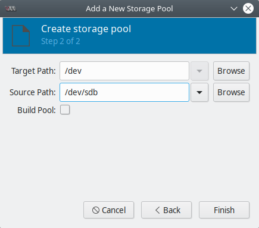
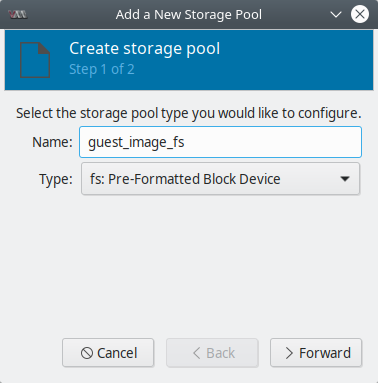
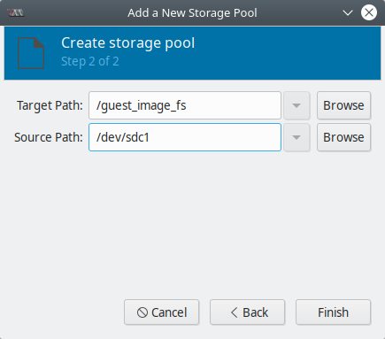

.. _poolswithlibvirt:

Pools con clientes de ``libvirt``
=================================

.. contents:: Table of Contents

Un pool de almacenamiento es un archivo, directorio o dispositivo de almacenamiento, administrado por ``libvirt`` para proveer almacenamiento a VMs. Los pools se dividen en volúmenes de almacenamiento que guardan imáges de VMs o son conectados a VMs como almacenamiento adicional. Varios guest pueden compartir el mismo pool de almacenamiento, permitiendo una mejor asignación de recursos.

Los pools de almacenamiento pueden ser locales o basados en red (compartidos):

- **Pools de almacenamiento locales**: conectados al servidor host directamente. Incluye directorios locales, discos conectados directamente, particiones físicas, y Logical Volume Management (LVM) volume groups en dispositivos locales.

- **Pools de almacenamiento en red (compartidos)**: pools de almacenamiento en red incluyen dispositivos de red compartidos a través de la red usando protocolos estándar. Se requiere este almacenamiento cuando migramos VMs a otro host.

Lista de pools soportados por ``libvirt``:

- ``-dir``: usa el directorio filesystem para guardar discos virtuales
- ``-disk``: usa discos duros físicos para crear discos virtuales
- ``-fs``: usa particiones pre-formateadas para guardar discos virtuales
- ``-netfs``: usa almacenamiento compartido por red como NFS para discos virtuales
- ``-gluster``: permite usar el filesystem gluster para guardar discos virtuales
- ``-iscsi``: usa almacenamiento compartido por red ISCSI para guardar disco virtuales
- ``-scsi``: usa almacenamiento local SCSI para guardar discos virtuales
- ``-lvm``: depende de grupos de volúmenes LVM para guardar discos virtuales
- ``-rbd``: permite conectar almacenamiento **Ceph** para discos virtuales

Creando pools
-------------

Creando pools con ``virt-manager``
''''''''''''''''''''''''''''''''''

A continuación se listan los pasos para la creación de un pool de almacenamiento, de forma general, usando ``virt-manager``:

1. Preparar el medio en el que se creará el pool de almacenamiento.

Según el tipo de pool que se use, el procedimiento será distinto. Para ver el procedimiento a seguir de un tipo de pool en específico, buscarlo en `Configuraciones específicas de pools`_.

2. Abrir la configuración de almacenamiento

En ``virt-manager`` ir a :guilabel:`Edit` | :guilabel:`Connection details` | pestaña :guilabel:`Storage`

.. figure:: images/pools-with-libvirt/storage-tab-connection-details.png
    :align: center

    ``virt-manager`` - :guilabel:`Connection details` - pestaña :guilabel:`Storage`

3. Crear un nuevo pool de almacenamiento

a. Agregar un nuevo pool de almacenamiento (Paso 1):

Hacer clic en el botón :guilabel:`+` (:guilabel:`Add pool`) bajo la lista de pools. Aparecerá un wizard.

Dar un nombre al pool en el campo :guilabel:`Name`. Seleccionar un tipo de pool de la lista en el campo :guilabel:`Type`.

    ``virt-manager`` - Create storage pool - Step 1 

b. Agregar un nuevo pool de almacenamiento (Paso 2):

Configurar al pool de almacenamiento con los parámetros específicos del tipo de pool. Para más detalles ir a `Configuraciones específicas de pools`_.

    ``virt-manager`` - Create storage pool - Step 1 

.. Note::

    Para un tipo de pools aparece un check box con la opción :guilabel:`Build Pool`. Si deseamos construir un pool desde el almacenamiento, seleccionar esta opción.

Luego de verificar la configuración clic en el botón :guilabel:`Finish` para crear el pool.

Creando pools con ``virsh``
'''''''''''''''''''''''''''

A continuación se listan los pasos para la creación de un pool de almacenamiento, en este caso de tipo **basado en partición**, usando ``virsh``:

1. Asegurarse de cumplir los prerequisitos

Los prerequisitos y recomendaciones para los distintos tipos de pool varían. Para ver más a detalle cada tipo de pool ir a `Configuraciones específicas de pools`_.

2. Definir el pool

Los pools de almacenamiento pueden ser **persistentes (persistent)** o **transitorio (transient)**. Un pool persistente sigue exstiendo luego de reiniciar el sistema host, mientras que el pool transitorio dura hasta que el sistema se reinicia.

En ``virsh``, podemos definir un pool de 2 formas:

- Definir el pool usando un archivo XML

a. Crear un archivo XML temporal (``~/guest_images_fspool.xml``) con la información requerida para el nuevo dispositivo. Según el tipo de pool, los campos dentro del XML cambiarán.

Se muestra un ejemplo de un archivo XML con la definición de un pool tipo basado en partición:

.. code-block:: xml

    <pool type='fs'>
    <name>guest_images_fs</name>
    <source>
        <device path='/dev/sda3'/>
    </source>
    <target>
        <path>/guest_images</path>
    </target>
    </pool> 

b. Usar el comando ``virsh pool-define`` o ``virsh pool-create`` para crear un pool persistente o transitorio, respectivamente:

Persistent (permanente):

.. code-block:: bash

    $ virsh pool-define ~/guest_images_fspool.xml

    Pool guest_images_fs defined from ~/guest_images_fspool.xml

Transient (temporal):

.. code-block:: bash

    $ virsh pool-create ~/guest_images_fspool.xml
    
    Pool guest_images_fs created from ~/guest_images_fspool.xml

c. Eliminar el archivo XML del paso ``a``.

- Crear el pool usando ``virsh pool-define-as`` o ``virsh pool-create-as`` para crear un pool persistente o transitorio, respectivamente.

Los siguientes comandos crean un pool de almacenamiento (persistent o transient) llamado ``guest_images_fs`` mapeado a ``/dev/sda3`` desde el directorio ``/guest images``:

Persistent (permanente):

.. code-block:: bash

    $ virsh pool-define-as guest_images_fs fs - - /dev/sda3 - "/guest_images"

    Pool guest_images_fs defined

Transient (temporal):

.. code-block:: bash

    $ virsh pool-create-as guest_images_fs fs - - /dev/sda3 - "/guest_images"
    
    Pool guest_images_fs created

.. Note::

    En ``virsh``, algunas opciones de nombre son opcionales. Si no serán usados, reemplazarlos por un ``-``.

3. Verificar que el pool ha sido creado

Listar los pools con ``virsh pool-list``:

.. code-block:: bash

    $ virsh pool-list --all
    Name                 State      Autostart 
    -------------------------------------------
    default              active     yes       
    guest_images_fs      active     no

4. Definir el target path del pool

Usar el comando ``virsh pool-build`` para crear un **pool target path** para pool file system pre-formateado, inicializar el dispositivo origen y definir el formato de los datos:

.. code-block:: bash

    $ virsh pool-build guest_images_fs
    Pool guest_images_fs built

.. Note::

    Hacer build del target path solo es necesario para pools basados en disco (:guilabel:`disk: Physical Disk Device`), file system (:guilabel:`fs: Pre-Formatted Block Device`) y lógicos (:guilabel:`logical: LVM Volume Group`). Si ``libvirt`` detecta que el formato del dispositivo fuente difiere del tipo de pool, el build falla; a menos que se use la opción ``overwrite``.

5. Iniciar el pool

Para poder iniciar un pool y usarlo, ejecutar el comando ``virsh pool-start``:

.. code-block:: bash

    $ virsh pool-start guest_images_fs

    Pool guest_images_fs started

    $ virsh pool-list --all
    Name                 State      Autostart
    -----------------------------------------
    default              active     yes
    guest_images_fs      active     no

6. Activar autostart

Para que un pool inicie automáticamente cuando el servicio de ``libvirtd`` inicie usar ``virsh pool-autostart``:

.. code-block:: bash

    $ sudo virsh pool-autostart guest_images_fs
    
    Pool guest_images_fs marked as autostarted

    # virsh pool-list --all
    Name                 State      Autostart
    -----------------------------------------
    default              active     yes
    guest_images_fs      active     yes

    $ virsh pool-info guest_images_fs

    Name:           guest_images_fs
    UUID:           2908eed7-a00b-4629-9ad7-f9bbe00bf2f4
    State:          running
    Persistent:     no
    Autostart:      yes
    Capacity:       82,00 GiB
    Allocation:     38,62 GiB
    Available:      43,38 GiB

    $ mount | grep /guest_images
    /dev/sda3 on /guest_images type ext4 (rw)

.. Important::

    Como vemos en el último comando con este tipo de pool (basado en filesystem) se tiene montada una partición del disco (**source**) en nuestro directorio del pool (**target path**).

Configuraciones específicas de pools
------------------------------------

Según el tipo de pool de almacenamiento que se planea crear, el procedimiento para preparar el medio donde el pool será creado varía.

Pool basado en directorio
'''''''''''''''''''''''''

**Parámetros:**

Tabla con los parámetros requeridos para crear un **pool basado en directorio** con 3 distintos métodos: XML, ``pool-define-as``, ``virt-manager``

+----------------+--------------------------------+----------------------------+---------------------------------------------+
| Descripción    | XML                            | ``pool-define-as``         | ``virt-manager``                            |
+----------------+--------------------------------+----------------------------+---------------------------------------------+
| Tipo de pool   | ``<pool type='dir'>``          | ``[type]`` dir             | :guilabel:`Type: dir: Filesystem Directory` |
+----------------+--------------------------------+----------------------------+---------------------------------------------+
| Nombre de pool | ``<name>nombre_pool</name>``   | ``[name]`` *nombre_pool*   | :guilabel:`Name`                            |
+----------------+--------------------------------+----------------------------+---------------------------------------------+
| Target path    | .. code-block:: xml            | ``--target`` *target_path* | :guilabel:`Target Path`                     |
| del pool.      |                                |                            |                                             |
|                |     <target>                   |                            |                                             |
| Ruta usada     |       <path>target_path</path> |                            |                                             |
| para el pool.  |     </target>                  |                            |                                             |
+----------------+--------------------------------+----------------------------+---------------------------------------------+

**Ejemplos:**

- Pool con archivo XML. Archivo XML para definir un pool basado en el directorio ``/guest_images``:

.. code-block:: xml

    <pool type='dir'>
    <name>mydirectorypool</name>
    <target>
        <path>/guest_images</path>
    </target>
    </pool>

- Pool con ``pool-define-as``

    $ sudo virsh pool-define-as dirpool dir --target "/guest_images"
    Pool FS_directory defined

- Pool con ``virt-manager``

Pasos a realizar con ``virt-manager`` para crear un nuevo pool: ir a :guilabel:`Edit` | :guilabel:`Connection details` | pestaña :guilabel:`Storage` | clic en el botón :guilabel:`+` (:guilabel:`Add pool`) bajo la lista de pools.

|pic1| |pic2|

Pool basado en disco
''''''''''''''''''''

**Recomendaciones:**

.. Caution::

    - Según la versión de libvirt, dedicar un disco a un pool de almacenamiento puede reformatear y eliminar todos los datos guardados en el disco.
    - Los guests no deben tener acceso para escribir en todo el disco o bloque (por ejemplo ``/dev/sdb``); en cambio, usar particiones (por ejemplo, ``/dev/sdb1``) o volúmenes LVM.

**Pre-requisitos:**

.. Note::

    Estos requisitos solo son válidos si no vamos a usar ``virsh pool-build``.

Antes de crear un pool basado en disco en el disco del host, el disco debe ser renombrado con un disk label *GUID Partition Table (GPT)*. Los labels de disco GPT permiten crear hasta 128 particiones en cada dispositivo.

.. code-block:: bash

    $ parted /dev/sdb
    GNU Parted 2.1
    Using /dev/sdb
    Welcome to GNU Parted! Type 'help' to view a list of commands.
    (parted) mklabel
    New disk label type? gpt
    (parted) quit
    Information: You may need to update /etc/fstab.

Ahora ya estamos listo para seguir con la definición del pool.

**Parámetros:**

Tabla con los parámetros requeridos para crear un **pool basado en disco** con 3 distintos métodos: XML, ``pool-define-as``, ``virt-manager``

+----------------------+--------------------------------+---------------------------------+----------------------------------------------+
| Descripción          | XML                            | ``pool-define-as``              | ``virt-manager``                             |
+======================+================================+=================================+==============================================+
| Tipo de pool         | ``<pool type='disk'>``         | ``[type]`` disk                 | :guilabel:`Type: disk: Physical Disk Device` |
+----------------------+--------------------------------+---------------------------------+----------------------------------------------+
| Nombre de pool       | ``<name>nombre_pool</name>``   | ``[name]`` *nombre_pool*        | :guilabel:`Name`                             |
+----------------------+--------------------------------+---------------------------------+----------------------------------------------+
| Source path          | .. code-block:: xml            | ``--source-dev`` *path_to_disk* | :guilabel:`Source Path`                      |
| del pool.            |                                |                                 |                                              |
|                      |     <source>                   |                                 |                                              |
| Ruta del dispositivo |       <device path=/dev/sdb/>  |                                 |                                              |
| de almacenamiento.   |     </source>                  |                                 |                                              |
+----------------------+--------------------------------+---------------------------------+----------------------------------------------+
| Target path          | .. code-block:: xml            | ``--target`` *target_path*      | :guilabel:`Target Path`                      |
| del pool.            |                                |                                 |                                              |
|                      |     <target>                   |                                 |                                              |
| Ruta usada           |       <path>target_path</path> |                                 |                                              |
| para el pool.        |     </target>                  |                                 |                                              |
+----------------------+--------------------------------+---------------------------------+----------------------------------------------+

**Ejemplos:**

- Pool con archivo XML. Archivo XML para definir un pool basado en el disco ``/dev/sdb``:

.. code-block:: xml

    <pool type='disk'>
    <name>phy_disk</name>
    <source>
        <device path='/dev/sdb'/>
        <format type='gpt'/>
    </source>
    <target>
        <path>/dev</path>
    </target>
    </pool>

- Pool con ``pool-define-as``

.. code-block:: bash

    $ sudo virsh pool-define-as phy_disk disk gpt --source-dev=/dev/sdb --target /dev
    
    Pool phy_disk defined

- Pool con ``virt-manager``

Pasos a realizar con ``virt-manager`` para crear un nuevo pool: ir a :guilabel:`Edit` | :guilabel:`Connection details` | pestaña :guilabel:`Storage` | clic en el botón :guilabel:`+` (:guilabel:`Add pool`) bajo la lista de pools.

|pic3| |pic4|

Pool basado en filesystem
'''''''''''''''''''''''''

**Recomendaciones:**

.. Caution::

    No usar este procedimiento para asignar un disco completo como pool (por ejemplo ``/dev/sdb``). No se le debe dar acceso de escritura a los guests a discos completos. Usar este método solo para asignar particiones (por ejemplo ``/dev/sdb1``) a pools.

**Pre-requisitos:**

.. Note::

    Estos requisitos solo son válidos si no vamos a usar ``virsh pool-build``.

Para crear un pool de una partición, formatear el filesystem a **ext4**:

.. code-block:: bash

    $ sudo mkfs.ext4 /dev/sdc1

Ahora ya estamos listo para seguir con la definición del pool.

**Parámetros:**

Tabla con los parámetros requeridos para crear un **pool basado en filesystem** con 3 distintos métodos: XML, ``pool-define-as``, ``virt-manager``

+-----------------------+--------------------------------+--------------------------------------+-------------------------------------------------+
| Descripción           | XML                            | ``pool-define-as``                   | ``virt-manager``                                |
+=======================+================================+======================================+=================================================+
| Descripción           | XML                            | ``pool-define-as``                   | ``virt-manager``                                |
+-----------------------+--------------------------------+--------------------------------------+-------------------------------------------------+
| Tipo de pool          | ``<pool type='fs'>``           | ``[type]`` fs                        | :guilabel:`Type: fs: Pre-Formated Block Device` |
+-----------------------+--------------------------------+--------------------------------------+-------------------------------------------------+
| Nombre de pool        | ``<name>nombre_pool</name>``   | ``[name]`` *nombre_pool*             | :guilabel:`Name`                                |
+-----------------------+--------------------------------+--------------------------------------+-------------------------------------------------+
| Source path           | .. code-block:: xml            | ``--source-dev`` *path_to_partition* | :guilabel:`Source Path`                         |
| del pool.             |                                |                                      |                                                 |
|                       |     <source>                   |                                      |                                                 |
| Ruta de la partición. |       <device path=/dev/sdc1>  |                                      |                                                 |
+-----------------------+--------------------------------+--------------------------------------+-------------------------------------------------+
| Tipo de filesystem    | .. code-block:: xml            | ``--source-format`` *fs-format*      | N/A                                             |
|                       |                                |                                      |                                                 |
| (p. ej. ext4)         |       <format type='fs_type'/> |                                      |                                                 |
|                       |     </source>                  |                                      |                                                 |
+-----------------------+--------------------------------+--------------------------------------+-------------------------------------------------+
| Target path           | .. code-block:: xml            | ``--target`` *target_path*           | :guilabel:`Target Path`                         |
| del pool.             |                                |                                      |                                                 |
|                       |     <target>                   |                                      |                                                 |
| Ruta usada            |       <path>target_path</path> |                                      |                                                 |
| para el pool.         |     </target>                  |                                      |                                                 |
+-----------------------+--------------------------------+--------------------------------------+-------------------------------------------------+

**Ejemplos:**

- Pool con archivo XML. Archivo XML para definir un pool basado en partición ``/dev/sdc1``:

.. code-block:: xml

    <pool type='fs'>
    <name>guest_images_fs</name>
    <source>
        <device path='/dev/sdc1'/>
        <format type='auto'/>
    </source>
    <target>
        <path>/guest_images</path>
    </target>
    </pool>

- Pool con ``pool-define-as``

.. code-block:: bash

    $ virsh pool-define-as guest_images_fs fs --source-dev /dev/sdc1 --target /guest_images
    
    Pool guest_images_fs defined

- Pool con ``virt-manager``

Pasos a realizar con ``virt-manager`` para crear un nuevo pool: ir a :guilabel:`Edit` | :guilabel:`Connection details` | pestaña :guilabel:`Storage` | clic en el botón :guilabel:`+` (:guilabel:`Add pool`) bajo la lista de pools.

|pic5| |pic6|

Referencias
-----------

- `USING STORAGE POOLS - Red Had Documentation`_

.. _USING STORAGE POOLS - Red Had Documentation: https://access.redhat.com/documentation/en-us/red_hat_enterprise_linux/7/html/virtualization_deployment_and_administration_guide/storage_pools#storage_pool_params_directory-based