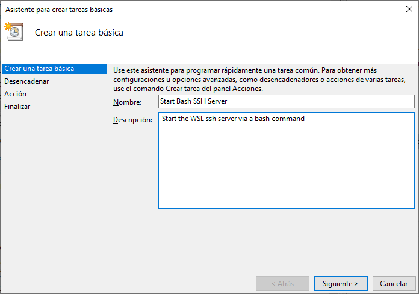

Iniciar el servidor SSH automáticamente en WSL
==============================================

.. contents:: Table of Contents

Documentación para iniciar el servidor SSH de WSL junto con el arranque del sistema de Windows. El comportamiento normal es que WSL no iniciará una tarea mientras no ejecutemos el bash de Linux e iniciemos manualmente el servicio SSH.

Permitir iniciar el servicio SSH sin password
---------------------------------------------

- Editar los permisos de ``/etc/sudoers`` con ``visudo``:

.. code-block:: bash

    $ sudo visudo

- Añadir la siguiente línea al final del archivo ``/etc/sudoers`` para tener permisos de iniciar el servicio de SSH:

.. code-block:: bash

    %sudo ALL=NOPASSWD: /etc/init.d/ssh start

.. Note::

    Otras opciones de permisos en ``/etc/sudoers``:

    .. code-block:: bash

        # Start/Stop scripts for ssh service
        %sudo ALL=NOPASSWD: /etc/init.d/ssh

        # service command
        %sudo ALL=NOPASSWD: /usr/sbin/service

        # ssh command
        %sudo ALL=NOPASSWD: /usr/bin/ssh

        # sshd command
        %sudo ALL=NOPASSWD: /usr/sbin/sshd

Crear una nueva tarea en el Programador de tareas de Windows
------------------------------------------------------------

- Abrir el programa :guilabel:`Programador de tareas`:

.. figure:: images/automatically_start_ssh_server_wsl/windows_search.png
    :align: center

    Búsqueda de Windows: :guilabel:`Programador de tareas`

- En el :guilabel:`Programador de tareas`, seleccionar la opción :guilabel:`Crear tarea básica...`:

    Búsqueda de Windows: :guilabel:`Programador de tareas`

- Pasos para la creación de una nueva tarea:

1. Dar un Nombre y Descripción a la nueva tarea:

    Dar un Nombre y Descripción a la tarea

2. Elegir como desencadenante de la acción :guilabel:`Al iniciar sesión`:

.. figure:: images/automatically_start_ssh_server_wsl/nueva_tarea2.png
    :align: center

    Desencadenador de tarea: :guilabel:`Al iniciar sesión`

3. Elegir como acción que realizará la tarea :guilabel:`Iniciar un programa`:

.. figure:: images/automatically_start_ssh_server_wsl/nueva_tarea3.png
    :align: center

    Acción de la tarea: :guilabel:`Iniciar un programa`

4. El programa a ejecutarse será el bash de WSL y le pasamos como argumento el comando a ejecutar:

- Programa o script: ``C:\Windows\System32\bash.exe``
- Argumentos: ``-c "sudo /etc/init.d/ssh start"``

.. figure:: images/automatically_start_ssh_server_wsl/nueva_tarea4.png
    :align: center

    Programa a ejecutar con sus argumentos

5. Revisar la configuración de la tarea y clic en :guilabel:`Finalizar`:

    Revisar el resumen de la tarea

6. En la barra lateral izquierda, escogemos la opción :guilabel:`Biblioteca del Programador de tareas` y podremos ver listada nuestra nueva tarea:

.. figure:: images/automatically_start_ssh_server_wsl/nueva_tarea6.png
    :align: center

    Nueva tarea agregada a la Biblioteca

Comprobar funcionamiento
------------------------

Para comprobar que se está ejecutando el servicio de SSH de WSL al iniciar el sistema de Windows realizaremos los siguientes pasos:

1. Reiniciar nuestro sistema de Windows

2. Desde un equipo remoto haremos conexión SSH al usuario, IP y puerto pertenecientes al WSL:

.. code-block:: bash

    ssh mogago@192.168.1.8 -p 2222
    mogago@192.168.1.8 s password:

Si la conexión por SSH al equipo remoto ha sido exitosa, hemos configurado correctamente la tarea.

Referencias
-----------

- `SSH on Windows Subsystem for Linux (WSL)`_

.. _SSH on Windows Subsystem for Linux (WSL): https://www.illuminiastudios.com/dev-diaries/ssh-on-windows-subsystem-for-linux/