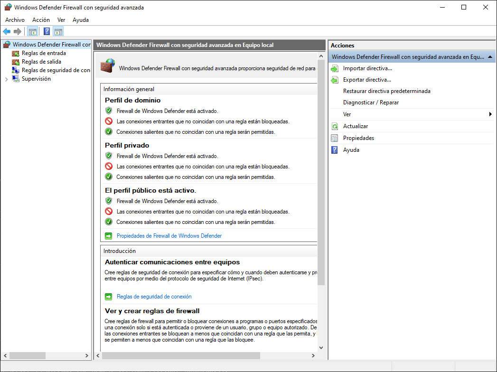
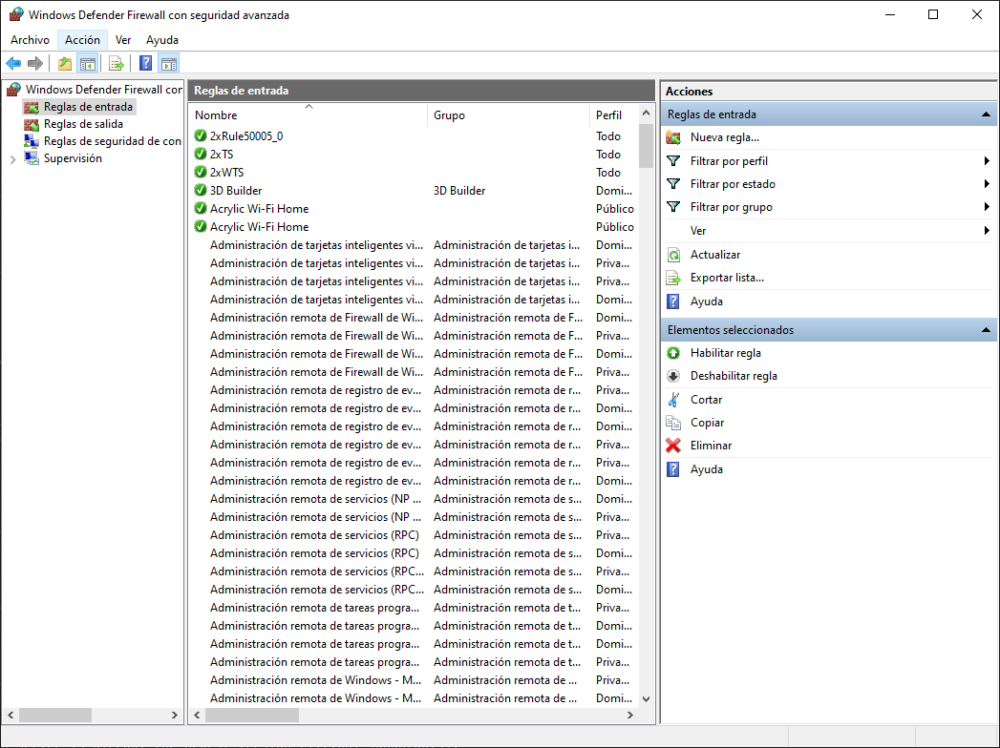
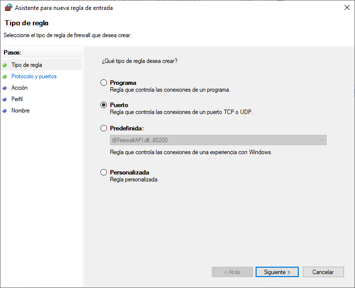
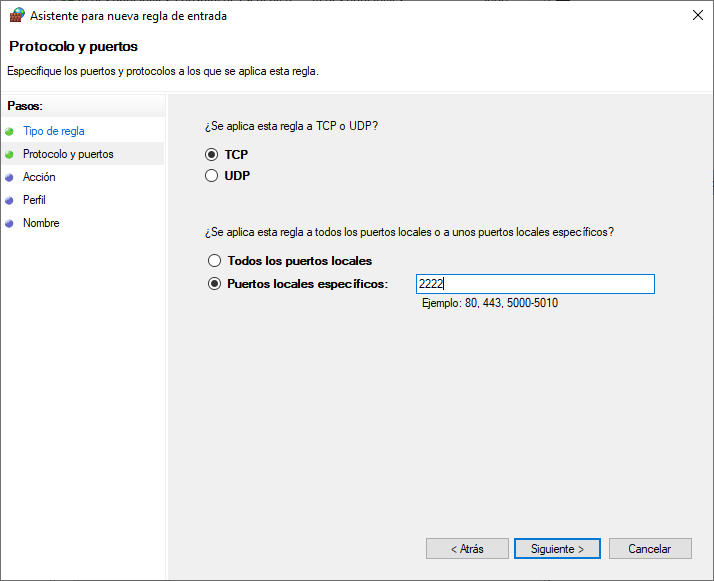
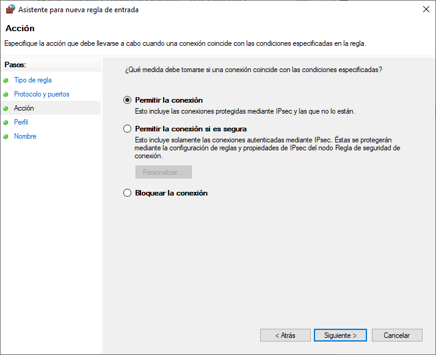
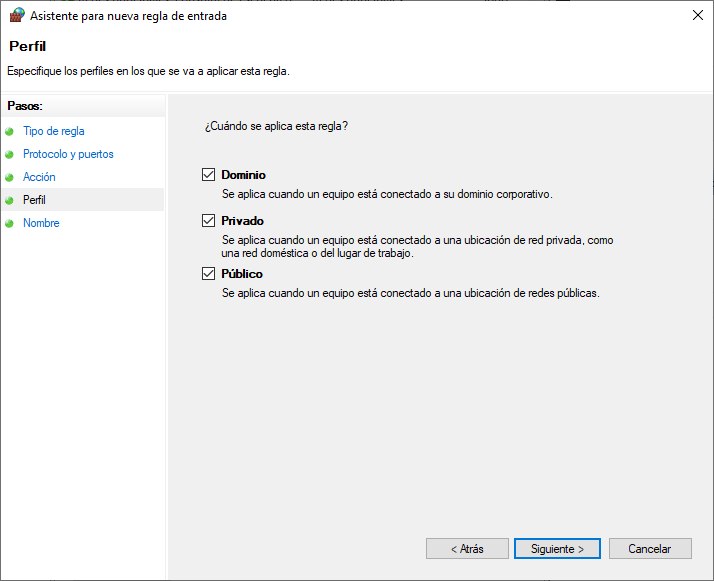
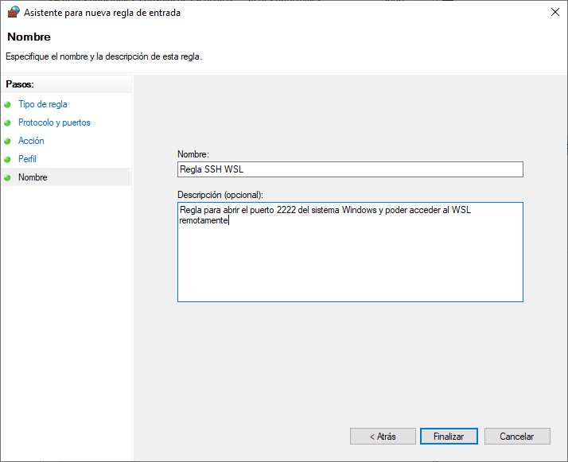

Enabling SSH into WSL 
=====================

.. contents:: Table of Contents

- Instalar ``openssh-server`` en la distro de WSL:

.. code-block:: bash

    $ sudo apt-get install openssh-server

    Reading package lists... Done
    Building dependency tree
    Reading state information... Done
    openssh-server is already the newest version (1:7.6p1-4ubuntu0.3).
    0 upgraded, 0 newly installed, 0 to remove and 0 not upgraded.

.. Note::

    Para la distro de WSL Ubuntu 18.04, ya se encontrará instalado el servidor SSH por defecto

- En el WSL bash shell, reinstalar (reconfigurar) OpenSSH con:

.. code-block:: bash

    $ sudo dpkg-reconfigure openssh-server

    Creating SSH2 RSA key; this may take some time ...
    2048 SHA256:a1Wm2wlyu+xMvJpFADe8oqlSJCUfT96/8qXPYcWGe8U root@DESKTOP-PTFJ9SQ (RSA)
    Creating SSH2 ECDSA key; this may take some time ...
    256 SHA256:YYqT6dvLFpUA21BduvnqXM7i5RdSurvdkafD2lw7glw root@DESKTOP-PTFJ9SQ (ECDSA)
    Creating SSH2 ED25519 key; this may take some time ...
    256 SHA256:q084sqn9frKtN9ZcwQw02/mGmYzn7XNQsFoKzdQ4GDo root@DESKTOP-PTFJ9SQ (ED25519)
    invoke-rc.d: could not determine current runlevel

- Editar el archivo ``/etc/ssh/sshd_config`` y agregar las 2 líneas siguientes:

.. code-block:: bash

    $ sudo vim /etc/ssh/sshd_config

.. code-block:: bash

    PasswordAuthentication yes
    Port 2222

.. Note::

    La razón del cambio de puerto por defecto para SSH (``22``) es debido a que puede estar en uso por Windows.

- Abrir el puerto ``2222`` en el firewall de Windows:

1. En el barra de navegación de Windows, abrir el programa :guilabel:`WF.msc` Seleccionar la opción :guilabel:`Reglas de entrada` en la barra izquierda:

    Abrir el programa :guilabel:`WF.msc` de Windows, :guilabel:`Reglas de entrada`

2. Seleccionar la opción :guilabel:`Nueva regla...` en la barra derecha:

    Seleccionar la opción :guilabel:`Nueva regla...`

3. Seleccionar el tipo de regla :guilabel:`Puerto`:

    Tipo de regla: :guilabel:`Puerto`

4. Aplicar la regla a :guilabel:`TCP` y usar la opción :guilabel:`Puertos locales específicos:` y escribir :guilabel:`2222`:

    Aplicar la regla a :guilabel:`TCP`, :guilabel:`Puertos locales específicos:` :guilabel:`2222`

5. Elegir la opción :guilabel:`Permitir la conexión`:

    Seleccionar :guilabel:`Permitir la conexión`

6. Aplicar la regla sobre todas las opciones: :guilabel:`Dominio`, :guilabel:`Privado`, :guilabel:`Público`

    Seleccionar :guilabel:`Permitir la conexión`

7. Dar un nombre y descripción a la nueva regla de firewall creada:

    Nombre y descripción de la regla de firewall

- En el WSL bash shell, reiniciar el SSH server

.. code-block:: bash

    $ sudo service ssh --full-restart

- Comprobar que Windows se encuentra escuchando en el puerto ``2222``. Desde el Powershell ejecutar:

.. code-block:: powershell

    $ netstat -aon | findstr "2222"

- Desde un equipo remoto conectarnos por SSH al WSL de Windows usando un terminal o PuTTY, apuntando a la IP del sistema Windows y el puerto ``2222``. Por ejemplo para conectarnos por SSH desde un terminal de Linux usamos:

.. code-block:: bash

    $ ssh mogago@192.168.1.8 -p 2222

Referencias
'''''''''''

- `SSH on Windows Subsystem for Linux`_
- `SSH-ing into a Windows WSL Linux Subsystem`_
- `How to Determine What Ports are Being Used in Windows 10`_

.. _SSH on Windows Subsystem for Linux: https://www.illuminiastudios.com/dev-diaries/ssh-on-windows-subsystem-for-linux/
.. _SSH-ing into a Windows WSL Linux Subsystem: https://jeetblogs.org/post/sshing-into-a-windows-wsl-linux-subsystem/
.. _How to Determine What Ports are Being Used in Windows 10: https://www.isunshare.com/blog/how-to-determine-what-ports-are-being-used-in-windows-10/